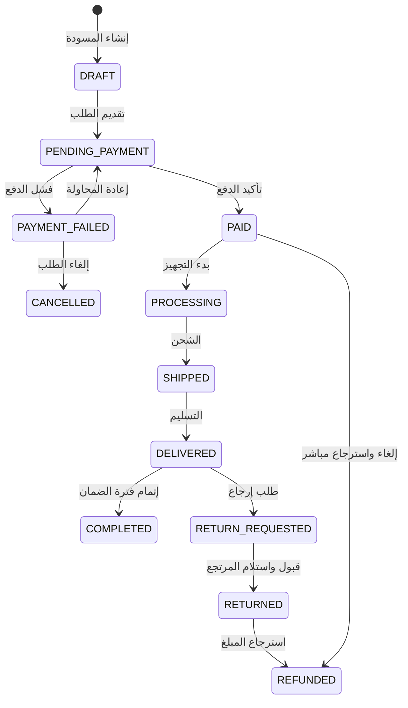

# آلة حالات الطلبات (Ecommerce Order State Machine)

```mermaid
stateDiagram-v2
    [*] --> DRAFT : إنشاء المسودة
    DRAFT --> PENDING_PAYMENT : تقديم الطلب
    PENDING_PAYMENT --> PAID : تأكيد الدفع
    PENDING_PAYMENT --> PAYMENT_FAILED : فشل الدفع
    PAYMENT_FAILED --> PENDING_PAYMENT : إعادة المحاولة
    PAYMENT_FAILED --> CANCELLED : إلغاء الطلب
    PAID --> PROCESSING : بدء التجهيز
    PROCESSING --> SHIPPED : الشحن
    SHIPPED --> DELIVERED : التسليم
    DELIVERED --> COMPLETED : إتمام فترة الضمان
    DELIVERED --> RETURN_REQUESTED : طلب إرجاع
    RETURN_REQUESTED --> RETURNED : قبول واستلام المرتجع
    RETURNED --> REFUNDED : استرجاع المبلغ
    PAID --> REFUNDED : إلغاء واسترجاع مباشر
```

- **حظر القفزات غير الشرعية**: يُحظر نقل الطلب من DRAFT إلى SHIPPED أو من CANCELLED إلى PAID دون المرور بالمسار المعتمد.
