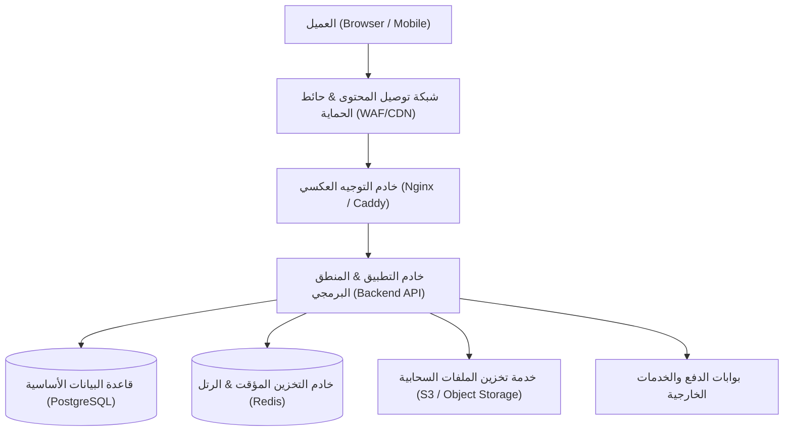

# الوثيقة المعمارية للنظام (System Architecture Specification)

## 1. الهيكل المعماري العام (High-Level Architecture)

## 2. الطبقات البرمجية والمسؤوليات
- **طبقة الواجهات (Presentation Layer)**: معالجة العرض، التفاعل، والحالات دون احتواء منطق أعمال.
- **طبقة الخدمات (Domain / Service Layer)**: تنفيذ قواعد الأعمال والمعاملات والتحقق الأمني.
- **طبقة الوصول للبيانات (Persistence Layer)**: استعلامات قاعدة البيانات المجهزة والترحيلات.

## 3. تدفق البيانات والأمان
- تشفير كافة الاتصالات عبر TLS 1.3.
- التحقق الصارم من المدخلات وتفويض الصلاحيات عند كل نقطة وصول.
