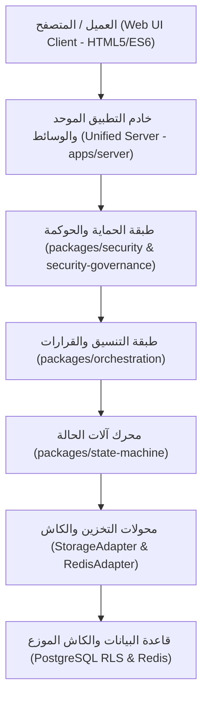

# التقرير المعماري النهائي — WebForge OS Final Architecture Report

## 1. الرؤية المعمارية (Architectural Vision)
يعتمد نظام **WebForge OS** على معمارية معيارية محكمة وقائمة على الأحداث والعقود الصارمة (Strict Contract & Event-Driven Architecture) مع الفصل التام بين الاهتمامات (Separation of Concerns) وانعدام الثقة (Zero Trust).

## 2. الهيكل الهرمي للطبقات (Architectural Layering)

## 3. القرارات المعمارية الرئيسية (Key Architectural Decisions - ADRs)
1. **ADR-001: التخزين الموحد مع عزل المستأجرين (Multi-Tenant Storage Adapter)**
   - **القرار**: توفير واجهة تخزين برمجية موحدة تدعم استراتيجيات التخزين في الذاكرة (للاختبارات والبيئات الخفيفة) و PostgreSQL مع سياسات RLS للإنتاج.
2. **ADR-002: معالجة الطلبات عبر آلات الحالة المنضبطة (Finite State Machines)**
   - **القرار**: لا يتم تعديل أي حالة حساسة في دورة حياة الطلب أو المشروع إلا من خلال `StateMachineEngine` لضمان عدم وجود حالات غير صالحة.
3. **ADR-003: سياسة الإخفاق الآمن والمغلق (Fail-Closed Policy)**
   - **القرار**: في حالة تعطل أو بطء خادم الكاش الموزع أو خدمة التوثيق، يتم رفض الطلب أمنياً بدلاً من تجاوزه دون تحقق.
4. **ADR-004: تصميم واجهات المستخدم بمكافحة الابتذال والتناسق اللوني**
   - **القرار**: استخدام نظام الرموز اللونية `Design Tokens` المستوحى من مصادر التصميم العالمية ومنع القوالب الذكائية المبتذلة (Anti-Slop).

---
**تاريخ الاعتماد**: 2026-10-02  
**كبير المعماريين**: WebForge OS Chief Architecture Team
