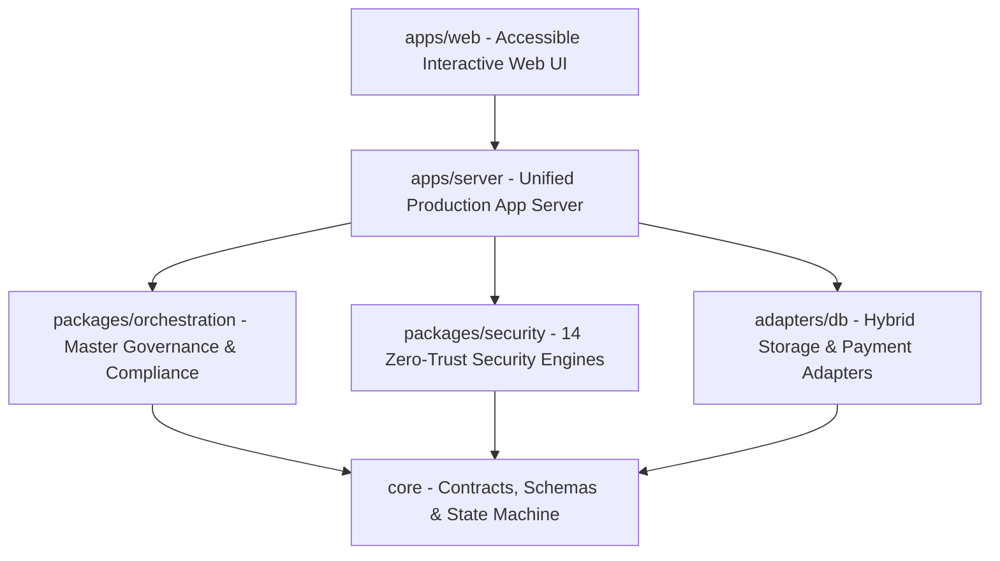

# تقرير المعمارية الهندسية للنظام — ARCHITECTURE_REPORT.md
## WebForge OS — Comprehensive Architecture & Design Report

### 1. الملخص المعماري (Architecture Summary)
يتبع WebForge OS معمارية الطبقات المنضبطة والمستقلة (Modular Layered Architecture) الموجهة بالمجالات (Domain-Driven Design) مع عزل صارم بين الحزم البرمجية وخوادم التطبيق وواجهات المستخدم.

---

### 2. المخطط المعماري للطبقات (Architectural Layering Diagram)

---

### 3. تدقيق الحدود المعمارية (Boundary & Coupling Audit)
* **عزل الحزم (Package Independence):** كل حزمة في `packages/` تمتلك نطاق مسؤولية محدد واختباراتها المستقلة.
* **إدارة الاعتماديات العكسية (Inversion of Control):** يعتمد خادم التطبيق على واجهات محولات التخزين والدفع التجريدية (`adapters/`) مما يتيح التبديل السلس بين التخزين المحلي وقواعد البيانات الإنتاجية.
* **الحوكمة وقفل المعمارية (Architectural Invariants):** محرك `ArchitectureDecisionEngine` يقوم بتسجيل وحفظ كافة القرارات المعمارية في صيغة ADR قابلة للتدقيق.

---

### 4. تقييم الأنماط المعمارية ومكافحة الانجراف (Anti-Drift Verification)
* تم التأكد من عدم وجود تداخلات أو استدعاءات دائرية (Circular Dependencies).
* لا تعتمد أي وحدة خلفية على كود خاص بالمتصفح أو العكس.
* تم إحكام التوافق مع مبادئ Zero-Trust في جميع نقاط الدخول والخروج.

---

### 5. تصنيف الأدلة والجاهزية
* **الحالة المعمارية:** متوافقة ومحصنة (Compliant & Hardened).
* **الأدلة:** اجتياز اختبارات المعمارية والـ ADR وفحوصات السلامة عبر `npm test`.
