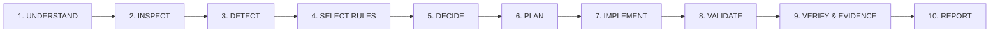
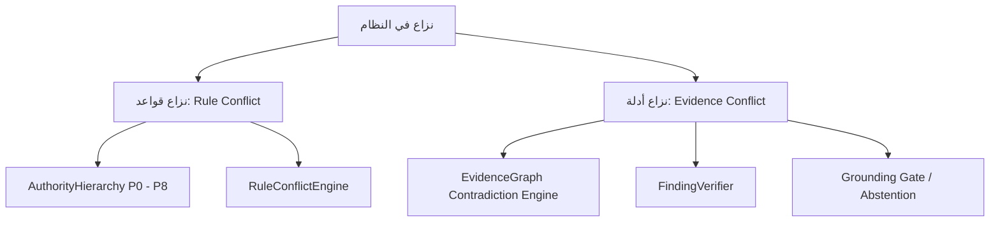
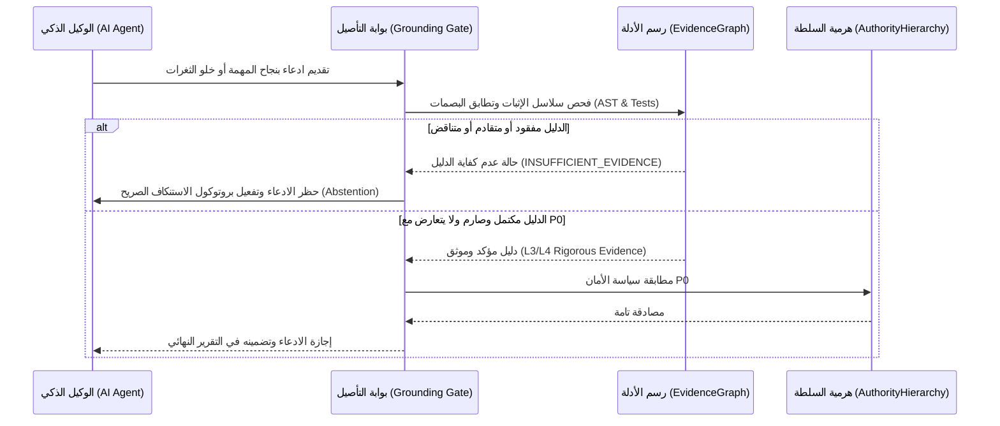

# معمارية التحقق الإدراكي والتأصيل البرمجي (C1 Cognitive Verification & Grounding Architecture)

## 1. الفلسفة المعمارية والحدود الحاكمة (Architectural Philosophy & Hard Boundaries)

يعد نظام **WebForge OS** إطاراً دستورياً وقواعدياً لهندسة الذكاء الاصطناعي وضمان جودة النظم البرمجية المعقدة (`AI Engineering Rulebook & Quality Framework`)، وهو محايد تماماً للمكدسات واللغات البرمجية (`Stack-Agnostic`).

### الحدود الصارمة غير القابلة للتفاوض:
1. **ليس بيئة تشغيل إنتاجية (Not an Application Runtime)**: لا يقوم WebForge OS بتشغيل تطبيقات المستخدم في الإنتاج، بل يحكم سلوك الوكلاء أثناء التطوير والتحقق.
2. **ليس محرك توليد أكواد تلقائي (Not a Code Generator)**: لا يبتكر الأكواد عشوائياً، بل يفرض متطلبات السلامة والأمان والمعايير الهندسية.
3. **الفصل الإبستيمولوجي الصارم (Epistemic Boundary)**: لا تُعتبر الافتراضات أو استنتاجات النماذج اللغوية أدلة ما لم تخضع لاختبار صارم ومستقل.

---

## 2. المبدأ الإبستيمولوجي الكنسي (The Canonical Epistemic Law)

يقوم إطار التحقق الإدراكي C1 على ستة لاءات قطعية:
```
Memory !== Evidence
Retrieved Content !== Evidence
Tool Result !== Evidence
MCP Result !== Evidence
LLM Output !== Evidence
Citation !== Verification
```

### التفسير الهندسي للمبدأ:
* **الذاكرة (Memory)**: مستودع سياقي وتاريخي للأخطاء السابقة والأنماط، لكنها تصف الماضي ولا تضمن صحة الحاضر.
* **المحتوى المسترجع (Retrieved Content)**: نصوص خام غير موثوقة قد تحتوي على أخطاء أو سموم حقن (Indirect Injections).
* **مخرجات الأدوات (Tool Output)**: استجابة الأداة تعبر فقط عما رأته الأداة في تلك اللحظة ولا ترقى لمرتبة الدليل القطعي حتى تصادق عليها براهين ثنائية الاتجاه.
* **بروتوكول MCP**: قناة لنقل البيانات، وجميع الحمولات الواردة منها تخضع لحراسة عدم الثقة (`Zero-Trust Boundary`).
* **مخرجات النموذج (LLM Output)**: توليد لغوي إحصائي عرضة للهلوسة ما لم يقترن بتدقيق آلي في الرسم البياني.
* **الاقتباس (Citation)**: ذكر سطر أو ملف لا يعني أن الادعاء بشأنه صحيح أو تم التحقق منه فعلياً.

---

## 3. التوفيق الصارم مع دورة الحياة الكنسية (The Canonical 10-Stage Lifecycle)

يتم دمج عمليات التحقق الإدراكي حصرياً ضمن دورة الحياة الرسمية المعتمدة لنظام WebForge OS ذات المراحل العشر دون استحداث أي دورة حياة موازية:



### موقع عمليات التحقق الإدراكي داخل المراحل الكنسية:
1. **المرحلة 8 (VALIDATE - التحقق الأولي)**:
   - تشغيل أدوات الفحص، اختبارات المترجم، والاختبارات الآلية الحتمية.
   - تجميع مخرجات الفحص ووسمها كمخرجات أدوات أولية (`Tool Outputs`).
2. **المرحلة 9 (VERIFY & EVIDENCE - التحقق المستقل وبناء الأدلة)**:
   - استدعاء محرك `FindingVerifier` لتحويل المخرجات إلى حالات تدقيق كنسية الخمس (`CONFIRMED`, `LIKELY`, `FALSE_POSITIVE`, `INSUFFICIENT_EVIDENCE`, `ENVIRONMENT_LIMITATION`).
   - استدعاء `EvidenceGraph` لبناء روابط التأصيل الصريحة بين الادعاء ودليل الإثبات الحقيقي.
   - تطبيق **بوابة التأصيل الإدراكي (Grounding Gate)** وسياسة الاستنكاف (`Abstention`).
3. **المرحلة 10 (REPORT - إعداد التقارير)**:
   - صياغة التقرير استناداً حصرياً إلى العقد المؤصلة والمثبتة في `EvidenceGraph`.
   - إبراز حالات الاستنكاف بشفافية تامة ومنع تزييف النجاح.

---

## 4. عقود الادعاءات الذرية ومستويات الأدلة (Atomic Claim Contracts & Evidence Rigor)

### 4.1 بنية عقد الادعاء الذري (Atomic Claim Specification)
كل ادعاء يصدره الوكيل أو النظام يجب أن يتخذ بنية قياسية تعاقدية:
```json
{
  "claim_id": "CLM_20261003_001",
  "statement": "The SQL Injection vulnerability in file-security.js is fully remediated.",
  "category": "SECURITY_REPAIR",
  "target_artifact": "packages/security/file-security.js",
  "artifact_hash": "a1b2c3d4e5f6...",
  "status": "UNVERIFIED",
  "required_evidence_level": "L3_DYNAMIC_PROOF",
  "supporting_evidence_ids": [],
  "grounding_confidence": 0.0,
  "created_at": "2026-10-03T17:30:00Z"
}
```

### 4.2 مستويات صرامة الأدلة (Levels of Evidence Rigor)
* **L0 — ادعاء مجرد (Unsupported Claim)**: ادعاء دون أي دليل مرفق (مرفوض قطعاً، حظر إلزامي).
* **L1 — سياق مسترجع / ذاكرة (Context / Retrieved)**: وجود نص أو نمط سابق في الذاكرة (لا يثبت الادعاء، استنكاف فوري).
* **L2 — فحص ساكن موثق (Deterministic Static Proof)**: فحص AST أو فحص مطابقة الأنماط الصارمة لغياب الدوال الخطرة.
* **L3 — برهان ديناميكي حتمي (Deterministic Dynamic Proof)**: اختبار انحدار برمجي ناجح (`Automated Test Passed`) مع مسار تتبع مثبت في `EvidenceGraph`.
* **L4 — برهان شامل متعدد الأبعاد (Multi-Dimensional Verified Rigor)**: فحص ساكن + اختبار ديناميكي + مراجعة حدود الأمان عبر `AISecurityGuard` + غياب أي تعارض في `EvidenceGraph`.

---

## 5. الصلاحية الزمنية وإبطال الأدلة (Temporal Invalidation & Snapshot Invalidation)

تخضع كافة الأدلة في `EvidenceGraph` لقواعد الإبطال الحتمي التالية:
1. **تغير البصمة الزمنية للملف (Artifact Hash Mismatch)**:
   إذا تغيرت بصمة تجزئة الملف المستهدف (`artifact_hash`) بعد تسجيل الدليل، يُعتبر الدليل **ملغى فوراً وبحكم القانون المعماري (INVALIDATED_DUE_TO_MUTATION)**.
2. **فترة الصلاحية الزمنية (Time-To-Live - TTL)**:
   كل دليل تشغيلي يرتبط بمهلة زمنية (مثل 30 دقيقة أثناء جلسة التطوير). عند انقضاء المهلة، يجب إعادة الفحص.
3. **ظهور دليل مضاد حاسم (Emergence of Counter-Evidence)**:
   إذا فشل اختبار انحدار لاحق مرتبط بذات الادعاء، يتم إبطال عقدة الدليل السابقة وتسجيل حالة نزاع أدلة (`EVIDENCE_CONTRADICTION`).

---

## 6. فض نزاعات الأدلة مقابل فض نزاعات القواعد (Evidence Conflict vs Rule Conflict)

يميز WebForge OS فصلاً حاسماً بين نوعين من النزاعات:


### المبدأ الكنسي:
> **نزاع القواعد (Rule Conflict) يُحل عبر هرمية الصلاحيات (`AuthorityHierarchy`) ومحرك فض النزاعات (`RuleConflictEngine`). بينما نزاع الأدلة (Evidence Conflict) يُحل عبر التحقق الحسابي التجريبي الصارم في `EvidenceGraph`؛ وإذا تعذر الترجيح التجريبي، يُطبق الاستنكاف الحتمي (`Mandatory Abstention`).**

* لا يمكن لقاعدة ذات أولوية عالية (مثل P2) أن تحوّل دليلاً فاشلاً إلى دليل ناجح.
* حدود الأمان P0 (Security Hard Floor) تفرض الفشل الآمن (`Fail-Closed`) عند أي نزاع أدلة أمني غير محسوم.

---

## 7. بوابة التأصيل وسياسة الاستنكاف الإلزامي (Grounding Gate & Mandatory Abstention)



### حالات الاستنكاف الإلزامي (Mandatory Abstention Trigger Conditions):
1. عدم وجود اختبار تشغيلي مؤتمت يثبت صحة التعديل.
2. وجود قيد بيئي يمنع التنفيذ (`ENVIRONMENT_LIMITATION`).
3. تعارض بين أداتين دون حسم تجريبي.
4. وسم المدخل بأنه غير موثوق به لاحتمال احتوائه على حقن تعليمات.

---

## 8. حراسة أمان الذكاء الاصطناعي (AI Security Guard & Zero-Trust Verification)

تخضع كافة قنوات الاسترجاع واستدعاء الأدوات للضوابط التالية:
1. **معاملة المحتوى الخارجي كمحتوى غير موثوق به (Untrusted Context Default)**.
2. **حظر حقن التعليمات المباشرة وغير المباشرة** عبر مرشحات التعبير النمطي والفحص السياقي في `AISecurityGuard`.
3. **حظر تجاوز الصلاحيات (Privilege Escalation Prevention)**: لا يحق للوكيل الذكي استدعاء أدوات إدارية ما لم يكن مصرحاً له صراحة.
4. **سقف العمليات (Action Limits)** لمنع هجمات الاستنزاف وحلقات التكرار اللانهائية.

---

## 9. الخلاصة
تضع هذه المعمارية الحدود الصارمة لمشروع التحقق الإدراكي، وتضمن أن الانتقال المستقبلي لمرحلة C2 (محرك الادعاءات) ومرحلة C3 (محرك التأصيل) سيتم فوق أرضية هندسية راسخة تحمي نظام WebForge OS من أي ثغرات أو ادعاءات وهمية.
