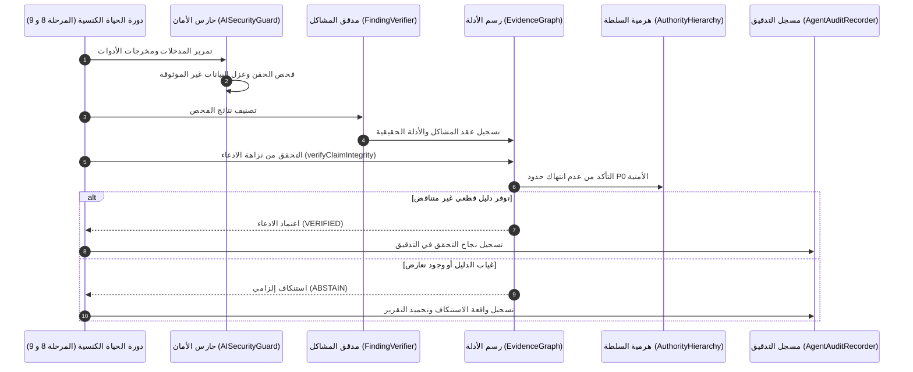

# مصفوفة تكامل التحقق الإدراكي (C1 Cognitive Verification Integration Matrix)

## 1. الغرض من مصفوفة التكامل
تهدف هذه المصفوفة إلى ربط كافة المتطلبات الهندسية والمعمارية لإطار **التحقق الإدراكي والتأصيل البرمجي** مع المكونات الفعلية في المستودع، وتحديد العقود التعاقدية المعنية، وضوابط الأمان الإلزامية، وآليات التحقق والاختبار المؤتمتة لكل متطلب.

---

## 2. جدول مصفوفة التكامل المعماري الشامل (Comprehensive Integration Matrix)

| رقم المتطلب | المتطلب المعماري الإدراكي | المكون المسؤول | العقد المطبق | نوع الإجراء | ضوابط الأمان والتحكم بالوصول (P0 Security) | آلية التحقق والاختبار المؤتمتة |
| :---: | :--- | :--- | :--- | :---: | :--- | :--- |
| **REQ-C1-01** | عزل فضاء الذاكرة عن فضاء الأدلة ومنع ترقية الذاكرة | `EngineeringMemory` | `MemoryIsolationPolicy` | **REUSE** | منع قبول سجلات الذاكرة كأدلة قطعية دون مصادقة تجريبية مباشرة. | اختبار معماري: التحقق من رفض الادعاء غير المدعوم باختبار مباشر (`packages/orchestration/tests/c1-cognitive-verification-architecture.test.js`). |
| **REQ-C1-02** | ربط الادعاءات بالأدلة الصريحة وتتبع مسارات الإثبات | `EvidenceGraph` | `verifyClaimIntegrity` | **EXTEND** | التحقق من أن كافة عقد الإثبات الداعمة تحمل حالة `PASSED` أو `VERIFIED`. | اختبار دورة التتبع السداسية وتدقيق روابط DAG في `evidence-graph.test.js`. |
| **REQ-C1-03** | إدارة الصلاحية الزمنية وإبطال الأدلة عند تحور الكود | `EvidenceGraph` | `ArtifactHashMismatch` | **EXTEND** | إبطال الأدلة آلياً عند تغير بصمة التجزئة للملف المستهدف (`Fail-Closed`). | اختبار مقارنة بصمات SHA-256 قبل وبعد التعديل البرمجي. |
| **REQ-C1-04** | تصنيف المشاكل وفق الحالات الخمس الكنسية المعتمدة | `FindingVerifier` | `VERIFICATION_VERDICTS` | **REUSE** | عزل القيود البيئية والإنذارات الخاطئة بدقة ومنع تزييف النجاح. | اختبارات وحدات تغطي الحالات الخمس (`finding-verifier.test.js`). |
| **REQ-C1-05** | سيادة الأمان المطلق وحظر تجاوزه عبر أي ادعاء أو دليل | `AuthorityHierarchy` | `AuthorityHierarchy.LEVELS` | **REUSE** | سيادة مستوى P0 (Security Hard Floor) على كافة المستويات P1-P8 دون استثناء. | اختبار حسم النزاعات الصارم بين P0 وباقي الصلاحيات في `c1-cognitive-verification-architecture.test.js`. |
| **REQ-C1-06** | حراسة مدخلات MCP والتصدي لهجمات حقن التعليمات | `AISecurityGuard` | `detectPromptInjection` | **EXTEND** | فحص كافة المدخلات المسترجعة وحظر محاولات تجاوز الضوابط بنمط عدم الثقة. | اختبارات كشف الحقن الصريحة والضمنية وحظر الأوامر التنفيذية الخطرة. |
| **REQ-C1-07** | توثيق أحداث الاستنكاف الإدراكي ورفض الادعاءات | `AgentAuditRecorder` | `recordAgentAction` | **EXTEND** | الحفاظ على سجل تدقيق غير قابل للتلاعب لأي تراجع ناتج عن نقص الأدلة. | فحص مخرجات التدقيق وتأكيد احتواء التقرير على أسباب الاستنكاف. |
| **REQ-C1-08** | التوافق الحصري مع دورة الحياة الكنسية ذات الـ 10 مراحل | `WebForge Orchestrator` | `10-Stage Lifecycle` | **REUSE** | منع استحداث أي دورة حياة موازية وحصر التحقق داخل المرحلتين 8 و 9. | الفحص الهيكلي لدورة الحياة وضمان سلامة تسلسل المراحل العشر. |
| **REQ-C1-09** | التمييز القطعي بين نزاعات الأدلة ونزاعات القواعد | `RuleConflictEngine` | `arbitrateRuleConflict` | **REUSE** | حسم نزاع القواعد بالهرمية، وحسم نزاع الأدلة بالتحقق التجريبي الحتمي. | اختبارات فض النزاعات الهندسية في `rule-conflict-engine.test.js`. |
| **REQ-C1-10** | حظر التوليد البرمجي الحر وصيانة هوية الإطار القواعدي | `Core Governance` | `WebForge Constitution` | **REUSE** | منع إنشاء أي بيئة تشغيل تطبيقات أو محرك كتابة كود مستقل. | تدقيق نطاق الحزم ومراجعة غياب أي Runtime تنفيذي للتطبيقات. |

---

## 3. مصفوفة التفاعل بين الطبقات (Cross-Layer Interaction Matrix)

---

## 4. شروط الجاهزية التشغيلية للمراحل القادمة (Transition Gates to C2 & C3)

لضمان سلامة الانتقال المستقبلي دون أي خلل معماري، تم تحديد شروط الجاهزية التالية:
1. **جاهزية الانتقال إلى C2 (Claim & Evidence Intelligence)**:
   - ثبات عقد `AtomicClaimSchema` واعتماده دستورياً.
   - خلو `EvidenceGraph` من أي تسريب لسجلات الذاكرة كبديل للأدلة.
   - نجاح كافة اختبارات الانحدار الحالية بنسبة 100%.
2. **جاهزية الانتقال إلى C3 (Grounding & Output Verification)**:
   - اكتمال محرك الادعاءات C2.
   - دمج خوارزميات قياس مسافة التأصيل (`Grounding Distance`).
   - تفعيل بوابة الحظر القطعية (`Grounding Gate`) لمنع صدور أي مخرجات غير مؤصلة.

---

## 5. الخلاصة
تؤكد مصفوفة التكامل أن معمارية C1 تغطي كافة الجوانب التعاقدية والأمنية والتنظيمية المطلوبة دون ترك أي مساحة للغموض أو التداخل، مع الحفاظ الكامل على سلامة الكود القائم.
