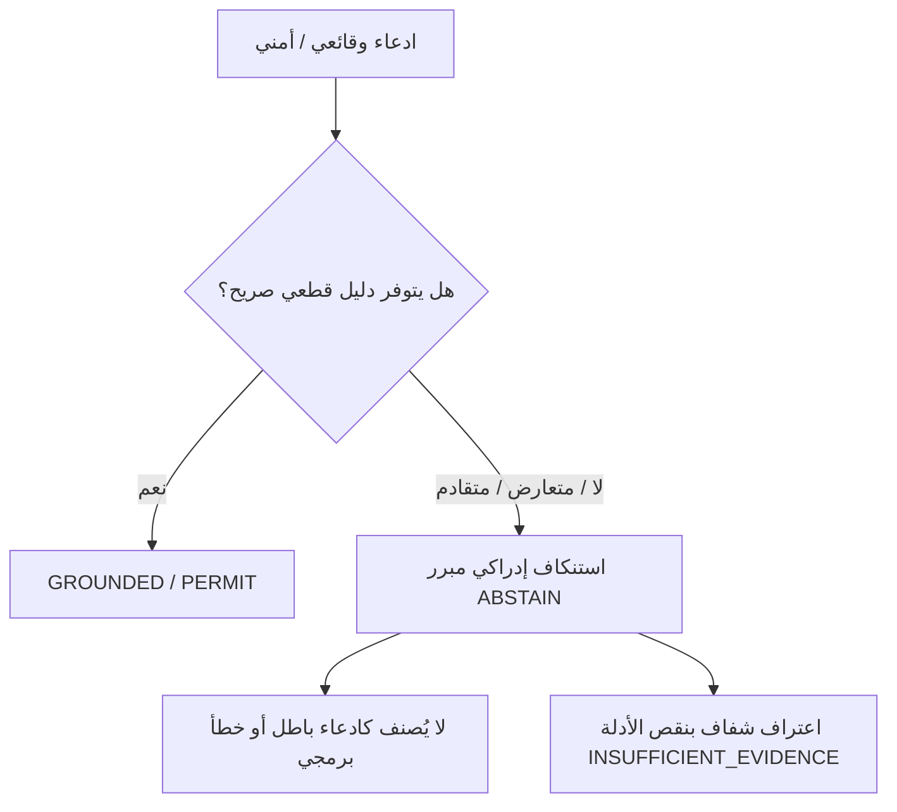

# تقرير الاستنكاف الإدراكي الصريح (C3 Abstention Intelligence Report)

## 1. الفلسفة المعمارية للاستنكاف الإدراكي
في هندسة الذكاء الاصطناعي التقليدية، غالباً ما يتم الخلط بين "عدم القدرة على الإثبات" وبين "الخطأ البرمجي" أو "الحكم بالبطلان".
يؤسس نظام **WebForge OS** لمفهوم **الاستنكاف الإدراكي الصريح (Formal Abstention)** كحالة تحقق معيارية ومشروعة تعبر عن النزاهة الهندسية للوكيل الذكي عندما تنعدم الأدلة القاطعة أو تتعارض.

---

## 2. المبدأ الدستوري الحاكم: الاستنكاف لا يعني الكذب (Abstention ≠ Falsehood)

> **الاستنكاف لا يعني أن الادعاء كاذب أو باطل، بل يعني أن النظام يعترف بشفافية تامة بأنه لا يملك حالياً الدليل الكافي أو الصالح زمنياً لإثباته بصورة حتمية.**

---

## 3. تصنيف حالات الاستنكاف المعتمدة (Abstention Categories)

1. **نقص الأدلة الداعمة (`INSUFFICIENT_EVIDENCE`)**:
   - عدم وجود اختبار انحدار برمجي يثبت الادعاء.
   - استناد الادعاء حصرياً إلى نصوص استرجاعية أو ذاكرة تاريخية (`Memory !== Evidence`).
2. **تعارض الأدلة المباشر (`CONFLICTED_EVIDENCE`)**:
   - وجود نتائج متناقضة بين أداتي فحص أو بين اختبار سابق واختبار حالي.
   - يمتنع النظام عن ترجيح طرف اعتباطياً حتى يتدخل فحص تجريبي حاسم.
3. **تقادم الأدلة وتحور الشيفرة (`STALE_EVIDENCE`)**:
   - تغير بصمة تجزئة الملف المستهدف (`artifact_hash`) بعد إجراء الاختبار، مما يلزم الاستنكاف وإعادة الفحص.
4. **فشل التحقق من أصل ومصدر الدليل (`PROVENANCE_FAILURE`)**:
   - ورود دليل مجهول المصدر أو فاقد للبيانات الوصفية الأساسية.
5. **القيود البيئية المعلنة (`ENVIRONMENT_LIMITATION`)**:
   - تعذر تشغيل الاختبار بسبب غياب بيئة التشغيل المناسبة في بيئة الفحص الحالية.

---

## 4. الفارق بين الاستنكاف الإدراكي (ABSTAIN) والحظر الأمني (BLOCK)

| البعد الهندسي | الاستنكاف الإدراكي (`ABSTAIN`) | الحظر الأمني المباشر (`BLOCK`) |
| :--- | :--- | :--- |
| **طبيعة الحالة** | حالة نقص معرفي أو تعارض تجريبي في الأدلة. | انتهاك صريح لحدود الأمان P0 أو رصد تهديد أمني. |
| **الموقف من الادعاء** | الادعاء قد يكون صحيحاً في الواقع لكنه يفتقر للبرهان المعاصر. | الادعاء يحتوي على أمر خبيث، محاولة حقن، أو تسميم أدلة. |
| **المخرجات المترتبة** | بيان استنكاف رسمي شفاف يوضح الدليل الناقص. | إيقاف العملية فوراً وتوثيق محاولة الاختراق في التدقيق. |
| **حكم التأصيل** | `INSUFFICIENT_EVIDENCE` أو `CONFLICTED`. | `REJECTED` بحكم قطعي. |

---

## 5. الخلاصة
يحمي بروتوكول الاستنكاف الصريح مستخدمي WebForge OS من ظاهرة الثقة المفرطة والهلوسة التوليدية، ويؤسس لثقافة هندسية قائمة على البراهين القاطعة.
