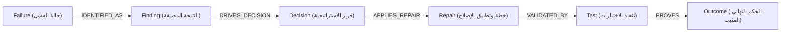

# تقرير تتبع مسارات الأدلة والقرارات — P1_EVIDENCE_TRACE_REPORT.md
## WebForge OS — Phase 3: Evidence Graph & Traceability Cycles Report

> **تاريخ الإصدار**: 2026-10-02  
> **النظام المختص**: `packages/orchestration/evidence-graph.js`  
> **حالة التحقق**: `VERIFIED` بنسبة 100%

---

### 1. مسار تتبع دورة الفشل والإصلاح (Failure-to-Outcome Trace Cycle)

يربط `EvidenceGraph` السلسلة السببية الكاملة لكل عملية تعديل أو إصلاح آلي:

---

### 2. إمكانية الاستعلام وتتبع الإثبات (Traceability Queries)

يتيح النظام الإجابة على الأسئلة البرمجية الحرجة عبر دوال الاستعلام المباشرة:
1. **لماذا تم إجراء هذا التعديل؟** $\rightarrow$ عبر مسار `getFailureRepairTrace(failureId)` الذي يربط العقدة بحالة الفشل الأصلية.
2. **ما هي الأدلة التي أثبتت صحة الإصلاح؟** $\rightarrow$ عبر فحص عقدة `TEST_EXECUTION` المرتبطة بحالة `PASSED`.
3. **هل تم التحقق المستقل من المشكلة أم أنها إنذار كاذب؟** $\rightarrow$ عبر ربط `FindingVerifier` بالعقدة وتحديد `formalVerdict`.
4. **هل تكررت نفس المشكلة مسبقاً؟** $\rightarrow$ عبر الاستعلام من `EngineeringMemory.getResolvedFailures()`.
