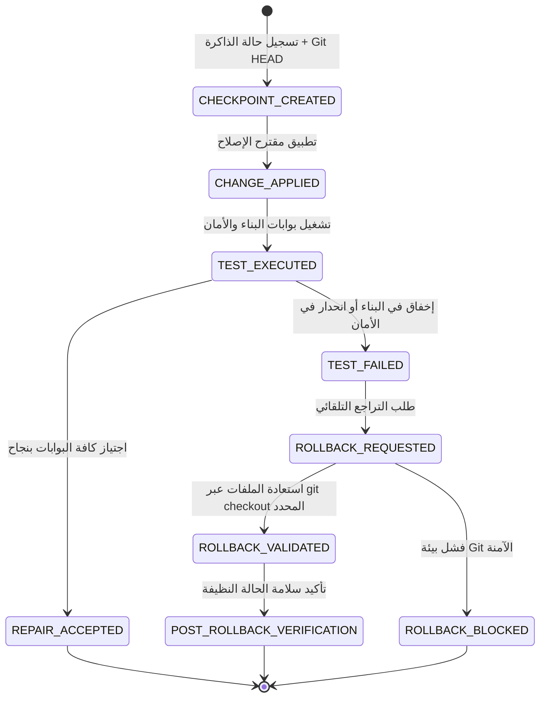

# تقرير محرك الإصلاح الآمن ونقاط استعادة Git — P1_SAFE_REPAIR_REPORT.md
## WebForge OS — Phase 3: Safe Autonomous Repair & Git Checkpoint Lifecycle Report

> **تاريخ الإصدار**: 2026-10-02  
> **النظام المختص**: `packages/security/safe-repair-engine.js`  
> **حالة التحقق**: `VERIFIED` بنسبة 100%

---

### 1. دورة حياة نقطة الاستعادة (Checkpoint Lifecycle)

---

### 2. ضوابط الأمان الصارمة لعمليات Git

1. **الامتناع التام عن `git reset --hard`**: لا يتم استخدام أوامر مسح الحالة الشاملة تجنباً لفقدان عمل المطور.
2. **التراجع المحصور بالملفات (Scoped File Restore)**: استرجاع الملفات المحددة في خطة التعديل حصراً عبر `git checkout <gitRef> -- <file>`.
3. **منع حقن الأوامر (Command Injection Defense)**: استخدام `execFileSync` مع مصفوفة وسائط صريحة دون تفعيل Shell.
4. **حظر التراجع في البيئات غير الآمنة**: إرجاع `ROLLBACK_BLOCKED` عند غياب Git أو وجود تضارب غير قابل للحل آلياً.
5. **تطهير سجلات الأخطاء**: حجب كلمات المرور والرموز السرية من كافة رسائل الاستثناء وسجلات التدقيق.
