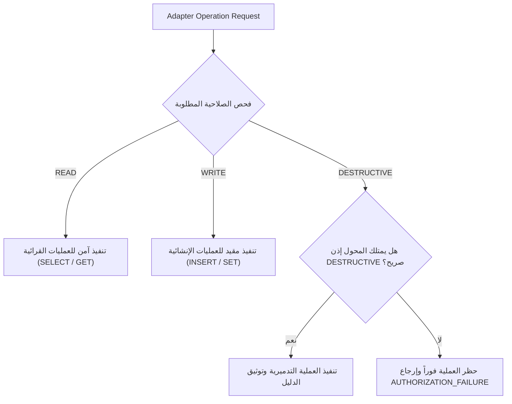

# WebForge OS — تقرير معمارية المحولات والإضافات المتقدمة (Phase 4 — Domain C Report)

## 1. ملخص تنفيذي (Executive Summary)
يوثق هذا التقرير معمارية **محولات النسيج الهندسي المتقدمة (PluginAdapterManager Fabric)** المطورة في المرحلة 4، والتي تتيح دعم وتكامل البنى التحتية الخارجية (قواعد البيانات، الكاش، طوابير الرسائل، السحابة، وأدوات CI/CD والمراقبة) بشكل اختياري تماماً وبدون جعل أي منها إلزامياً للنواة (Core).

---

## 2. مصفوفة تصنيفات المحولات وحالات التوفر (Adapter Categories & Status)

| تصنيف المحول (Category) | أمثلة الأنظمة المدعومة اختيارياً (Optional Systems) | حالات التوفر (Supported Statuses) |
| :--- | :--- | :--- |
| **DATABASE** | PostgreSQL, MySQL, MongoDB, SQLite, In-Memory | `AVAILABLE`, `NOT_DETECTED`, `AVAILABLE_OPTIONAL_ADAPTER` |
| **CACHE** | Redis, Memcached, Local In-Memory Map | `AVAILABLE`, `NOT_DETECTED`, `AVAILABLE_OPTIONAL_ADAPTER` |
| **QUEUE** | RabbitMQ, Kafka, SQS, BullMQ, Local Sync | `AVAILABLE`, `NOT_APPLICABLE`, `NOT_DETECTED` |
| **CLOUD** | AWS, Azure, GCP, Cloudflare, Vercel | `AVAILABLE`, `NOT_APPLICABLE`, `ENVIRONMENT_LIMITATION` |
| **CICD** | GitHub Actions, GitLab CI, Jenkins | `AVAILABLE`, `ENVIRONMENT_LIMITATION`, `NOT_DETECTED` |
| **OBSERVABILITY** | Prometheus, OpenTelemetry, Sentry, Local /metrics | `AVAILABLE`, `NOT_APPLICABLE` |
| **STORAGE** | S3, MinIO, Local Disk Filesystem | `AVAILABLE`, `NOT_APPLICABLE` |

---

## 3. هرمية الصلاحيات والحوكمة الأمنية (Permission Matrix & Safety Gates)

- **القاعدة الحتمية**: `READ > WRITE > DESTRUCTIVE`.
- **حظر العمليات التدميرية**: أي محاولة لحذف جداول أو تفريغ كاش دون إذن صريح تُحظر تلقائياً بقرار `AUTHORIZATION_FAILURE`.

---

## 4. تصنيف أخطاء المحولات وربطها بإعادة التخطيط (Failure Intelligence Mapping)

| خطأ المحول (Adapter Error) | التصنيف الأمني (Failure Class) | رد فعل محرك إعادة التخطيط (TaskReplanner Strategy) |
| :--- | :--- | :--- |
| انقطاع المصادقة أو انتهاء الرمز | `AUTHENTICATION_FAILURE` | تصعيد أمني وتطهير رسائل الأخطاء وتحديث بيانات الدخول |
| رفض الصلاحية أو غياب التصريح | `AUTHORIZATION_FAILURE` | حظر العملية ومراجعة مصفوفة الصلاحيات (Least Privilege) |
| انقطاع الشبكة أو تعذر الاتصال | `NETWORK_FAILURE` | محاولة إعادة مع خوارزمية التراجع الأسي (Exponential Backoff) |
| انتهاء مهلة الاستجابة (>5000ms) | `TIMEOUT` | تحويل التنفيذ للوضع المخفف أو الكاش المحلي |
| تجاوز حدود الاستدعاء (Rate Limit) | `RATE_LIMIT` | تهدئة الاستدعاءات (Throttle / Debounce) |
| غياب أداة أو برنامج محلي | `TOOL_NOT_INSTALLED` | التحول للمحاكي الداخلي الساكن (Internal Normalizer) |

---

## 5. خلاصة التحقق والأدلة (Verification Summary)
- تم التحقق من تسجيل المحولات وتطبيق بوابات الصلاحيات وحظر العمليات التدميرية وتصنيف 11 فئة خطأ بدقة 100% عبر `phase4-production-excellence.test.js`.
