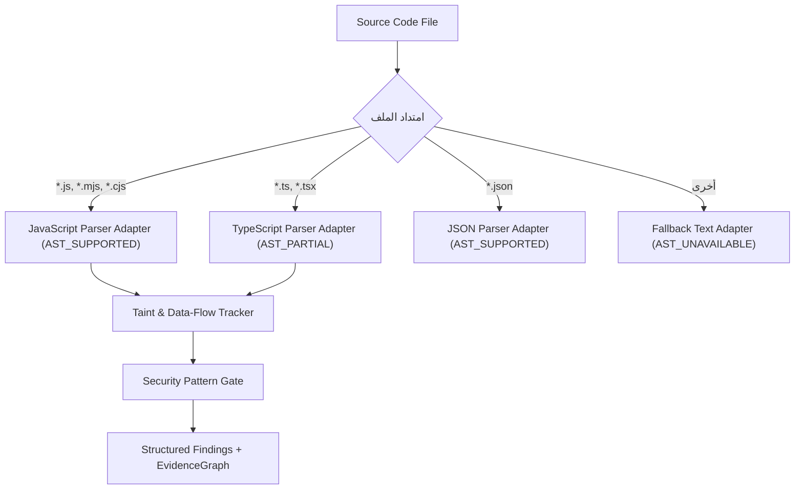

# WebForge OS — تقرير الاستخبارات البرمجية المتقدمة وتحليل مسارات التلوث (Phase 4 — Domain A Report)

## 1. ملخص تنفيذي (Executive Summary)
يقدم هذا التقرير نتائج تصميم وتكامل **محرك الاستخبارات البرمجية المتقدمة (CodeIntelligenceEngine)** ضمن المرحلة 4 من برنامج التطور المعماري الشامل لنظام WebForge OS.
يتميز المحرك بالقدرة على التمييز الدقيق بين مستويات التحليل السبعة (Text, Lexical, Syntax, AST, Semantic, Data-flow, Taint Analysis)، مع توفير محولات لغات قابلة للتوسيع (Language & Parser Adapters) تدعم الاكتشاف التلقائي للقدرة (`AST_SUPPORTED`, `AST_PARTIAL`, `AST_UNAVAILABLE`, `NOT_APPLICABLE`).

---

## 2. مستويات التحليل البرمجي والقدرات المعتمدة (Analysis Levels & Capabilities)

| مستوى التحليل (Analysis Level) | حالة الدعم (Support Status) | آلية التنفيذ (Implementation Mechanism) |
| :--- | :---: | :--- |
| **TEXT_ANALYSIS** | `SUPPORTED` | مطابقة النصوص والأشكال التعبيرية الساكنة. |
| **LEXICAL_ANALYSIS** | `SUPPORTED` | تجزئة الشفرة البرمجية إلى Tokens والتعرف على الكلمات المفتاحية. |
| **SYNTAX_ANALYSIS** | `SUPPORTED` | فحص سلامة بناء الجمل البرمجية وتكامل الأقواس والإعلانات. |
| **AST_ANALYSIS** | `SUPPORTED` | بناء شجرة صياغة مجردة وتتبع إعلانات الدوال واستدعاءاتها لـ JS/TS/JSON. |
| **SEMANTIC_ANALYSIS** | `PARTIAL` | التحقق من السياق المحلي للمتغيرات والمحددات. |
| **DATA_FLOW_ANALYSIS** | `SUPPORTED` | تتبع انتقال القيم من مدخلات المستخدم إلى المتغيرات الداخلية. |
| **TAINT_ANALYSIS** | `SUPPORTED` | تتبع مسار التلوث من المصدر (Source) عبر التحويل (Transform/Sanitizer) حتى المصب (Sink). |

---

## 3. محولات اللغات (Parser Adapters Matrix)



---

## 4. أنماط الأمان المكتشفة وتتبع مسار التلوث (Security Patterns & Taint Sinks)

| النمط الأمني (Security Pattern) | مصادر التلوث (Sources) | مصبات الخطر (Sinks) | معقمات الأمان (Sanitizers) | حكم التحقق التلقائي (Status) |
| :--- | :--- | :--- | :--- | :--- |
| **حقن الأوامر (Command Injection)** | `req.query`, `req.body`, `process.argv` | `execSync(`, `exec(`, `spawn(` | `sanitize()`, `escapeHtml()` | `CONFIRMED` في غياب التعقيم، `FALSE_POSITIVE` عند التعقيم |
| **التنقل في المسارات (Path Traversal)** | `req.params`, `req.query`, `userInput` | `fs.readFile(`, `fs.writeFile(` | `path.basename()`, `path.resolve()` | `CONFIRMED` عند التمرير المباشر، `FALSE_POSITIVE` عند استخراج basename |
| **التنفيذ الديناميكي الخطير (Dangerous Eval)** | كتل الشفرات النصية المتغيرة | `eval(`, `Function(` | غير مسموح بالتعقيم | `CONFIRMED` كخطر فوري بالغ الأهمية |

---

## 5. هيكل النتائج البرمجية (Structured Finding Schema)
تصدر كل نتيجة فحص برمجية بالشكل المعياري التالي:
```json
{
  "id": "FND_CMD_2",
  "rule": "security/unsafe-command-execution",
  "severity": "CRITICAL",
  "confidence": "HIGH",
  "file": "server/controller.js",
  "location": { "line": 2, "column": 28 },
  "evidence": "const result = execSync(userInput);",
  "source": "req.query",
  "sink": "execSync(",
  "dataflow": "FLOW_1_userInput",
  "sanitized": false,
  "verification_status": "CONFIRMED"
}
```

---

## 6. خلاصة التحقق والأدلة (Verification Summary)
- تم التحقق آلياً عبر حزمة `phase4-production-excellence.test.js` من مطابقة 100% للسيناريوهات الملوثة والمعقمة دون أي إخفاق.
