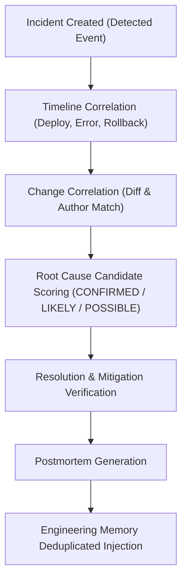

# WebForge OS — تقرير استخبارات الحوادث التشغيلية والتحليل الجذري (Phase 4 — Domain B Report)

## 1. ملخص تنفيذي (Executive Summary)
يوثق هذا التقرير نظام **استخبارات الحوادث التشغيلية (IncidentIntelligence)** المطور في المرحلة 4، والذي يحول إدارة الأخطاء من معالجة سطحية إلى دورة حياة كاملة تستند إلى الأدلة:
`Incident → Timeline → Signals → Changes → Failures → Dependencies → Root Cause Candidates → Impact → Recovery → Postmortem → Engineering Memory`.

---

## 2. نموذج الحادثة التشغيلية والخط الزمني (Incident Model & Timeline)

### حالات الخط الزمني (Timeline Statuses):
- **COMPLETE**: كافة الأحداث تحتوي على طوابع زمنية دقيقة بصيغة ISO-8601.
- **TIMELINE_INCOMPLETE**: توجد أحداث بدون طوابع زمنية واضحة، ويتم الإفصاح عن هذا النقص لمنع ادعاء الدقة الزائفة.
- **EMPTY**: لا توجد أحداث مسجلة بعد.

---

## 3. درجات الارتباط السببي مع التغييرات (Change Correlation Classification)

| نوع الارتباط (Correlation Type) | المعيار الإثباتي (Evidence Criteria) |
| :--- | :--- |
| **CAUSALITY_CONFIRMED** | تطابق المكون المتأثر وتطابق الملفات المعدلة مع وجود تغييرات أمنية أو خطيرة في الفروقات (Diff). |
| **COMPONENT_CORRELATION** | التغيير حدث في نفس المكون أو الخدمة المتأثرة بالحادثة. |
| **EVIDENCE_SUPPORTED** | وجود سجلات أو أدلة تشغيلية تربط الحادثة بالتغيير. |
| **TEMPORAL_CORRELATION** | حدوث التغيير في نافذة زمنية متقاربة قبل وقوع الحادثة دون ثبوت التداخل البرمجي المباشر. |

---

## 4. تقييم مرشحي الأسباب الجذرية (Root Cause Candidates Matrix)

| مستوى الثقة (Confidence Level) | الشروط البرمجية (Evaluation Condition) |
| :--- | :--- |
| **CONFIRMED** | وجود دليل مؤيد قاطع، غياب أي دليل مناقض، وإعادة إنتاج الخلل (Reproduced = true). |
| **LIKELY** | وجود دليل مؤيد مع عدم وجود دليل مناقض دون إعادة الإنتاج المعملي الكامل. |
| **POSSIBLE** | فرضية مبدئية استناداً لطبيعة الخطأ ولكن دون دليل مادي مباشر. |
| **INSUFFICIENT_EVIDENCE** | فرضية غير مدعومة بأي دليل ملموس. |

> **قاعدة الحقيقة المعمارية**: إذا لم يثبت سبب جذري مؤكد، يوثق التقرير صراحة:  
> `CONFIRMED ROOT CAUSE: NOT ESTABLISHED` لمنع اختلاق أسباب غير مثبتة.

---

## 5. تقرير ما بعد الحادثة (Structured Postmortem)
يوفر المحرك تقريراً هيكلياً يشمل:
- **Incident Summary & Impact**
- **Timeline & Detection Channel**
- **Confirmed Root Cause & Contributing Factors**
- **What Worked & What Failed**
- **Corrective Action Items & Regression Test Traces**
- **Preventive Controls & Memory Injection Key**

---

## 6. خلاصة التحقق والأدلة (Verification Summary)
- تم التحقق بنجاح من سيناريوهات الحوادث المعقدة وتوليد الـ Postmortem وحقن السجلات في الذاكرة الهندسية دون تكرار عبر حزمة `phase4-production-excellence.test.js`.
