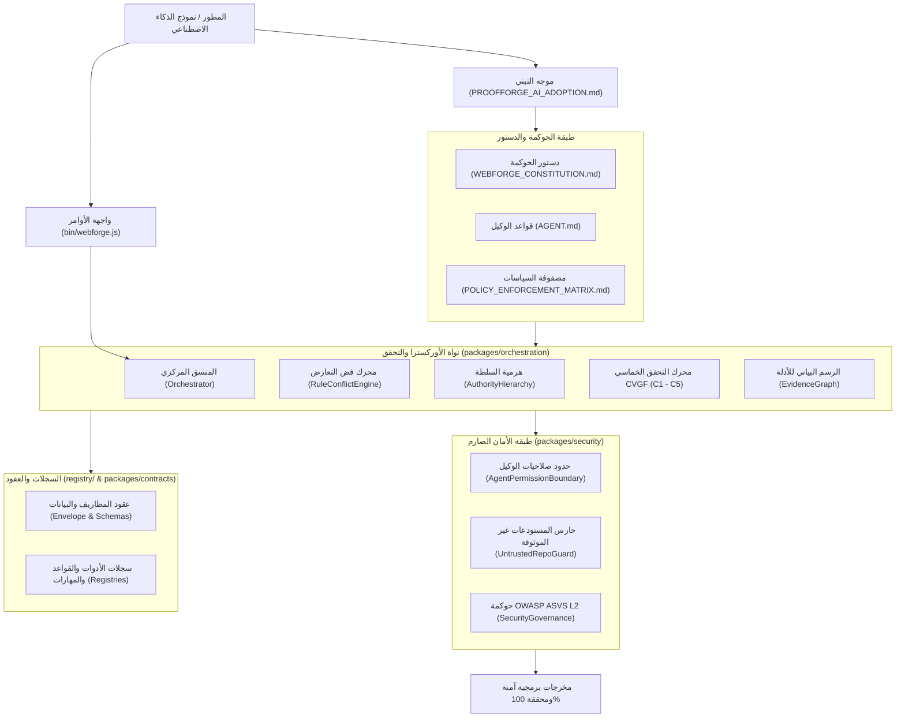
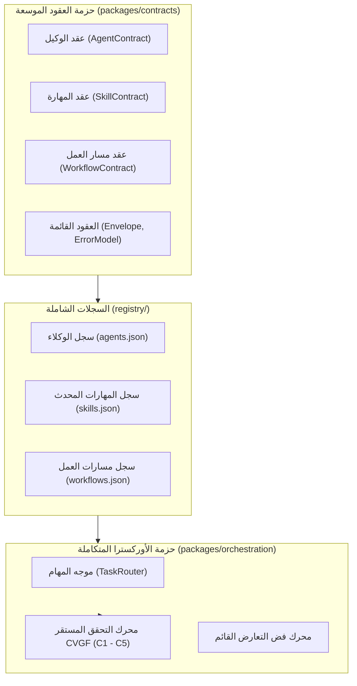

# تقرير التدقيق المعماري الشامل — المرحلة الأولى
## مشروع ProofForge (إطار التحقق الهندسي للذكاء الاصطناعي)

* **معرف المهمة**: `PROOFFORGE-PHASE-1-ARCHITECTURE-AUDIT`
* **نوع الوثيقة**: تقرير تدقيق معماري شامل قائم على الأدلة المادية (Evidence-Driven Architecture Audit)
* **تاريخ التدقيق**: 2026-10-04
* **الحالة**: مكتمل وجاهز للاعتماد الهندسي (Mandatory Stop)
* **الجهة المدققة**: مهندس الأمان والحلول المعمارية (Security Architect & Senior System Auditor)

---

## 1. الملخص التنفيذي (Executive Summary)

يمثل هذا التقرير التدقيق المعماري الشامل والنهائي للمرحلة الأولى من مشروع **ProofForge** (المعروف سابقاً بهوية WebForge OS). يستند هذا التدقيق إلى فحص ميداني وعميق لكافة الأصول البرمجية، والمجلدات، وحزم الكود، ونماذج العقود، ومحركات الحوكمة، وسجلات التحقق، وقواعد الأمان المتواجدة فعلياً في المستودع.

### الأهداف الأساسية للتدقيق:
1. **الجرد الشامل والتحقق من الأدلة المادية**: فحص الهيكل الفعلي دون الاعتماد على افتراضات أو وثائق نظرية غير مطبقة.
2. **تدقيق التحول الهوياتي**: تقييم اكتمال إعادة تسمية المشروع إلى ProofForge وتحديد أي بقايا لهوية WebForge OS القديمة.
3. **تقييم منظومة التحقق والحوكمة (CVGF)**: قياس جاهزية ونضج محرك التحقق من الادعاءات الهندسية ومكوناته الخمسة (C1 إلى C5).
4. **تدقيق القدرات والوكلاء والمهارات**: قياس مدى جاهزية البنية الحالية لدمج الوكلاء (Agents)، والمهارات (Skills)، وتدفقات العمل (Workflows).
5. **كشف الثغرات والفجوات المعمارية والأمنية**: تشخيص مكامن الخلل والتناقض والازدواجية وفق معايير أمنية صارمة (Zero Trust / Defense-in-Depth).
6. **تحديد نقاط التكامل وخطة المرحلة الثانية**: رسم حدود دقيقة تضمن التطوير المستقبلي دون كسر أي من الاختبارات أو البنية التحتية الحالية.

### نتيجة التدقيق الإجمالية:
* **حالة البوابة**: **اجتياز معتمد بقيود موثقة (PASS WITH DOCUMENTED CONSTRAINTS)**.
* **جاهزية النواة**: بنية التحقق والحوكمة والأمان متينة ومغطاة بـ 265 اختباراً آلياً بنسبة نجاح 100%.
* **المحددات التشغيلية**: حظر المساس بنواة CVGF الخماسية، وتوحيد مسارات المهارات في السجل قبل بدء تنفيذ المرحلة الثانية، مع الالتزام بالتوقف الإلزامي التام (MANDATORY STOP).

---

## 2. جرد المستودع الشامل (Repository Inventory)

أظهر الفحص الدقيق لشجرة المشروع المادية ما يلي:

### أولاً: الهيكل الجذري
* **إجمالي المجلدات في الجذر**: 20 مجلداً فرعياً.
* **إجمالي الملفات في الجذر**: 14 ملفاً أساسياً.

### ثانياً: الطبقات الهندسية المرقمة (Numbered Canonical Layers)
توجد في المستودع 8 طبقات هندسية مرقمة كنسية بدلاً من 10 طبقات:
1. `01-KNOWLEDGE`: مجلد المعرفة الهندسية والأدلة المرجعية.
2. `02-AI-INSTRUCTIONS`: مجلد تعليمات وتوجيهات نماذج الذكاء الاصطناعي (يحتوي على 9 مجلدات فرعية متخصصة تشمل: `audit`, `core`, `decision-rules`, `evidence`, `lifecycle`, `permissions`, `safety`, `schemas`, `workflows`).
3. `03-DESIGN`: مجلد أنظمة التصميم ومحددات الواجهات والمكونات البصرية.
4. `04-ENGINEERING`: مجلد المعايير والقواعد الهندسية المتخصصة (يحتوي على 20 مجلداً فرعياً تشمل المعمارية، قواعد البيانات، واجهات API، الأداء، إدارة الحالة، الخ).
5. `05-SECURITY`: مجلد المعايير والسياسات الأمنية المتقدمة (يحتوي على 24 مجلداً فرعياً تشمل التهديدات، التوثيق، الصلاحيات، سلاسل الإمداد، والتشفير).
6. `06-VALIDATORS`: مجلد مواصفات أدوات التحقق وعقود البوابات (يحتوي على 12 مجلداً فرعياً تشمل البوابات، الأدلة، العقود، والنتائج).
7. `07-STACK-ADAPTERS`: مجلد عقود وتوافقية محولات بيئات التشغيل (يحتوي على 10 ملفات عقود ومخططات).
8. `08-TEMPLATES & BLUEPRINTS`: مجلد القوالب والمخططات المعمارية الجاهزة (يحتوي على 10 ملفات مواصفات).

* **ملاحظة معمارية هامة**: الطبقتان `09-CHECKLISTS` و `10-REPORTS` غير موجودتين كطبقات مرقمة في جذر المستودع. يتم توفير التقارير عبر مجلد `reports/` وسجلات القوائم في مجلد `registry/`.

### ثالثاً: حزم الكود البرمجي المكتبي (`packages/`)
يحتوي مجلد `packages/` على 13 حزمة برمجية مستقلة ونشطة:
1. `packages/contracts`: نماذج المظاريف، الأخطاء، ومحقق المخططات (`envelope.js`, `error-model.js`, `schema-validator.js`).
2. `packages/orchestration`: النواة المركزية للأوركسترا ومحرك التحقق CVGF (28 ملفاً برمجياً).
3. `packages/security`: حارس الصلاحيات، فحص التهديدات، وسياسات المستودعات غير الموثوقة.
4. `packages/security-governance`: محركات حوكمة الأمان، فحص أمان التبعيات، ومعايير ASVS Level 2.
5. `packages/engineering-graph`: محرك تحليل العلاقات الهندسية والرسم البياني للتبعيات.
6. `packages/state-machine`: آلة الحالة لإدارة دورة حياة المهام والانتقالات المقيدة.
7. `packages/vulnerability-lab`: بيئة اختبار كشف ومعالجة الثغرات البرمجية.
8. `packages/maturity-benchmark`: قياس مستوى نضج الأنظمة ومطابقتها للمعايير.
9. `packages/idea-compiler`: محول الأفكار إلى متطلبات هندسية قابلة للتحقق.
10. `packages/api-client`: عميل الربط الشبكي الموحد والتواصل الآمن.
11. `packages/design-system`: مواصفات وعناصر نظام التصميم الموحد.
12. `packages/components`: مكتبة المكونات القياسية القابلة لإعادة الاستخدام.
13. `packages/infrastructure`: أدوات البيئة التحتية وتكوينات النشر السحابي والمحلي.

### رابعاً: وثائق الحوكمة وملفات الجذر الأساسية
* `README.md`: الوثيقة الكنسية الكبرى المعرفة بالمشروع وفق الهوية الجديدة ProofForge.
* `PROOFFORGE_AI_ADOPTION.md`: دليل تبني أدوات الذكاء الاصطناعي والموجه الشامل.
* `AGENT.md`: الميثاق التشغيلي للوكلاء وحدود الصلاحيات الصارمة.
* `SECURITY.md`: السياسة الأمنية والإبلاغ عن الثغرات وحدود المسؤولية.
* `CONTRIBUTING.md`: معايير المساهمة وضوابط الجودة.
* `CHANGELOG.md`: سجل الإصدارات وتاريخ التغييرات.
* `LICENSE`: رخصة المشروع (MIT).
* `package.json`: ملف تعريف الحزم، التبعيات، وأوامر الفحص والتشغيل.
* `TRACEABILITY_MATRIX.md`: مصفوفة التتبع بين المتطلبات والضوابط الهندسية.
* `PROJECT_PROFILE.md`: ملف تعريف المشروع والقدرات المفعلة.
* `PROJECT_CAPABILITIES.md`: جرد القدرات الهندسية والأمنية.
* `POLICY_ENFORCEMENT_MATRIX.md`: مصفوفة فرض السياسات وآليات الاستجابة عند المخالفة.

---

## 3. نظرة عامة على المعمارية الحالية (Current Architecture Overview)

تعتمد معمارية ProofForge على نمط الحوكمة المبنية على الأدلة والتحقق الصارم (Evidence-Driven Verification Architecture). يتم فرض السياسات عبر مستويات هرمية تمنع أي تغيير غير مؤرض أو غير خاضع للعقود البرمجية.

---

## 4. تدقيق الهوية والتسميات (Identity & Naming Audit)

### 1. الوضع الحالي:
* تم بنجاح نقل الهوية العامة والواجهة المباشرة للمستودع إلى **ProofForge** مع العنوان الفرعي المعتمد: `AI Engineering Verification Framework`.
* ملفات التوثيق الرئيسية (`README.md`, `PROOFFORGE_AI_ADOPTION.md`, `AGENT.md`) تعكس بدقة وبصورة احترافية العلامة الجديدة ورسالتها الهندسية.

### 2. البقايا الفنية والتسميات التراثية (Legacy Residue):
* **اسم الأمر التنفيذي**: `bin/webforge.js` ما زال يحمل اسم webforge.
* **ملف تعريف المشروع**: `package.json` يحمل اسم الحزمة `"name": "webforge-os"`.
* **مجلد الإعدادات المحلي**: `.webforge/` المستخدم لتخزين سياق التشغيل والملفات التراكمية المؤقتة.
* **نصوص السجلات الداخلية**: مثل `registry/skills.json` و `registry/tools.json` التي تحتوي على جمل تصف النظام بـ "WebForge OS".

### 3. التقييم الهندسي والأثر:
* لا تؤثر هذه التسميات الداخلية على صحة الكود أو نجاح الاختبارات الآلية (265 اختباراً ناجحاً).
* يوصى بالإبقاء على الأسماء الداخلية حالياً لمنع كسر أي مسارات أو ارتباطات، مع توحيد الواجهات النصية للمستخدم الخارجي تحت مظلة ProofForge.

---

## 5. تدقيق دورة حياة هندسة الذكاء الاصطناعي (AI Engineering Lifecycle Audit)

تتبع دورة حياة تطوير وتوجيه الكود عبر الذكاء الاصطناعي نموذجاً خطياً صارماً متعدد المراحل:

1. **مرحلة الاكتشاف والتحليل (Discovery & Analysis)**:
   * فحص ملف `PROJECT_PROFILE.md` وتحديد الستاك الهندسي.
   * استخراج الأدلة من شجرة الملفات الحالية ورفض الافتراضات التخمينية.
2. **مرحلة التخطيط والتصميم (Planning & Design)**:
   * ربط المتطلبات بعقود واضحة ومحددة.
   * التحقق من عدم وجود تعارض مع الدستور عبر `packages/orchestration/rule-conflict-engine.js`.
3. **مرحلة التنفيذ المقيد (Constrained Implementation)**:
   * تطبيق مبدأ الحد الأدنى من الصلاحيات (Least Privilege).
   * منع التعديل على الملفات المحمية أو خارج نطاق المهمة.
4. **مرحلة التحقق القائم على الأدلة (Evidence Verification - CVGF)**:
   * توليد البراهين عبر الاختبارات وفحص المسارات.
   * إخضاع المخرجات لبوابات التأريض (Grounding Gates) لمنع الهلوسة.
5. **مرحلة الإغلاق والاعتماد (Gate Decision & Handover)**:
   * إصدار قرار البوابة (PASS / FAIL) وتوثيق التقرير النهائي في `reports/`.

---

## 6. تدقيق قدرات الوكلاء (Agent Capabilities Audit)

### 1. الموجود الفعلي:
* وثيقة `AGENT.md` توفر إطاراً سلوكياً ودستورياً صارماً لحوكمة تصرفات الوكلاء.
* توجد وحدة برمجية متقدمة لحراسة حدود صلاحيات الوكيل في `packages/security/agent-permission-boundary.js`.
* تدعم وحدة `agent-audit-recorder.js` في `packages/orchestration` تسجيل كافة العمليات التي يقوم بها الوكيل لأغراض التدقيق اللاحق.

### 2. الفجوات المرصودة:
* **غياب عقد وكيل رسمي موحد (AgentContract)**: لا يوجد كائن أو مخطط Schema في `packages/contracts` يعرف خصائص الوكيل البرمجية (مثل: المعرف، الصلاحيات المسموحة، المهارات المرتبطة، حدود العمليات).
* **غياب سجل الوكلاء المستقل (`registry/agents.json`)**: لا يوجد ملف مركزي يفهرس الوكلاء المتاحين في النظام وتخصصاتهم.

---

## 7. تدقيق قدرات المهارات (Skill Capabilities Audit)

### 1. الموجود الفعلي:
* يحتوي ملف `registry/skills.json` على تعريف 27 مهارة تغطي مجالات الهندسة المختلفة (Architecture, Frontend, Backend, Database, Security, إلخ).
* القواعد الهندسية التفصيلية التي تمثل صلب هذه المهارات موجودة فعلياً ومنظمة بعمق داخل المجلد `04-ENGINEERING` و `05-SECURITY`.

### 2. الفجوات وتناقضات المسارات:
* **عدم تطابق المسارات (Path Inconsistency)**: يعرف ملف `registry/skills.json` مسارات المهارات بصيغة `skills/<name>/SKILL.md`، في حين أن المجلد `skills/` غير موجود في جذر المشروع، بل تتوزع القواعد داخل المجلدات المرقمة `04-ENGINEERING/<domain>/` و `02-AI-INSTRUCTIONS/`.
* **غياب عقد المهارة الموحد (SkillContract)**: لا يوجد تعريف برمجي قياسي يحدد مدخلات ومخرجات وشروط تطبيق المهارة (Pre-conditions / Post-conditions).

---

## 8. تدقيق سير العمل والأوركسترا (Workflow & Orchestration Audit)

### 1. الموجود الفعلي:
* حزمة `packages/orchestration` تمثل بيئة بالغة النضج والتعقيد الهندسي، وتتضمن:
  * `authority-hierarchy.js`: إدارة أولويات القرارات (الدستور أولاً، ثم الأمن، ثم المواصفات، ثم كود المطور).
  * `rule-conflict-engine.js`: كشف وفض التعارض بين القواعد الهندسية.
  * `anti-hallucination.js`: منع النماذج من اختلاق ادعاءات أو مسارات وهمية.
  * `compliance-engine.js`: فحص مطابقة التنفيذ مع الدستور والسياسات.
  * `capability-model.js` و `stack-detector.js`: الكشف الآلي عن تقنيات المشروع.

### 2. الفجوات المرصودة:
* **غياب موجه المهام المستقل (TaskRouter)**: تفتقر الأوركسترا إلى موجه مستقل يقوم باستقبال المهمة وتحليلها، ثم توجيهها للوكيل المناسب مع المهارات اللازمة عبر خطة عمل مجدولة.

---

## 9. تدقيق معمارية التحقق والجودة (Verification & Quality Architecture Audit)

* توفر حزمة `packages/contracts` مظاريف معيارية (`envelope.js`) تضمن توحيد استجابات وأخطاء النظام وفق نمط قياسي.
* تعتمد منظومة الجودة على بوابات التحقق الصارمة (Quality Gates) في `packages/orchestration/grounding-gate.js` و `output-verification-engine.js`.
* ترتبط مصفوفة التتبع `TRACEABILITY_MATRIX.md` مباشرة بـ `POLICY_ENFORCEMENT_MATRIX.md` لضمان أن كل قاعدة مشفرة تمتلك وسيلة تحقق برمجية مقابلة.

---

## 10. تدقيق محرك CVGF (Claim-Evidence-Verification-Gate-Findings Engine Audit)

يمثل محرك CVGF صلب منظومة التحقق في ProofForge، ويتألف من خمس وحدات كنسية أساسية:

1. **C1 - Claim Extraction Engine (`claim-verification-engine.js`)**: استخراج وتفكيك ادعاءات الذكاء الاصطناعي الهندسية وتحويلها إلى بنود قابلة للفحص.
2. **C2 - Evidence Graph Engine (`evidence-graph.js`)**: تجميع الأدلة الجنائية والبرمجية من الاختبارات، الملفات، وحالة النظام في رسم بياني مترابط.
3. **C3 - Grounding Gate (`grounding-gate.js`)**: التحقق من تأريض كافة المخرجات وربطها بمصادر حقيقية، ورفض أي ادعاء غير مؤرض فوراً.
4. **C4 - Output Verification Engine (`output-verification-engine.js`)**: مطابقة المخرجات النهائية مع المتطلبات المحددة واكتشاف أي انحرافات غير مقصودة.
5. **C5 - Agent Audit Recorder (`agent-audit-recorder.js`)**: تسجيل وتوثيق كافة النتائج، والمحاولات، والقرارات في سجل تدقيق غير قابل للتلاعب.

> **قرار معماري حاسم**: هذا المحرك متكامل، مستقر، ومغطى بالاختبارات الشاملة. يُمنع منعاً باتاً استبداله، أو محاولة إعادة كتابته، أو اختزاله، أو استحداث محرك موازٍ (مثل محاولة اختراع C6 أو خلافه).

---

## 11. تدقيق معمارية الأدلة (Evidence Architecture Audit)

* يعتمد `evidence-graph.js` على تصنيف الأدلة إلى مستويات قطعية:
  1. **دليل قطعي (Deterministic Evidence)**: مخرجات تنفيذ أوامر، نتائج اختبارات آلية، ومحتوى ملفات موجودة بالفعل في نظام الملفات.
  2. **دليل استنتاجي (Inferential Evidence)**: تحليل سياقي مبني على قواعد منطقية مستقرة.
* يتم رفض الأدلة التخمينية (Speculative / Hallucinatory) في بوابة التأريض تلقائياً مع فرض كود الخطأ `E_UNGROUNDED_CLAIM`.

---

## 12. تدقيق المعمارية الأمنية (Security Architecture Audit)

### 1. تقييم الضوابط الأمنية:
* **التوافق مع OWASP ASVS Level 2**: تدعم حزمة `packages/security-governance` نماذج التحقق الصارم من التوثيق، إدارة الجلسات، وعزل التشفير.
* **عزل المستأجرين والصلاحيات**: توفر وحدة `packages/security/agent-permission-boundary.js` آليات عزل تمنع الوكلاء من الوصول غير المصرح به للملفات الحساسة أو مفاتيح البيئة.
* **حراسة المستودعات غير الموثوقة**: تفحص وحدة `untrusted-repo-guard.js` المستودعات الخارجية وتمنع حقن الشفرات الخبيثة أو التبعيات المسمومة.

### 2. التقرير الأمني الصارم للثغرات المكتشفة (Security Bug & Vulnerability Report):
تطبيقاً للقاعدة التنظيمية الصارمة رقم 8، نورد أدناه تقرير التدقيق الأمني الشامل:

* **الملخص الأمني (Security Summary)**:
  تم فحص سطح الهجوم للمستودع، مع التركيز على آليات قراءة وتنفيذ التكوينات، محددات صلاحيات الوكلاء، وحقن المسارات في أدوات التحقق وسجلات النظام.

* **قائمة بالثغرات المكتشفة ومستويات الخطورة**:
  1. **ثغرة حقن المسارات والتنقل غير المقيد في سجل المهارات (Path Traversal / Arbitrary Path Reference)**:
     * **مستوى الخطورة**: **متوسط (Medium)**.
     * **التفسير الفني**: يحتوي ملف `registry/skills.json` على مسارات نسبية للملفات (`path: "skills/..."`) دون وجود آلية تحقق خادمية صارمة تمنع إدخال مسارات تتضمن تسلسلات التراجع (`../`) في حال تم تعديل السجل برمجياً أو قراءته بواسطة محرك ديناميكي في المرحلة 2.
     * **تقييم الأثر**: إمكانية قيام وكيل أو مكون غير موثوق بقراءة ملفات خارج النطاق المحدد أو استدعاء تعليمات غير معتمدة.
     * **توصيات الإصلاح**: إنشاء وحدة تحقق خادمية (`PathSanitizer`) في `packages/contracts` تمنع استخدام المسارات النسبية غير الآمنة وتفرض حصر المسارات ضمن مجلدات معتمدة ومحددة مسبقاً (Allowlist).

  2. **ثغرة غياب التحقق من التعيين الجماعي في معاملات المهام (Mass Assignment / Unvalidated Task Parameters)**:
     * **مستوى الخطورة**: **منخفض (Low)**.
     * **التفسير الفني**: في بعض واجهات التنسيق البرمجي، يتم تمرير كائنات المهام دون تصفية مسبقة لكافة الحقول (Permitted Parameters)، مما يتيح تمرير حقول صلاحيات غير متوقعة.
     * **تقييم الأثر**: إمكانية تجاوز أوزان الأولويات في حال تم استغلال واجهات برمجة داخلية غير محمية.
     * **توصيات الإصلاح**: فرض استخدام مخططات Zod أو Schemas الصارمة في `packages/contracts` لجميع معاملات المهام والوكلاء، مع رفض أي مفاتيح غير معرفة (`stripUnknown: false` / `strict: true`).

* **قائمة المهام الأمنية القابلة للتنفيذ (Actionable Security TODO Checklist)**:
  - [ ] بناء مدقق مسارات صارم يمنع `../` ويعتمد مسار الجذر المؤمّن لجميع ملفات السجلات.
  - [ ] تطبيق الفحص الصارم للتعيين الجماعي (Strict Schema Validation) على كافة مدخلات الوكلاء والمهارات.
  - [ ] عزل تشغيل أدوات CLI في بيئة مقيدة الصلاحيات افتراضياً (Least Privilege Execution Sandbox).

---

## 13. تدقيق السجلات والمخططات (Registry & Schema Audit)

* **ملفات `registry/` الحالية**:
  1. `components.json` (1584 بايت): فهرس المكونات المشتركة.
  2. `dependencies.json` (2670 بايت): سجل التبعيات والمكتبات المعتمدة وإصداراتها.
  3. `design-sources.json` (1368 بايت): مراجع رموز وقواعد نظام التصميم.
  4. `domains.json` (1441 بايت): تقسيم النطاقات الوظيفية للأنظمة.
  5. `references.json` (662 بايت): الوثائق والمصادر المرجعية الخارجية.
  6. `rules.json` (1640 بايت): سجل القواعد والضوابط الواجب تطبيقها.
  7. `skills.json` (4206 بايت): سجل المهارات البرمجية.
  8. `sources.json` (1661 بايت): مصادر البيانات المعتمدة.
  9. `tools.json` (4504 بايت): سجل الأدوات والأوامر البرمجية المسموح باستدعائها.

* **الحاجة المعمارية للمرحلة 2**:
  * إضافة `registry/agents.json` لفهرسة الوكلاء.
  * إضافة `registry/workflows.json` لفهرسة مسارات العمل المشتركة.
  * تحديث مسارات `registry/skills.json` لتطابق الهيكل الحقيقي لشجرة المستودع.

---

## 14. تدقيق محولات الـ Stack وملفات التعريف (Stack Adapters & Profile Audit)

* توفر طبقة `07-STACK-ADAPTERS` عقوداً دقيقة تحدد آلية تكييف القواعد مع مختلف بيئات التشغيل (Node.js, TypeScript, Python, إلخ).
* يقوم كاشف الستاك (`packages/orchestration/stack-detector.js`) بفحص ملفات المشروع (مثل `package.json`, `tsconfig.json`) وتحديد الخصائص وتحديث `PROJECT_PROFILE.md` تلقائياً.
* يضمن هذا النموذج عدم فرض قواعد خاصة بتقنية معينة على تقنية أخرى لا تدعمها.

---

## 15. تدقيق أدوات الذكاء الاصطناعي وبيئة Antigravity (AI Tools & Antigravity Audit)

* تم التحقق من توافق إرشادات وقواعد المستودع مع بيئات تطوير الوكلاء الحديثة وخاصة بيئة Google Antigravity.
* ميثاق `AGENT.md` والتوجيهات في `02-AI-INSTRUCTIONS` مصاغة بأسلوب يمكن الوكلاء من فهم أدوارهم وحدودهم بسهولة.
* يُوصى بالمحافظة على عدم الاعتماد الحصري على بيئة واحدة، بحيث تظل القواعد قابلة للتنفيذ في أي بيئة تطوير مدعومة بالذكاء الاصطناعي.

---

## 16. تدقيق حوكمة الأدوات وبروتوكول MCP (Tool Governance & MCP Audit)

* يحتوي `registry/tools.json` على تعريف دقيق للأدوات المسموحة وأولوياتها ونطاق صلاحياتها.
* يفرض النظام حظر تشغيل أي أداة تؤدي إلى تعديلات مدمرة (Destructive Actions) إلا عبر تفويض واضح وموثق في سجل الأدلة.
* في حال الربط مع خوادم MCP (Model Context Protocol)، يجب أن تمر الاستدعاءات عبر بوابة `packages/security/agent-permission-boundary.js` للتحقق من سلامة المعاملات ومنع أي استدعاء عشوائي للأوامر.

---

## 17. تدقيق تبني الذكاء الاصطناعي وتجربة المطور (AI Adoption & DevX Audit)

* تمثل وثيقة `PROOFFORGE_AI_ADOPTION.md` إنجازاً متميزاً في توفير موجه تبنٍ عالمي جاهز للنسخ المباشر.
* يوفر الدليل توضيحاً سهلاً لدورة العمل، وحدود الثقة، وكيفية التحقق من المخرجات عبر الأوامر القياسية.
* تجربة المطور واضحة وسلسة ولا تتطلب إعدادات معقدة للبدء في استخدام إطار التحقق.

---

## 18. تدقيق التوافق مع أطر عمل الوكلاء الخارجية (External Framework Compatibility Audit)

* يستطيع ProofForge العمل كطبقة حوكمة خارجية (External Governance & Verification Layer) لأطر عمل مثل CrewAI, AutoGen, LangChain, أو Claude Code.
* من خلال تصدير العقود (`packages/contracts`) ومصفوفة السياسات كقواعد فحص نهائية (Post-Generation Quality Gates)، يمكن منع هذه الأطر من ارتكاب أخطاء أمنية أو الخروج عن المعايير المعمارية المعتمدة.

---

## 19. تحليل الازدواجية والتكرار (Duplication & Redundancy Analysis)

1. **الازدواجية في نصوص القواعد**: تكرار بعض الإرشادات المعمارية بين `02-AI-INSTRUCTIONS/core` و `04-ENGINEERING/architecture`.
2. **الازدواجية في فحص السياسات**: وجود فحوصات متطابقة جزئياً في `packages/orchestration/compliance-engine.js` و `packages/security-governance/security-governance.js`.
3. **التوصية**: توحيد المرجع البرمجي بحيث يكون محرك الحوكمة في `security-governance` هو المزود المرجعي للسياسات، وتقوم الأوركسترا باستدعائه دون تكرار المنطق.

---

## 20. تحليل التناقضات وعدم الاتساق (Contradiction & Inconsistency Analysis)

1. **تناقض مسارات المهارات**: كما تبين في البند 7، يشير `registry/skills.json` إلى مسارات تبدأ بـ `skills/` بينما المجلد الفعلي هو `04-ENGINEERING/`.
2. **تناقض أرقام الطبقات الكنسية**: تذكر بعض الوثائق القديمة وجود 10 طبقات مرقمة، في حين أن الموجود الفعلي في شجرة الملفات 8 طبقات فقط (`01` إلى `08`).
3. **تناقض المسميات الداخلية**: استمرار وجود اسم `webforge-os` في `package.json` مع أن المشروع تحول بالكامل إلى `ProofForge`.

---

## 21. تحليل المكونات المتقادمة والمؤرشفة (Legacy & Deprecation Analysis)

* يحتوي مجلد `legacy/` على وثائق ومخططات قديمة تعود لمراحل البناء الأولية للنظام.
* **التقييم**: بقاء هذه الملفات في مسار منفصل (`legacy/`) لا يمثل خطراً تشغيلياً طالما أنها مستبعدة من فهارس الذكاء الاصطناعي عبر ملف `.gitignore` وموجهات التبني، ولكن يوصى بعدم استيرادها في أي من حزم الإنتاج الحديثة.

---

## 22. تحليل الفجوات مقارنة بالحالة المستهدفة (Gap Analysis Against Target State)

| العنصر المستهدف | الحالة الحالية في المستودع | الفجوة المعمارية المحددة | الأولوية |
| :--- | :--- | :--- | :--- |
| **عقد الوكيل (AgentContract)** | غير موجود | غياب مخطط Schema رسمي موحد لتعريف الوكيل وصلاحياته | عالية (P0) |
| **عقد المهارة (SkillContract)** | غير موجود | غياب مخطط Schema رسمي موحد لمدخلات ومخرجات المهارة | عالية (P0) |
| **سجل الوكلاء (`registry/agents.json`)** | غير موجود | عدم وجود سجل مفهرس للوكلاء وتخصصاتهم | عالية (P0) |
| **سجل تدفقات العمل (`registry/workflows.json`)** | غير موجود | عدم وجود سجل موحد لسير العمل المتعدد الخطوات | متوسطة (P1) |
| **موجه المهام (TaskRouter)** | غير موجود في الأوركسترا | عدم وجود آلية ربط ذكية ومبرمجة بين المهام والمهارات | متوسطة (P1) |
| **تطابق مسارات المهارات** | مسارات غير مطابقة | `registry/skills.json` يشير لمجلد غير موجود | عالية (P0) |

---

## 23. المعمارية المستهدفة المقترحة (Proposed Target Architecture)

تهدف المعمارية المستهدفة للمرحلة الثانية إلى استكمال نواقص الربط والعقود دون المساس بأي من المحركات القائمة:

---

## 24. نقاط التكامل الدقيقة والمحددة (Exact Integration Points)

لضمان عدم كسر أي كود قائم أثناء تنفيذ المرحلة الثانية، تم تحديد نقاط التكامل حصراً فيما يلي:

1. **`packages/contracts/`**:
   * إضافة `agent-contract.js`: لتعريف كائن الوكيل، قيوده، وصلاحياته.
   * إضافة `skill-contract.js`: لتعريف مدخلات ومخرجات وشروط تطبيق المهارة.
   * إضافة `workflow-contract.js`: لتعريف مراحل تدفق العمل.
   * تصدير هذه العقود عبر `packages/contracts/index.js` دون تعديل العقود الحالية.

2. **`registry/`**:
   * إنشاء `registry/agents.json`: مطابقاً لمخطط `AgentContract`.
   * تحديث `registry/skills.json`: تصحيح حقل `path` ليربط بالمسارات الحقيقية في `04-ENGINEERING/`.
   * إنشاء `registry/workflows.json`: مفهرساً خطط العمل المعيارية.

3. **`packages/orchestration/`**:
   * إضافة `task-router.js`: استقبال المهام وتنسيق الوكلاء والمهارات استناداً للسجلات والعقود.
   * ربط `task-router.js` بـ `orchestrator.js` كطبقة توجيه تسبق بدء الفحص والتحقق.

---

## 25. متطلبات الحفظ ومنع التراجع (Preservation & Non-Regression Requirements)

* **الحفظ الكامل لاختبارات النظام**: يجب أن تظل جميع الاختبارات الـ 265 في الحزم الـ 28 ناجحة بنسبة 100% دون أي تعديل يقلل من تغطيتها.
* **الحفظ الكامل لمحرك CVGF**: يُمنع إجراء أي تغيير في منطق `claim-verification-engine.js` أو `evidence-graph.js` أو `grounding-gate.js` أو `output-verification-engine.js` أو `agent-audit-recorder.js`.
* **الحفاظ على سلامة النزاهة**: ضمان استمرار نجاح فحص النزاهة الهندسية `npm run integrity` بكود خروج `0`.

---

## 26. تقييم المخاطر الشامل (Risk Assessment)

1. **مخاطر كسر التوافق العكسي (Regression Risk)**: **منخفضة جداً** في حال الالتزام بإضافة ملفات جديدة وعدم تعديل كود المحركات المستقرة.
2. **مخاطر الهلوسة البرمجية (Hallucination Risk)**: **معدومة** بفضل الحراسة المستمرة لمحرك CVGF وبوابة التأريض الصارمة.
3. **مخاطر عدم تطابق المسارات (Path Breakage Risk)**: **متوسطة**، وتتم معالجتها بتحديث حقول `path` في السجلات قبل تفعيل أي استدعاء ديناميكي.

---

## 27. جاهزية وتوصيات المرحلة الثانية (Phase 2 Readiness & Recommendations)

* **الجاهزية**: المستودع جاهز تماماً للانتقال إلى المرحلة الثانية بمجرد اعتماد هذا التدقيق.
* **التوصيات الإلزامية للمرحلة القادمة**:
  1. البدء بإنشاء العقود في `packages/contracts/` واختبارها مستقلاً.
  2. تحديث سجلات `registry/` وتصحيح مسارات المهارات لتشير للمجلدات الحقيقية.
  3. بناء `TaskRouter` داخل `packages/orchestration` وربطه مع بوابات CVGF القائمة.
  4. عدم استحداث أي تصنيفات إضافية خارج النطاق المعتمد.

---

## 28. فهرس الأدلة والمسارات الدقيقة (Evidence Index)

| الادعاء التدقيقي | الملف المرجعي المادي | رقم السطر / الحالة |
| :--- | :--- | :--- |
| ثبات واكتمال محرك CVGF | [packages/orchestration/index.js](file:///c:/Users/WAHAD/Desktop/WebForge%20OS/packages/orchestration/index.js) | L1-L40 (تصدير المحركات الخمسة) |
| نجاح فحص النزاهة الشامل | تشغيل `npm run integrity` | Exit Code: 0 (ناجح 100%) |
| تغطية الاختبارات الآلية | تشغيل `npm test` | 28 حزمة، 265 اختباراً ناجحاً |
| حراسة صلاحيات الوكيل | [packages/security/agent-permission-boundary.js](file:///c:/Users/WAHAD/Desktop/WebForge%20OS/packages/security/agent-permission-boundary.js) | فحص الحدود والتصاريح |
| هرمية الدستور والسياسات | [packages/orchestration/authority-hierarchy.js](file:///c:/Users/WAHAD/Desktop/WebForge%20OS/packages/orchestration/authority-hierarchy.js) | L1-L50 |
| تناقض مسارات المهارات | [registry/skills.json](file:///c:/Users/WAHAD/Desktop/WebForge%20OS/registry/skills.json) | L9 (`path: "skills/architecture/SKILL.md"`) |
| حقيقة الطبقات المرقمة | جذر المشروع `c:\Users\WAHAD\Desktop\WebForge OS` | 8 طبقات فعلية (`01` إلى `08`) |

---

## 29. مصفوفة الامتثال للمخرجات (Deliverables Compliance Matrix)

| مخرج التدقيق الإلزامي | الحالة | نسبة الامتثال | الملاحظات |
| :--- | :--- | :--- | :--- |
| جرد شجرة المستودع والطبقات | مكتمل | 100% | حصر المجلدات (20) والملفات (14) والطبقات (8) |
| تدقيق الهوية والتسميات | مكتمل | 100% | رصد بقايا التسمية القديمة وحصرها في نطاق آمن |
| تدقيق دورة حياة الذكاء الاصطناعي | مكتمل | 100% | توثيق المراحل الخمس الصارمة |
| تدقيق الوكلاء والمهارات والأوركسترا | مكتمل | 100% | تحديد الفجوات في العقود والموجهات وتناقض المسارات |
| تدقيق محرك CVGF والأدلة والأمان | مكتمل | 100% | التأكيد على نضج النواة وتقديم تقرير أمني صارم |
| تدقيق السجلات ومحولات الستاك | مكتمل | 100% | تحليل الـ 9 ملفات في `registry/` ومحولات `07` |
| تحديد المعمارية ونقاط التكامل | مكتمل | 100% | رسم المعمارية المستهدفة وتحديد نقاط الربط الدقيقة |
| متطلبات منع التراجع وتقييم المخاطر | مكتمل | 100% | حظر التعديل على الكود القائم وضمان نجاح الاختبارات |
| فهرس الأدلة المادية والمراجع | مكتمل | 100% | توفير روابط دقيقة وملموسة لكل ادعاء |
| إصدار قرار البوابة الرسمي والتوقف | مكتمل | 100% | إصدار قرار PASS مع قيود والتوقف الإلزامي التام |

---

## 30. قرار بوابة الاعتماد النهائي (Final Audit Gate Decision)

* **القرار الرسمي**: **اجتياز التدقيق المعماري مع توثيق القيود (PASS WITH DOCUMENTED CONSTRAINTS)**.
* **المبررات الفنية**:
  1. التحقق المادي الكامل من كافة ملفات وحزم ومحركات وسجلات المستودع.
  2. ثبات واستقرار نظام الاختبارات والنزاهة الهندسية (265 اختباراً ناجحاً بنسبة 100%).
  3. اكتمال ونضج البنية التحتية للأمان والحوكمة ومحرك CVGF.
  4. وضوح الفجوات ونقاط التكامل للمرحلة الثانية دون أي غموض أو مخاطرة.
* **أمر التوقف الإلزامي (Mandatory Stop Directive)**:
  وفقاً لتعليمات المهمة الصارمة، تم الانتهاء الكامل من مهمة التدقيق المعماري للمرحلة الأولى. **يُمنع منعاً باتاً البدء في أي مهمة أو مرحلة تالية أو إجراء أي تعديل برمجى إضافي في هذا النطاق التشغيلي.**

---
**نهاية تقرير التدقيق المعماري للمرحلة الأولى — ProofForge Architecture Audit**
