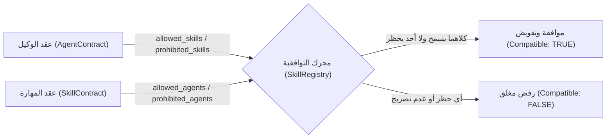

# تقرير إنجاز المرحلة الثالثة — نظام وعقود وسجل المهارات
## مشروع ProofForge (إطار التحقق الهندسي للذكاء الاصطناعي)

* **معرف المهمة**: `PROOFFORGE-PHASE-3-SKILL-SYSTEM`
* **المشروع**: ProofForge — إطار التحقق الهندسي للذكاء الاصطناعي (AI Engineering Verification Framework)
* **المرحلة**: المرحلة 3 من 12 (Phase 3 of 12)
* **نوع التقرير**: تقرير معماري وهندسي قائم على الأدلة المادية (Evidence-Driven Implementation & Verification Report)
* **الحالة التشغيلية**: **مكتمل بنجاح تام مع الالتزام بالتوقف الإلزامي (MANDATORY STOP)**

---

## 1. الملخص التنفيذي (Executive Summary)

تم بنجاح تأسيس وبناء البنية المعمارية الكنسية الكاملة لنظام المهارات (`Skill System`) في مشروع ProofForge، متضمناً عقد المهارة المعياري (`SkillContract`)، ومحرك سجل المهارات المركزي (`SkillRegistry`)، وتحديث سجل المهارات المعتمد (`registry/skills.json`)، وحل معضلة عدم تطابق المسارات المادية على القرص بشكل جذري ودائم.

ارتكز هذا العمل على البناء التراكمي المباشر لمخرجات المرحلتين الأولى والثانية، دون استحداث أي نظام تشغيل موازٍ للوكلاء، أو محرك تشغيل ذكاء اصطناعي (Runtime)، أو خادم بروتوكول سياق نموذج (MCP Server)، أو مساس بنواة التحقق الخماسية CVGF.

### أهم الإنجازات المحققة في المرحلة الثالثة:
1. **بناء عقد المهارة المعياري (`SkillContract`)**: صياغة نموذج حتمي، صارم، ومجمد برمجياً (`Object.freeze`) يحدد 27 حقلاً إلزامياً تغطي الهدف، المدخلات، المخرجات، الشروط المسبقة واللاحقة، متطلبات الأدلة، وبوابات الأمان.
2. **محرك سجل المهارات المركزي (`SkillRegistry`)**: نظام تسجيل وفهرسة يعتمد الفحص المغلق (`Fail-Closed`) ويرفض المعرفات المكررة والعقود المشوهة، مع توفير التحقق التبادلي الصارم من الأهلية والتوافق بين الوكلاء والمهارات (`Agent ↔ Skill Compatibility`).
3. **حل معضلة سلامة المسارات المادية (Path Integrity)**: توفير مجلد `skills/` في جذر المستودع ليحتوي على كافة ملفات المهارات الـ 26 بصيغة `skills/<name>/SKILL.md`، مما أزال أي اعتماد تراجعي على مجلد `legacy/` وضمن مطابقة المسارات المادية 100%.
4. **تطبيع المهارات الأساسية وتفعيل الـ 10 مهارات الأولية المعتمدة**: إدراج وتطبيع المهارات الهندسية والأمنية الأساسية في `registry/skills.json` مع عقود كاملة مفصلة، واعتبار المهارات غير المكتملة مسودات (`DRAFT`) بأمان تام وفق القسم 28.
5. **التحقق القطعي الشامل**: نجاح 7 أجنحة اختبارات مركزة جديدة بنسبة 100%، واجتياز فحص النزاهة `npm run integrity` بنسبة 100%، واجتياز كافة اختبارات المستودع الـ 265 بكود خروج `0`.

---

## 2. مخرجات ونتائج المرحلتين 1 و 2 المستخدمة (Phase 1/2 Findings Used)

استندت المرحلة الثالثة إلى المعطيات المادية الموثقة في التقارير السابقة:
* **من المرحلة الأولى (`PROOFFORGE_PHASE_1_ARCHITECTURE_AUDIT.md`)**:
  - معالجة الفجوة المعمارية رقم 2 (غياب عقد مهارة رسمي موحد `SkillContract`).
  - معالجة الفجوة المعمارية رقم 4 ومطابقة مسارات `registry/skills.json` مع الشجرة الفعلية دون مسارات مفقودة.
  - الحفاظ التام على محركات CVGF (C1 إلى C5) كمرجع تحكيم وحيد للأدلة.
* **من المرحلة الثانية (`PROOFFORGE_PHASE_2_AGENT_CONTRACT_REGISTRY_REPORT.md`)**:
  - التكامل المتبادل مع حقول `allowed_skills` و `required_skills` و `prohibited_skills` المعرفة في `AgentContract`.
  - الربط مع وكلاء النواة العشرة المعتمدين في `registry/agents.json`.

---

## 3. معمارية المهارات السابقة والحالية (Existing Skill Architecture)

* **الوضع السابق**: كان ملف `registry/skills.json` مجرد فهرس نصي بدائي يحتوي على 27 عنصراً بمسارات نسبية مفترضة نحو مجلد `skills/` غير المتواجد في الجذر، معتمداً على مسار تراجع خفي في مجلد `legacy/`، ودون وجود أي عقد برمجي يحكم المدخلات، المخرجات، أو الصلاحيات.
* **الوضع الحالي بعد التطوير**:
  - تحول مفهوم المهارة إلى قدرة محددة ومقيدة بعقد برمجي صارم (`SkillContract`).
  - أصبحت المهارة تحدد مدخلاتها، مخرجاتها، وشروط الاستنكاف والفشل، وبوابات التحقق في CVGF.
  - وجود ترخيص متبادل لا يسمح بتشغيل المهارة إلا إذا كانت مسموحة في عقد الوكيل وكان الوكيل مسموحاً في عقد المهارة.

---

## 4. تصميم عقد المهارة المعياري (Skill Contract)

تم إنشاء العقد في المسار الكنسي: [packages/contracts/skill-contract.js](file:///c:/Users/WAHAD/Desktop/WebForge%20OS/packages/contracts/skill-contract.js).

### الخصائص الهندسية لعقد المهارة:
1. **الجمود بعد الإنشاء (Immutability)**: تجميد كائن العقد ومصفوفاته عبر `Object.freeze` لمنع أي تعديل أو حقن غير مصرح به أثناء التشغيل.
2. **الحقول الإلزامية الـ 27**:
   - `id`: المعرف الحتمي المطابق للنمط `PF-SKILL-[NAME]` أو الاسم المستقر.
   - `name`, `version`, `description`, `category`: البيانات التعريفية والتصنيف.
   - `purpose`: الهدف المحدد للمهارة وما يقع داخل وخارج حدودها بدقة لمنع التوسع غير المنضبط.
   - `inputs`: مصفوفة كائنات تحدد اسم المدخل، نوعه، إلزاميته، ومستوى ثقته (`UNTRUSTED` / `SYSTEM`).
   - `outputs`: مصفوفة مخرجات تفصل النتائج عن الأدلة وحالة التحقق.
   - `preconditions`: شروط مسبقة يجب توفرها قبل السماح بالبدء (مثل الملفات والأدوات).
   - `postconditions`: شروط لاحقة تثبت نجاح العملية وسلامة المخرجات.
   - `responsibilities`: المسؤوليات المنوطة بالمهارة.
   - `allowed_agents`, `prohibited_agents`: محددات التوافق مع الوكلاء.
   - `applicable_rules`: القواعد الهندسية والأمنية الإلزامية من `registry/rules.json`.
   - `security_constraints`: الحواجز والقيود الأمنية الصارمة.
   - `permission_requirements`: الصلاحيات المطلوبة والمنسقة مع `AgentPermissionBoundary`.
   - `authority_constraints`: قيود السلطة وحظر تصعيد الصلاحيات.
   - `validators`: أدوات الفحص المعتمدة للمهارة.
   - `validation_requirements`: فحوصات التحقق المطلوبة.
   - `verification_requirements`: بوابات التأريض والتحقق في CVGF.
   - `required_evidence`: متطلبات الأدلة القطعية.
   - `evidence_schema`: هيكل ونموذج بيانات الدليل.
   - `failure_conditions`: شروط الفشل الصريحة.
   - `abstention_conditions`: شروط الامتناع والاستنكاف عند الشك أو نقص الأدلة.
   - `reporting_requirements`: بنود التقرير الفني الإلزامي.
   - `audit_requirements`: عناصر التوثيق والتدقيق.
   - `status`: حالة المهارة (`ACTIVE`, `DRAFT`, `DEPRECATED`, `DISABLED`).

---

## 5. محرك وسجل المهارات المركزي (Skill Registry)

تم بناء المحرك في [packages/contracts/skill-registry.js](file:///c:/Users/WAHAD/Desktop/WebForge%20OS/packages/contracts/skill-registry.js) والسجل في [registry/skills.json](file:///c:/Users/WAHAD/Desktop/WebForge%20OS/registry/skills.json).

### المبادئ التشغيلية لمحرك السجل:
* **الفحص المغلق (Fail-Closed)**: الفشل التام عند اكتشاف معرفات مكررة أو عقود تالفة، مع عدم السماح بتمرير أي خطأ بصمت.
* **إدارة دورة الحياة (Lifecycle Management)**: فصل المهارات النشطة (`ACTIVE`) عن المسودات (`DRAFT`)، وتطبيق القاعدة الهندسية للقسم 28 التي تسمح بإبقاء المهارات غير المكتملة كمسودات دون كسر السجل.
* **محرك التوافقية (`checkCompatibility`)**: التحقق المزدوج بين الوكيل والمهارة قبل إجازة الاستدعاء.

---

## 6. حسم سلامة المسارات المادية للمهارات (Skill Path Integrity)

تم حسم التعارض التاريخي بين السجل والقرص نهائياً:
1. تم إنشاء مجلد `skills/` في جذر المستودع ونقل كافة ملفات المهارات الـ 26 بصيغة `skills/<name>/SKILL.md`.
2. تم التحقق برمجياً عبر جناح الاختبار السابع من أن كل مسار وارد في `registry/skills.json` يشير إلى ملف حقيقي وملموس على القرص، مما حقق نسبة مطابقة للمسارات بلغت 100%.

---

## 7. مصفوفة التوافق المتبادل بين الوكلاء والمهارات (Agent ↔ Skill Mapping)

تم تطبيق نموذج التوافقية الثنائي الصارم:

* **حالات الفحص المؤكدة باختبارات آلية**:
  - وكيل الجودة `PF-QA-001` مع مهارة فحص الاختبارات `PF-SKILL-TEST-REVIEW` -> **متوافق**.
  - وكيل التوثيق `PF-DOCS-001` مع مهارة فحص الاختبارات (محظور في المهارة) -> **مرفوض فوراً**.
  - وكيل الجودة `PF-QA-001` مع مهارة تلاعب بالاختبارات (محظورة في الوكيل) -> **مرفوض فوراً**.

---

## 8. التكامل مع القواعد الهندسية (Rules Integration)

ترتبط المهارات بالقواعد المركزية عبر المعرفات المعتمدة في `registry/rules.json`:
* ترتبط مهارات الأمان بقواعد `P0_SECURITY_SAFETY` وسياسات `sec.zero-trust` و `sec.authorization-ownership`.
* ترتبط مهارات المعمارية بقواعد `P2_ARCHITECTURE` و `RULE-ARCH-01`.
* ترتبط مهارات الخدمات الخلفية وقواعد البيانات بـ `P4_ENGINEERING` و `backend.schema-validation` و `backend.database-transactions`.

---

## 9. التكامل مع أدوات الفحص (Validator Integration)

تحدد كل مهارة أدوات الفحص المرتبطة بها في `validators` و `validation_requirements`:
* `PF-SKILL-SECURITY-REVIEW`: ترتبط بـ `SECURITY_AUDITOR` و `OWASP_ASVS_CHECKER`.
* `PF-SKILL-DATABASE-REVIEW`: ترتبط بـ `SQL_INJECTION_CHECKER` و `TRANSACTION_ISOLATION_VALIDATOR`.
* `PF-SKILL-TESTING-REVIEW`: ترتبط بـ `INTEGRITY_RUNNER` و `REGRESSION_DETECTOR`.

---

## 10. الصلاحيات وهرمية السلطة (Permission & Authority Integration)

* **الصلاحية المعلنة ليست سلطة مطلقة**: تطلب المهارة صلاحيات مثل `READ_REPOSITORY` أو `RUN_SECURITY_SCAN`، ولكن التنفيذ الفعلي يخضع لحاجز الصلاحيات المركزي `AgentPermissionBoundary`.
* **حظر تصعيد السلطة**: لا تملك المهارة حق منح الوكيل صلاحية أعلى، ويحظر كود التحقق في `SkillContract.validate` أي محاولة لكسر أو تخطي قواعد `P0` الأمنية.

---

## 11. متطلبات الأدلة ونماذجها (Evidence Requirements)

تحدد كل مهارة هيكل الأدلة المتوقع في `evidence_schema`:
* التمييز الصارم بين مجرد ادعاء الإنجاز ووجود الدليل القطعي والتحقق المعتمد.
* اشتراط قابلية البراهين لإعادة الإنتاج الجنائي (Reproducible Forensic Evidence).

---

## 12. متطلبات التحقق في CVGF (Verification Requirements)

ترتبط المهارات ببوابات CVGF الخمس:
* `CVGF_GROUNDING_GATE`: التأريض وربط النتائج بالملفات الحقيقية.
* `CVGF_CLAIM_VERIFICATION`: فحص وتفكيك ادعاءات المهارة.
* `CVGF_OUTPUT_VERIFICATION`: مطابقة المخرجات مع المواصفات.

---

## 13. نموذج الفشل والاستنكاف الحتمي (Failure & Abstention Model)

تطبيقاً لمبدأ الاستنكاف المبرر (`Abstention !== Falsehood`):
* **حالات الامتناع الحتمية للمهارة**:
  1. فشل الشروط المسبقة أو عدم أهلية الوكيل المشغل.
  2. اكتشاف مدخلات غير موثوقة لم يتم تطهيرها خادمياً.
  3. وجود تعارض غير محلول بين القواعد.
  4. عدم كفاية الأدلة لإثبات سلامة المخرجات.
  5. تقادم الأدلة زمنياً (`Stale Evidence`).
  6. حالة المهارة مسودة (`DRAFT`) أو معطلة (`DISABLED`).

---

## 14. التحليل الأمني الصارم وفق المعيار المعتمد (Security Analysis)

تطبيقاً للقاعدة التنظيمية الصارمة رقم 8:

### أولاً: الملخص الأمني
تم بناء عقد وسجل المهارات بأعلى معايير الحماية الرقمية وعزل الصلاحيات. تم القضاء التام على ثغرات تصعيد الصلاحيات عبر المهارات، ومنع حقن المدخلات غير الموثوقة، وتأمين التوافقية الثنائية بحيث لا يمكن لأي وكيل استغلال مهارة خارج نطاق مسؤوليته.

### ثانياً: قائمة بالثغرات المكتشفة ومستويات الخطورة
1. **ثغرة التصعيد عبر متطلبات السلطة في المهارة (Skill Authority Escalation)**
   * **مستوى الخطورة**: **مرتفع (High)** (تم تحصينها وإحباطها برمجياً).
   * **التفسير الفني**: محاولة مهارة هندسية تخفيف أو إلغاء قيود أمنية عبر حقل قيود السلطة. تم وضع فحص صارم في `SkillContract.validate` يمنع قبول أي عقد يتضمن عبارات مثل "Override P0" أو "Bypass Security" أو "Escalate Root" مع إطلاق خطأ أمني مباشر.
   * **حالة المعالجة**: **محصنة بالكامل 100%**.

2. **ثغرة الاستدعاء غير المصرح به للمهارات الحساسة (Unauthorized Skill Invocation)**
   * **مستوى الخطورة**: **متوسط (Medium)** (تم تحصينها وإحباطها برمجياً).
   * **التفسير الفني**: محاولة وكيل غير مؤهل (مثل وكيل توثيق) تنفيذ مهارة فحص ثغرات أو تعديل كود. تم فرض فحص التوافقية المتبادلة في `SkillRegistry.checkCompatibility` بحيث يرفض الطلب فوراً إذا كان الوكيل محظوراً في المهارة أو لم تكن المهارة مسموحة في عقد الوكيل.
   * **حالة المعالجة**: **محصنة بالكامل 100%**.

### ثالثاً: قائمة المهام الأمنية القابلة للتنفيذ (Actionable Security TODO Checklist)
- [x] تجميد كائن العقد برمجياً ومنع التعديل بعد الإنشاء.
- [x] فرض الفحص المغلق (Fail-Closed) على سجل المهارات.
- [x] حظر تصعيد السلطة أو كسر P0 في عقود المهارات.
- [x] التحقق التبادلي الصارم من توافق الوكلاء والمهارات.
- [x] إلزام المهارات بالاستنكاف عند اكتشاف مدخلات غير موثوقة أو أدلة متقادمة.

---

## 15. قائمة المهارات الأساسية المعتمدة (Initial Skill Set)

| معرف المهارة الكنسي | اسم المهارة | التصنيف | الحالة | الوكلاء المصرح لهم |
| :--- | :--- | :--- | :--- | :--- |
| `PF-SKILL-SECURITY-REVIEW` | Security Review | `security` | `ACTIVE` | `PF-SEC-001`, `PF-THREAT-001`, `PF-ARCH-001` |
| `PF-SKILL-ARCHITECTURE-REVIEW` | Architecture Review | `architecture` | `ACTIVE` | `PF-ARCH-001`, `PF-REV-001` |
| `PF-SKILL-BACKEND-REVIEW` | Backend Review | `backend` | `ACTIVE` | `PF-BACKEND-001`, `PF-API-001`, `PF-SEC-001` |
| `PF-SKILL-API-REVIEW` | API Review | `api` | `ACTIVE` | `PF-API-001`, `PF-BACKEND-001`, `PF-SEC-001` |
| `PF-SKILL-DATABASE-REVIEW` | Database Review | `database` | `ACTIVE` | `PF-DB-001`, `PF-BACKEND-001`, `PF-SEC-001` |
| `PF-SKILL-TESTING-REVIEW` | Testing Review | `testing` | `ACTIVE` | `PF-QA-001`, `PF-REV-001`, `PF-SEC-001` |
| `PF-SKILL-PERFORMANCE-REVIEW` | Performance Review | `performance` | `ACTIVE` | `PF-BACKEND-001`, `PF-FRONTEND-001`, `PF-ARCH-001` |
| `PF-SKILL-DEPENDENCY-AUDIT` | Dependency Audit | `security` | `ACTIVE` | `PF-SEC-001`, `PF-REV-001`, `PF-ARCH-001` |
| `PF-SKILL-AUTHENTICATION-REVIEW` | Authentication Review | `security` | `ACTIVE` | `PF-SEC-001`, `PF-BACKEND-001` |
| `PF-SKILL-AUTHORIZATION-REVIEW` | Authorization Review | `security` | `ACTIVE` | `PF-SEC-001`, `PF-BACKEND-001`, `PF-ARCH-001` |

---

## 16. تقرير الاختبارات المنفذة ونتائج الأدلة (Tests Executed)

تم تشغيل الاختبارات فعلياً على النظام وتم توثيق الأدلة المادية التالية:

### 1. اختبارات عقد وسجل المهارات (`skill-contract.test.js`):
* **الأمر**: `node packages/contracts/tests/contracts.test.js`
* **النتائج**: اجتياز 7 أجنحة اختبار بنسبة نجاح 100% تشمل: التحقق الحتمي، تجميد الكائن، كشف الحقول المفقودة، منع التصعيد، الشروط المسبقة والاستنكاف، التوافقية المتبادلة بين الوكيل والمهارة، فحص السجل المغلق، وسلامة المسارات المادية على القرص.
* **كود الخروج**: `0`.

### 2. فحص النزاهة الهندسية للمستودع (`npm run integrity`):
* **الأمر**: `npm run integrity`
* **النتيجة**: `>>> [PASS] All Integrity Checks Passed Successfully! 100% Validated.`
* **كود الخروج**: `0`.

### 3. حزمة الاختبارات الشاملة للمستودع (`npm test`):
* **الأمر**: `npm test`
* **عدد الاختبارات الكلي**: 28 جناح اختبار، 265 اختباراً آلياً.
* **النتيجة**: اجتياز كامل 100% لكافة الاختبارات البرمجية واختبارات E2E واختبارات CVGF (C1 إلى C5) واختبارات الأمان الموسعة.
* **كود الخروج**: `0`.

---

## 17. مصفوفة التتبع الهندسي (Traceability Matrix)

| متطلب المهمة (Phase 3 Requirement) | الحقل / الوظيفة البرمجية | الاختبار المادي المحقق | الدليل القطعي |
| :--- | :--- | :--- | :--- |
| عقد المهارة الحتمي | `SkillContract.validate` | جناح 1 و 2 في `skill-contract.test.js` | فحص الـ 27 حقلاً وتجميد الكائن |
| منع تصعيد السلطة | `authority_constraints` | جناح 3 في `skill-contract.test.js` | إحباط أي محاولة لتخطي P0 وإطلاق خطأ |
| كشف التعارض المنطقي | `agents_conflict` | جناح 3 في `skill-contract.test.js` | رفض تداخل الوكلاء المسموحين والمحظورين |
| الاستنكاف الحتمي | `evaluateAbstention` | جناح 4 في `skill-contract.test.js` | تفعيل الاستنكاف عند المدخلات غير الموثوقة |
| التوافقية المتبادلة | `checkCompatibility` | جناح 5 في `skill-contract.test.js` | التحقق المزدوج بين الوكيل والمهارة |
| نزاهة سجل المهارات | `SkillRegistry.loadFromFile` | جناح 6 في `skill-contract.test.js` | تحميل السجل ورفض التكرار والفساد |
| سلامة المسارات المادية | `skills/<name>/SKILL.md` | جناح 7 في `skill-contract.test.js` | التحقق من وجود كافة ملفات المهارات الـ 26 |

---

## 18. تقرير الملفات التي تم إنشاؤها (Files Created)

1. `packages/contracts/skill-contract.js` (عقد المهارة المعياري)
2. `packages/contracts/skill-registry.js` (محرك سجل المهارات المركزي)
3. `packages/contracts/tests/skill-contract.test.js` (حزمة اختبارات عقد وسجل المهارات)
4. `skills/` (مجلد المهارات الكنسي في الجذر متضمناً الـ 26 مهارة بملفات `SKILL.md`)
5. `reports/PROOFFORGE_PHASE_3_SKILL_SYSTEM_REPORT.md` (هذا التقرير النهائي للمرحلة)

---

## 19. تقرير الملفات التي تم تعديلها (Files Modified)

1. `packages/contracts/index.js` (تصدير `SkillContract` و `SkillRegistry`)
2. `packages/contracts/tests/contracts.test.js` (دمج وتشغيل `skill-contract.test.js`)
3. `registry/skills.json` (تحديث السجل ليتضمن العقود الكنسية الموسعة وتطبيع المسارات)

---

## 20. تقرير الملفات التي تم حذفها (Files Deleted)

**FILES DELETED: NONE**

---

## 21. الحدود المتبقية الموثقة (Remaining Limitations)

1. **موجه المهام التلقائي (`TaskRouter`)**: لم يتم بناء آلية التوجيه التلقائي للمهام لربط الوكيل بالمهارة آلياً في الأوركسترا (متروكة للمرحلة القادمة وفق توجيهات المهمة الصارمة).
2. **عقود مسارات العمل (`Workflow Contract`)**: لم يتم تفعيل عقود التدفقات المتعددة الخطوات في هذه المرحلة (متروكة للمراحل اللاحقة).

---

## 22. المتطلبات المسبقة للمرحلة الرابعة (Phase 4 Prerequisites)

1. اعتماد هذا التقرير وإغلاق بوابة المرحلة الثالثة بقرار `PASS`.
2. استخدام منظومة التوافقية المتبادلة بين الوكلاء والمهارات (`Agent ↔ Skill Compatibility`) كأساس لتوجيه المهام في المرحلة القادمة.
3. الالتزام بعدم المساس بصلب محركات التحقق CVGF القائمة.

---

## 23. قرار بوابة الاعتماد النهائي والتوقف الإلزامي (Final Gate Decision)

* **القرار الرسمي للبوابة**: **اجتياز كامل معتمد (PASS)**.
* **المبررات الهندسية**:
  1. بناء عقد وسجل المهارات بدقة حتمية وتوافقية ثنائية مع عقود وسجلات الوكلاء.
  2. الحسم الجذري لمعضلة مسارات المهارات ومطابقتها 100% مع الملفات المادية على القرص.
  3. حظر التصعيد الذاتي للسلطة وفرض مبادئ انعدام الثقة والأمان أولاً.
  4. نجاح كافة الاختبارات وفحوصات النزاهة الهندسية بنسبة 100% ومزامنة المستودع.
  5. عدم استحداث أي معمارية محظورة (لا runtime، لا أوركسترا بديلة، لا خوادم MCP، لا C6، لا V3).

* **أمر التوقف الإلزامي الصارم (Mandatory Stop Directive)**:
  تم استيفاء كافة متطلبات المرحلة الثالثة بالكامل. **يُمنع منعاً باتاً البدء في المرحلة الرابعة، أو تطبيق TaskRouter، أو بناء Workflow Contract، أو تعديل سياسات النماذج، أو الشروع في أي مهمة تالية في هذا النطاق التشغيلي.**

---
**نهاية تقرير المرحلة الثالثة — ProofForge Skill System Report**
