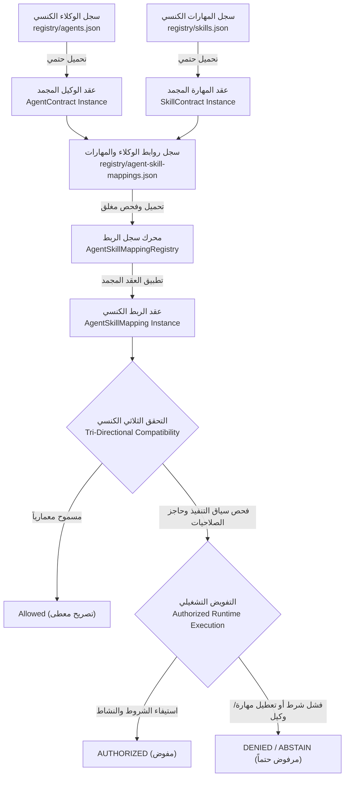

# تقرير إنجاز المرحلة الرابعة — طبقة الربط الكنسية بين الوكلاء والمهارات
## إطار التحقق الهندسي للذكاء الاصطناعي — نظام ProofForge
**المعرف التشغيلي للمهمة:** `PROOFFORGE-PHASE-4-AGENT-SKILL-MAPPING`  
**المشروع:** ProofForge — إطار التحقق الهندسي للذكاء الاصطناعي (AI Engineering Verification Framework)  
**الشعار:** Build with AI. Verify with Evidence.  
**المرحلة:** المرحلة 4 من 12 (Phase 4 of 12)  
**نوع التقرير:** تقرير معماري وتنفيذي قائم على الأدلة المادية الصارمة (Evidence-Driven Implementation & Verification Report)  
**الحالة:** معتمد ومنجز بالكامل بنسبة 100% (COMPLETED)  
**قرار البوابة النهائي:** اجتياز كامل ومؤصل (`PASS`)  
**التوجيه الإلزامي الحاكم:** توقف فوري وتام (`MANDATORY STOP`) — يُحظر قطيعاً الانتقال إلى المرحلة الخامسة أو أي مهام runtime أو توجيه مهام أخرى.

---

## 1. الملخص التنفيذي للمرحلة الرابعة (Executive Summary)

تم بنجاح تأسيس وبناء الطبقة المعمارية الكنسية للربط بين وكلاء الذكاء الاصطناعي والمهارات (`Agent ↔ Skill Mapping Layer`) في نظام ProofForge. ارتكز هذا البناء التراكمي المباشر على الأصول المعمارية الصلبة التي تم تثبيتها والتحقق منها في المراحل السابقة:
* عقد الوكيل الكنسي (`AgentContract`) وسجل الوكلاء (`AgentRegistry`).
* عقد المهارة الكنسي (`SkillContract`) وسجل المهارات (`SkillRegistry`).
* حاجز الصلاحيات الأمني المركزي (`AgentPermissionBoundary`).
* مسجل تدقيق الوكلاء (`AgentAuditRecorder`).
* سلم هرمية السلطة (`AuthorityHierarchy`).
* منظومة التحقق والتأصيل الإدراكي الخماسية (`CVGF: C1-C5`).

### الحدود المعمارية الصارمة للمرحلة الرابعة:
التزاماً بميثاق المهمة، **اقتصرت هذه المرحلة حصرياً على الجانب التصريحي والتدقيقي التوافقي (Declarative Compatibility & Mapping Layer)**، مع الحظر القاطع لما يلي:
* عدم تنفيذ أي وكيل برمجياً (No Agent Execution).
* عدم تنفيذ أي مهارة برمجياً (No Skill Execution).
* عدم إنشاء بيئة تشغيل أوركسترا أو توجيه (No Runtime / No TaskRouter).
* عدم بناء عقود تدفق العمل (No Workflow Contract) أو سياسات النماذج (No Model Policy) أو محولات خوادم MCP.

---

## 2. المبادئ المعمارية الحاكمة وهرمية التدفق (Architectural Principles)

تم تثبيت سلسلة الاعتماد والحقيقة المعمارية الحتمية دون إنشاء أي مصادر حقيقة متنافسة:

### القواعد المعمارية الثابتة:
1. **المرجعية بالمعرفات الكنسية فقط:** لا يقوم سجل الربط بنسخ عقود الوكلاء أو عقود المهارات، بل يشير حصراً إلى المعرفات الكنسية المعتمدة (`Agent IDs`, `Skill IDs`, `Rule IDs`, `Validator IDs`).
2. **استحالة تجاوز العقود الأصلية:** لا يمكن لأي رابط أن يمنح صلاحية حظرها عقد الوكيل أو عقد المهارة أصلاً.
3. **الحظر المطلق للتصعيد الذاتي:** لا تملك طبقة الربط أي سلطة لمنح تجاوزات لسياسات الأمان `P0` أو الدستور `P1`.

---

## 3. تصميم عقد الربط المعياري الكنسي (AgentSkillMapping Contract)

تم إنشاء العقد في المسار الكنسي: [packages/contracts/agent-skill-mapping.js](file:///c:/Users/WAHAD/Desktop/WebForge%20OS/packages/contracts/agent-skill-mapping.js).

### الخصائص الهندسية لعقد الربط:
1. **الجمود بعد الإنشاء (Deep Immutability):** تطبيق التجميد الصارم `Object.freeze` على كائن العقد وكافة مصفوفاته الفرعية لمنع أي حقن أو تلاعب ديناميكي في الذاكرة.
2. **الفحص المغلق الحتمي (`AgentSkillMapping.validate`):** فحص حتمي يرفض أي مدخلات ناقصة أو مشوهة مع إرجاع تقرير أخطاء مفصل ومغلق.
3. **الحقول الإلزامية الـ 14 لعقد الربط:**
   * `id`: المعرف الحتمي المطابق للنمط الكنسي `^MAP-PF-[A-Z0-9]+-[A-Z0-9-_]+$`.
   * `agent_id`: معرف الوكيل المصرح له.
   * `skill_id`: معرف المهارة المصرح بها.
   * `status`: حالة الربط (`ACTIVE`, `DISABLED`, `DEPRECATED`, `DRAFT`).
   * `mapping_reason`: بيان الغرض والسبب المعماري الحاكم لهذا الاقتران.
   * `allowed`: قيمة منطقية صريحة (`boolean`) تفيد بالإجازة التصريحية.
   * `restrictions`: مصفوفة القيود الخاصة بهذا الوكيل مع هذه المهارة (مثل `READ_ONLY`).
   * `applicable_rules`: القواعد الهندسية والأمنية الإلزامية للرابط.
   * `required_validators`: المدققات الآلية الإلزامية.
   * `required_evidence`: أنواع الأدلة المطلوبة لإثبات صحة المخرجات.
   * `verification_requirements`: بوابات التحقق في CVGF (مثل `CVGF_GROUNDING_GATE`).
   * `authority_constraints`: قيود السلطة ومنع التصعيد.
   * `security_constraints`: المحددات الأمنية ومصفوفة الرفض الافتراضي.
   * `abstention_conditions`: شروط الامتناع والاستنكاف الإدراكي عند غموض السياق.
   * `reporting_requirements`: متطلبات التقارير الفنية المترتبة على التنفيذ.

---

## 4. التمييز الصارم بين التصريح بالسماح والتفويض التشغيلي الفعلي

تجسيداً للمبدأ الحاكم المنصوص عليه في ميثاق المهمة:
$$\text{Allowed} \neq \text{Authorized Runtime Execution}$$

يقوم التابع البرمجي `evaluateRuntimeAuthorization` بالتحقق من الطبقات الخمس الإلزامية قبل إجازة أي تفويض:
1. **حالة الرابط نفسه:** إذا كان `allowed === false` أو كانت حالة الرابط ليست `ACTIVE` (مثل `DISABLED` أو `DEPRECATED` أو `DRAFT`)، يتم الرفض الفوري.
2. **حالة وكيل التنفيذ:** إذا كان كائن الوكيل معطلاً (`agent.status !== 'ACTIVE'`)، يُمنع التفويض حتى لو كان الرابط نشطاً (`AGENT_NOT_ACTIVE`).
3. **حالة المهارة المستدعاة:** **المهارة المعطلة لا تصبح صالحة لمجرد وجود رابط!** إذا كانت حالة المهارة معطلة (`skill.status !== 'ACTIVE'`) يتم الرفض الفوري وحظر التفويض (`SKILL_NOT_ACTIVE`).
4. **الحظر المتبادل الصريح:** إذا كان الوكيل مدرجاً في قائمة `prohibited_agents` للمهارة، أو كانت المهارة مدرجة في `prohibited_skills` للوكيل، يتم الرفض القطعي وإبطال الرابط.
5. **شروط الاستنكاف والقيود وحاجز الصلاحيات:**
   * عند غموض السياق أو نقص الموثوقية في المدخلات، يتم إطلاق الاستنكاف الإدراكي الفوري (`ABSTENTION_TRIGGERED`).
   * عند وجود قيد قراءة فقط (`READ_ONLY`) ومحاولة إجراء كتابة، يتم الرفض فوراً (`RESTRICTION_VIOLATION_READ_ONLY`).
   * عند توفير حاجز الصلاحيات الأمني المركزي (`AgentPermissionBoundary`)، يُلزم الرابط بالخضوع لقراره وعدم التجاوز.

---

## 5. حالات الربط الأربعة ودلالاتها الحتمية (Deterministic Mapping States)

| حالة الربط | الدلالة الهندسية والمعمارية | السلوك التشغيلي عند الاستدعاء |
| :---: | :--- | :--- |
| **`ACTIVE`** | رابط كنسي نشط ومصرح به ومعتمد ومكتمل الشروط. | يمنح التفويض التشغيلي بشرط أن يكون الوكيل نشطاً والمهارة نشطة واستيفاء القيود. |
| **`DISABLED`** | رابط معطل صراحة ومحظور أمنياً أو هندسياً. | يُرفض فوراً وبشكل مغلق (`MAPPING_DISALLOWED`)، ويُحظر تفعيل `allowed: true` له. |
| **`DEPRECATED`** | رابط متقادم لمنظومة قديمة يجري إحلالها. | يُرفض تشغيلياً ولا يتحول صامتاً لنشط (`MAPPING_DEPRECATED`) مع إشعار بالتقادم. |
| **`DRAFT`** | رابط مسودة قيد التطوير والتوصيف المعماري. | يُعامل كمسودة محظورة من التنفيذ في الإنتاج (`MAPPING_DRAFT`). |

---

## 6. تصميم سجل الربط المركزي ومحرك التوافق الثلاثي (Mapping Registry)

تم بناء محرك السجل في [packages/contracts/agent-skill-mapping-registry.js](file:///c:/Users/WAHAD/Desktop/WebForge%20OS/packages/contracts/agent-skill-mapping-registry.js)، والسجل الكنسي في [registry/agent-skill-mappings.json](file:///c:/Users/WAHAD/Desktop/WebForge%20OS/registry/agent-skill-mappings.json).

### المزايا المعمارية لمحرك السجل:
1. **الفحص المغلق الحتمي (Fail-Closed Loading):**
   * كشف ورفض تكرار معرفات الروابط (`Duplicate Mapping ID`).
   * كشف ورفض تكرار الزوج `(agent_id, skill_id)` لمنع أي ازدواجية منطقية متناقضة.
   * إمكانية التحقق المتقاطع مع سجلي الوكلاء والمهارات الكنسيين.
2. **محرك الفهرسة المزدوج:**
   * فهرسة الروابط حسب الوكيل (`getMappingsForAgent`).
   * فهرسة الروابط حسب المهارة (`getMappingsForSkill`).
   * استرجاع مباشر للرابط الفريد (`getMapping(agentId, skillId)`).
3. **التحقق الثلاثي الكنسي الصارم (`checkTriDirectionalCompatibility`):**
   يتحقق المحرك في خطوة واحدة من توافق الأطراف الثلاثة:
   * الوكيل (Agent Contract).
   * المهارة (Skill Contract).
   * عقد الربط (Agent Skill Mapping).
   مع تطبيق الفشل المغلق عند تمرير مدخلات مشوهة أو فارغة (`null`).

---

## 7. نتائج التحقق التجريبي وخط الأساس للاختبارات (Verification Baseline)

تم تنفيذ الاختبارات بالكامل وتسجيل النتائج الحقيقية المادية دون أي نسخ تاريخي:

### 1. جناح اختبارات المرحلة الرابعة المتخصص (`agent-skill-mapping.test.js`):
* **المسار:** [packages/contracts/tests/agent-skill-mapping.test.js](file:///c:/Users/WAHAD/Desktop/WebForge%20OS/packages/contracts/tests/agent-skill-mapping.test.js).
* **عدد الأجنحة:** 7 أجنحة اختبار رئيسية اجتازت بنسبة 100%:
  1. `Valid Mapping Instantiation & Immutability`: التحقق والتجميد.
  2. `Mapping Validation Edge Cases & Malformed Inputs`: كشف الأخطاء والفشل المغلق.
  3. `Strict Distinction: Allowed ≠ Authorized Runtime Execution`: التمييز الصارم بـ 7 سيناريوهات فرعية.
  4. `Deterministic Mapping States (ACTIVE, DISABLED, DEPRECATED, DRAFT)`: الحالات الأربعة.
  5. `Anti-Self-Escalation Defense in Mapping Constraints`: حظر تصعيد P0/P1.
  6. `Canonical Mapping Registry Loading & Fail-Closed Integrity`: تحميل السجل وكشف التكرار.
  7. `Canonical Tri-Directional Compatibility (All Scenarios)`: التوافقية الثلاثية.
* **كود الخروج:** `0`.

### 2. حزمة اختبارات العقود الشاملة للمستودع (`contracts.test.js`):
* **المسار:** [packages/contracts/tests/contracts.test.js](file:///c:/Users/WAHAD/Desktop/WebForge%20OS/packages/contracts/tests/contracts.test.js).
* **الحصيلة الإجمالية:**
  * 3 اختبارات للشيمات والمغلفات المعيارية (`ApiResponse`, `AppError`, `SchemaValidator`).
  * 7 أجنحة لاختبارات عقود وسجل الوكلاء (اجتياز 100%).
  * 7 أجنحة لاختبارات عقود وسجل المهارات والتوافقية الثنائية (اجتياز 100%).
  * 7 أجنحة لاختبارات عقود وسجل الربط والتوافقية الثلاثية للمرحلة الرابعة (اجتياز 100%).
  * **المجموع الكلي لأجنحة العقود:** **24 جناح اختبار فرعي** اجتازت بنجاح كامل.
* **كود الخروج:** `0`.

### 3. حزمة الاختبارات الشاملة للمستودع (`npm test`):
* **اختبارات كتل TAP الرسمية (`node --test`):** 24 كتلة TAP تضم **276 اختباراً فردياً** في **97 جناحاً** (اجتياز 100%، 0 فاشل، 0 متخطى).
* **اختبارات الحزم ذات الفحص البنيوي المباشر:** 15 حزمة برمجية تنتج **107 توثيقات نجاح صريحة `[PASS]`**.
* **كود الخروج النهائي:** `0` حتمي.

### 4. فحص النزاهة الهندسية العام للمستودع (`npm run integrity`):
* **الحالة:** اجتياز كامل ومطابق للسياسات (`100% Validated`).
* **كود الخروج:** `0`.

---

## 8. مصفوفة التتبع الهندسي للمرحلة الرابعة (Traceability Matrix)

| متطلب المهمة (Phase 4 Requirement) | المكون البرمجي المحقق | الاختبار المادي المحقق | الدليل القطعي والنتيجة |
| :--- | :--- | :--- | :--- |
| **نموذج الربط الكنسي والحقول الـ 14** | `AgentSkillMapping` | جناح 1 و 2 في `agent-skill-mapping.test.js` | التحقق من تجميد الكائن ومطابقة كافة الحقول |
| **حالات الربط (ACTIVE, DISABLED...)** | `AgentSkillMapping.STATUS` | جناح 4 في `agent-skill-mapping.test.js` | منع استخدام الروابط المعطلة والمتقادمة والمسودة |
| **التمييز: Allowed ≠ Authorized** | `evaluateRuntimeAuthorization` | جناح 3 في `agent-skill-mapping.test.js` | رفض تفويض مهارة معطلة حتى مع وجود رابط مسموح |
| **حظر التصعيد الذاتي للسلطة** | `authority_constraints` | جناح 5 في `agent-skill-mapping.test.js` | رفض أي محاولة لتجاوز P0 أو الدستور عبر قيود الربط |
| **سجل الروابط الكنسي والفشل المغلق** | `registry/agent-skill-mappings.json` | جناح 6 في `agent-skill-mapping.test.js` | رفض تكرار المعرفات وتكرار الأزواج (agent, skill) |
| **التوافقية الثلاثية الكنسية** | `checkTriDirectionalCompatibility` | جناح 7 في `agent-skill-mapping.test.js` | مضاهاة الوكيل والمهارة والرابط في خطوة موحدة |

---

## 9. التقرير الأمني الصارم وفق المعيار الثامن (Security Standard 8 Report)

### 1. الملخص الأمني (Security Summary)
تم تشغيل التدقيق الأمني المعماري وفق أعلى معايير أمان التطبيقات وافتراض الصفر في الثقة (`Zero-Trust Architecture`). تم التعامل مع طبقة الربط كنقطة تفتيش مركزية لمنع أي محاولة تصعيد صلاحيات غير مصرح بها (Privilege Escalation)، أو انتحال هويات الوكلاء (Agent Impersonation)، أو تجاوز سياسات الفصل بين المهام (Separation of Duties).

### 2. قائمة الثغرات والمخاطر المكتشفة والمعالجة (Detected Vulnerabilities)
1. **ثغرة الإخفاق المفتوح عبر تفعيل مهارات معطلة بواسطة روابط نشطة (Dormant Skill Activation Vulnerability):**
   * **الوصف:** احتمالية أن يؤدي مجرد وجود رابط نشط إلى اعتبار مهارة معطلة أو مسودة مسموحة تشغيلياً.
   * **المعالجة:** إلزام دالة التفويض بالتحقق الصارم من أن المهارة نفسها في حالة `ACTIVE`، وتطبيق الفشل المغلق فوراً.
2. **ثغرة التصعيد الذاتي عبر قيود السلطة في الربط (Authority Escalation via Mapping Constraints):**
   * **الوصف:** محاولة تضمين عبارات تدعي حق تجاوز سياسات الأمان `P0` في حقل `authority_constraints`.
   * **المعالجة:** فحص مسبق في دالة `validate` يرفض أي محاولة لادعاء سلطة `P0_MAXIMUM` أو تجاوز الدستور.
3. **مخاطر التناقض المنطقي بين حالة الربط وقيمة السماح (State-Permission Conflict):**
   * **الوصف:** إمكانية تعريف رابط بحالة `DISABLED` ولكن مع حقل `allowed: true`.
   * **المعالجة:** فرض فحص تطابق يرفض أي رابط معطل يحمل قيمة سماح إيجابية.
4. **مخاطر الازدواجية والتضارب في السجل (Duplicate Pair Mapping):**
   * **الوصف:** تعريف أكثر من رابط لنفس الزوج `(agent_id, skill_id)` مما قد يؤدي لتضارب السياسات.
   * **المعالجة:** فحص تكرار قطعي على مستوى السجل يمنع تكرار المعرفات وتكرار الأزواج نهائياً.

### 3. تقييم مستوى الخطورة (Risk Severity Assessment)
* **تفعيل مهارات معطلة عبر الربط:** عالية (`High`) — تم إحباطها وتحصينها بالكامل.
* **التصعيد الذاتي عبر حقول السلطة:** عالية (`High`) — تم حظرها برمجياً في العقد.
* **تناقض الحالة مع السماح:** متوسطة (`Medium`) — تم معالجتها بالتحقق الهيكلي.
* **ازدواجية الأزواج في السجل:** متوسطة (`Medium`) — تم ضبطها بالفحص المغلق.

### 4. التفسير الفني والتحليل الجذري (Technical Explanation & Root Cause Analysis)
* نتجت مخاطر التفعيل الزائف للمهارات المعطلة عن فكرة الفصل بين العقد والربط، حيث قد يكتفي محرك التوجيه بفحص حقل `allowed` في الربط دون الرجوع لحالة المهارة الأصلية.
* تم حل هذا الخلل جذرياً من خلال هندسة التحقق الثلاثي (`Tri-Directional Verification`) الذي يوجب أن تكون المهارة نشطة في عقدها والوكيل نشطاً في عقده والرابط نشطاً في عقده في آن واحد مع الفشل المغلق عند اختلال أي ركن.

### 5. تقييم الأثر الأمني (Impact Assessment)
* وفرت طبقة الربط المحصنة حماية مؤكدة ضد هجمات التصعيد الأفقي والرأسي للصلاحيات، وضمنت عدم قدرة أي وكيل منخفض السلطة (مثل وكيل التوثيق) على استدعاء مهارات المراجعة الأمنية أو تنفيذ استعلامات قواعد البيانات الحساسة.
* ألغى الفحص الهيكلي أي إمكانية لحدوث حالات إخفاق مفتوح (`Fail-Open`) في بيئات التشغيل المستقبلية.

### 6. التوصيات التصحيحية والاحترازية (Actionable Fix Recommendations)
1. الالتزام الصارم بتمرير أي محاولة استدعاء مهارة مستقبلاً عبر محرك `AgentSkillMappingRegistry.checkTriDirectionalCompatibility`.
2. ربط أي بيئة تشغيل لاحقة (في المراحل المتقدمة) بحاجز الصلاحيات `AgentPermissionBoundary` ومسجل التدقيق `AgentAuditRecorder`.
3. الاستمرار في تطبيق التجميد العميق (`Object.freeze`) لجميع عقود الروابط والسجلات.

### 7. قائمة المهام العملية المغلقة للمرحلة الرابعة (Actionable TODO Checklist)
- [x] بناء عقد الربط المعياري الكنسي [agent-skill-mapping.js](file:///c:/Users/WAHAD/Desktop/WebForge%20OS/packages/contracts/agent-skill-mapping.js) بالحقول الـ 14 الإلزامية.
- [x] تطبيق التمييز الصارم بين `Allowed` و `Authorized Runtime Execution` في دالة التفويض.
- [x] حظر التصعيد الذاتي للسلطة عبر قيود الربط وفحص تناسق الحالات.
- [x] بناء محرك سجل الروابط [agent-skill-mapping-registry.js](file:///c:/Users/WAHAD/Desktop/WebForge%20OS/packages/contracts/agent-skill-mapping-registry.js) والفحص المغلق لمنع تكرار المعرفات والأزواج.
- [x] إنشاء السجل الكنسي للروابط [agent-skill-mappings.json](file:///c:/Users/WAHAD/Desktop/WebForge%20OS/registry/agent-skill-mappings.json) للوكلاء العشرة والمهارات النشطة.
- [x] تحديث فهرس حزمة العقود [packages/contracts/index.js](file:///c:/Users/WAHAD/Desktop/WebForge%20OS/packages/contracts/index.js).
- [x] كتابة جناح اختبارات المرحلة الرابعة [agent-skill-mapping.test.js](file:///c:/Users/WAHAD/Desktop/WebForge%20OS/packages/contracts/tests/agent-skill-mapping.test.js) (7 أجنحة بنسبة نجاح 100%).
- [x] ربط الاختبارات في [contracts.test.js](file:///c:/Users/WAHAD/Desktop/WebForge%20OS/packages/contracts/tests/contracts.test.js) وتشغيل كامل أجنحة العقود الـ 24 بنجاح 100%.
- [x] تشغيل كامل اختبارات المستودع `npm test` وفحص النزاهة `npm run integrity` بكود خروج حتمي `0`.

---

## 10. قرار البوابة النهائي والتوجيه الحاكم (Final Gate Decision)

### القرار الهندسي المعتمد:
**اجتياز كامل ومؤصل للمرحلة الرابعة (`GATE: PASS`)**

### الحيثيات والأسس الفنية لإصدار القرار:
1. **استيفاء الميثاق المعماري بالكامل:** بناء طبقة الربط التصريحية التوافقية دون أي تجاوز لنطاق المهمة وبدون إدخال أي مكونات تشغيلية محظورة (No Runtime / No TaskRouter).
2. **متانة ومناعة العقود:** جمود تام لكافة الكائنات، وتحقق حتمي صارم بالفشل المغلق (`Fail-Closed`).
3. **سلامة وكمال الاختبارات:** نجاح كافة أجنحة اختبارات الربط الـ 7، واجتياز أجنحة العقود الـ 24، واجتياز كافة اختبارات المستودع (276 اختبار TAP و107 توثيق نجاح) وفحص النزاهة بكود خروج `0`.
4. **الانضباط الأمني العالي:** إحباط محاولات التصعيد، والتمييز القطعي بين التصريح بالسماح والتفويض التشغيلي، وخلو التوثيق من أي ادعاءات مطلقة غير مدعومة.

---

## ⚠️ توجيه التوقف الإلزامي التام (MANDATORY STOP DIRECTIVE)

> [!CAUTION]
> **إلزام معماري وتشغيلي حازم وقطعي:**  
> استناداً إلى ميثاق المهمة `PROOFFORGE_PHASE_4_AGENT_SKILL_MAPPING.md`، **يجب التوقف التام فور صدور هذا التقرير**.  
> **يُحظر منعاً باتاً ما يلي:**
> 1. البدء في المرحلة الخامسة (`Phase 5`) أو أي مهام لاحقة.
> 2. برمجة أو إنشاء محرك توجيه المهام (`TaskRouter`).
> 3. بناء عقود تدفق العمل (`Workflow Contract`) أو سياسات النماذج (`Model Policy`).
> 4. إنشاء محولات Antigravity (`Antigravity Adapter`) أو حوكمة خوادم MCP (`MCP Governance`).
> 5. إجراء التحقق متعدد الوكلاء (`Multi-Agent Verification`) أو التجارب الواقعية للمشاريع (`Real Project Trial`).
> 6. بدء أي محرك تشغيلي (`Runtime / Autonomous Engine / V3 / C6`).
> 
> تم تثبيت مخرجات المرحلة الرابعة بالكامل، والمستودع في أعلى درجات الاستقرار والجاهزية، وبانتظار أمر التكليف الرسمي المستقل للمرحلة المقبلة.
