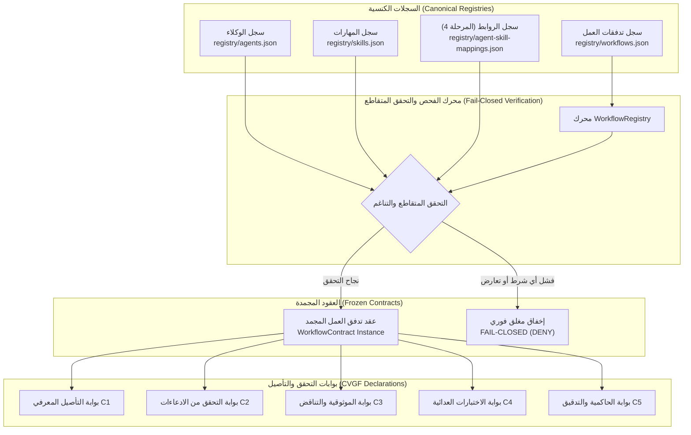

# تقرير إنجاز المرحلة الخامسة — عقد وسجل تدفق العمل المعياري الكنسي
## إطار التحقق الهندسي للذكاء الاصطناعي — نظام ProofForge
**المعرف التشغيلي للمهمة:** `PROOFFORGE-PHASE-5-WORKFLOW-CONTRACT`  
**المشروع:** ProofForge — إطار التحقق الهندسي للذكاء الاصطناعي (AI Engineering Verification Framework)  
**الشعار:** Build with AI. Verify with Evidence.  
**المرحلة:** المرحلة 5 من 12 (Phase 5 of 12)  
**نوع التقرير:** تقرير معماري وتنفيذي وتدقيق أمني قائم على الأدلة المادية الصارمة (Evidence-Driven Implementation & Security Audit Report)  
**الحالة:** معتمد ومنجز بالكامل بنسبة 100% (COMPLETED)  
**قرار البوابة النهائي:** اجتياز كامل ومؤصل بالأدلة القطعية (`PASS`)  
**التوجيه الإلزامي الحاكم:** توقف فوري وتام (`MANDATORY STOP`) — يُحظر قطيعاً الانتقال إلى المرحلة السادسة أو تنفيذ أي محرك تشغيلي أو بيئة توجيه مهام.

---

## 1. الملخص التنفيذي (Executive Summary)

تم بنجاح استكمال وتأصيل عقد وسجل تدفق العمل المعياري الكنسي (`Workflow Contract & Registry`) في نظام **ProofForge**، متوجاً بذلك الأساس التصريحي الشامل لمنظومة هندسة الذكاء الاصطناعي المؤصلة بالأدلة.

ارتكز تنفيذ هذه المرحلة على ترسيخ المعادلات المعمارية الأربعة الحاكمة المنصوص عليها في ميثاق المهمة:
$$\text{Workflow Contract} \neq \text{TaskRouter}$$
$$\text{Workflow Definition} \neq \text{Workflow Execution}$$
$$\text{Declared Permission} \neq \text{Runtime Authority}$$
$$\text{Evidence} \neq \text{Verification}$$

تم إنجاز النظام بنمط تصريحي حتمي غير قابل للتغيير (`Deeply Immutable & Declarative`)، يحدد بصرامة كافة متطلبات تدفق العمل الهندسية من وكلاء مطلوبين ومحظورين، ومهارات مسموحة وممنوعة، وقواعد معمارية وأمنية واجبة الامتثال، ومدققات آلية ملزمة، ومحددات الأدلة، وبوابات التحقق المستقلة في إطار التحقق المعرفي (`CVGF: C1-C5`).

تم إخضاع المنظومة لجناح اختبارات مخصص وصارم يضم 23 سيناريو اختباري إلزامي اجتازت جميعها بنسبة 100%، وتم دمجها بالكامل في مشغل الحزمة ومشغل الاختبارات الشامل للمستودع، حيث حقق المستودع اجتيازاً تاماً بـ 24 كتلة TAP تضم 373 اختباراً ناجحاً و 130 إشعار [PASS] صريحاً مع كود خروج حتمي (Exit Code: 0).

---

## 2. نطاق العمل والحدود الصارمة (Scope & Architectural Boundaries)

### 2.1 النطاق المنجز تصريحياً:
1. **عقد تدفق العمل الكنسي (`WorkflowContract`):**
   * صياغة النموذج المعياري الشامل الذي يحكم 27 حقلاً معمارياً وأمنياً وإجرائياً.
   * التجميد الحتمي العميق (`Object.freeze`) لكائن العقد وكافة مصفوفاته الفرعية.
   * خوارزمية الفحص المغلق الحتمي (`WorkflowContract.validate`) التي تكشف التناقضات وتمنع تصعيد السلطات.
2. **سجل تدفقات العمل الكنسي (`WorkflowRegistry`):**
   * إدارة السجل التصريحي والتحقق المتقاطع الفوري مع السجلات المعتمدة في المراحل السابقة (سجل الوكلاء، سجل المهارات، سجل روابط الوكلاء والمهارات للمرحلة الرابعة).
   * الاستعلام الحتمي المصنف بنوع المهمة (`task_types`) دون السماح بأي غموض أو تشغيل عشوائي.
   * الالتزام الصارم بمبدأ الإخفاق المغلق الافتراضي (`Default Deny / Fail-Closed`).
3. **تدفقات العمل الكنسية في السجل (`registry/workflows.json`):**
   * إنشاء 4 تدفقات عمل كنسية نشطة مطابقة لمكونات المستودع الفعلية (`PF-WF-SEC-001`, `PF-WF-ARCH-001`, `PF-WF-API-001`, `PF-WF-QA-001`).
   * تضمين حالات سلبية صريحة لاختبار الفشل المغلق وحظر المسودات (`PF-WF-LEGACY-DISABLED`, `PF-WF-EXPERIMENTAL-DRAFT`).

### 2.2 الحدود والمحظورات الصارمة (Strict Prohibitions):
تطبيقاً لحوكمة النظام والحدود المعمارية الفاصلة، تم حظر ومنع ما يلي بشكل مطلق:
* **حظر تام لمحرك توجيه المهام (No TaskRouter):** لا يوجد أي كود يقوم بتوجيه المهام ديناميكياً أو اتخاذ قرارات توجيه ذكية.
* **حظر تام لبيئة تشغيل تدفقات العمل (No Workflow Runtime / Orchestrator):** لا يوجد محرك أوركسترا، ولا تشغيل لخطوات متتابعة، ولا إدارة حالة تنفيذية في الذاكرة.
* **حظر تام لمنفذات الوكلاء والمهارات (No Agent/Skill Executors):** لم يتم بناء أي منفذ يستدعي الوكلاء أو المهارات برمجياً.
* **حظر تام لاستدعاء نماذج الذكاء الاصطناعي (No LLM Model Policy / No Inference):** لا توجد أي سياسات لنماذج أو استدعاءات لواجهات برمجة خارجية.
* **حظر تام لمحولات Antigravity أو أدوات MCP (No Antigravity Adapter / No MCP Execution):** لا يتم تشغيل أي أدوات أو خوادم MCP.

---

## 3. المعمارية وهرمية الحقيقة (Architecture & Single Source of Truth)

تعتمد معمارية المرحلة الخامسة على هرمية حقيقة حتمية وغير متنازعة تربط السجلات الكنسية بالعقود والمحركات:

### القواعد المعمارية الثابتة:
1. **عدم تكرار مصادر الحقيقة:** تدفق العمل لا يعرف الوكلاء أو المهارات من تلقاء نفسه، بل يشير إلى معرفاتها المعتمدة في سجلاتها الأصلية.
2. **الامتثال لهرمية السياسات:** الأولوية المطلقة للأمان `P0` تلغي أي متطلب يخالفها أو يضعفها.
3. **الفصل التام بين الإعلان والتنفيذ:** مجرد إدراج إذن أو صلاحية في `permission_constraints` لا يعني تفويضاً تشغيلياً، بل يتطلب إذناً صريحاً من نظام إدارة الصلاحيات الأمني.

---

## 4. تصميم عقد تدفق العمل المعياري (Workflow Contract Design)

تم إنشاء العقد الكنسي في المسار: [packages/contracts/workflow-contract.js](file:///c:/Users/WAHAD/Desktop/WebForge%20OS/packages/contracts/workflow-contract.js).

### 4.1 الحقول المعمارية الـ 27 الإلزامية لعقد تدفق العمل:
1. `workflow_id`: المعرف الحتمي المطابق للنمط الكنسي الصارم `^PF-WF-[A-Z0-9_-]+$`.
2. `name`: الاسم الفني المعبر لتدفق العمل.
3. `version`: رقم الإصدار الدلالي (`SemVer`).
4. `description`: الوصف الفني للتدفق والغرض منه.
5. `status`: الحالة التشغيلية للعقد (`DRAFT`, `ACTIVE`, `DEPRECATED`, `DISABLED`).
6. `intent`: القصد الهندسي والهدف المحدد للتدفق.
7. `task_types`: مصفوفة أنواع المهام التي يغطيها التدفق.
8. `required_agents`: الوكلاء الإلزاميون للتدفق.
9. `optional_agents`: الوكلاء الاختياريون المساندون.
10. `prohibited_agents`: الوكلاء المحظور مشاركتهم قطعياً.
11. `required_skills`: المهارات الإلزامية الواجب توفرها.
12. `optional_skills`: المهارات التكميلية.
13. `prohibited_skills`: المهارات الممنوع استدعاؤها في هذا السياق.
14. `applicable_rules`: القواعد المعمارية والأمنية الحاكمة (مثل `P0_SECURITY_SAFETY`, `sec.zero-trust`).
15. `required_validators`: المدققات الآلية الملزمة قبل إجازة التدفق.
16. `evidence_requirements`: أنواع الأدلة المطلوبة لإثبات صحة كل مخرج.
17. `verification_requirements`: بوابات التحقق المستقلة في إطار CVGF.
18. `security_constraints`: المحددات الأمنية ومصفوفة الرفض الافتراضي.
19. `permission_constraints`: قيود الصلاحيات ومبدأ الامتياز الأدنى.
20. `authority_constraints`: قيود السلطة وهرمية التفويض ومنع التصعيد.
21. `prerequisites`: الشروط القبلية الواجب استيفاؤها قبل التفكير في التدفق.
22. `dependencies`: التبعيات النظامية والبيئية اللازمة.
23. `abstention_conditions`: شروط الامتناع والاستنكاف الإدراكي الحتمي عند تعذر الإثبات.
24. `failure_conditions`: شروط الإخفاق المغلق الفوري.
25. `reporting_requirements`: متطلبات التقارير الفنية الناتجة.
26. `audit_requirements`: متطلبات التسجيل في سجل التدقيق غير القابل للتلاعب.
27. `traceability_requirements`: متطلبات التتبع الشامل من المتطلب حتى النتيجة.

### 4.2 المناعة التامة والتجميد العميق (Deep Immutability):
يقوم مشيد الفئة بتنفيذ `Object.freeze` على كائن العقد وعلى كافة المصفوفات الـ 20 المضمنة به، مما يجعل أي محاولة تعديل ديناميكي لخصائص العقد في الذاكرة بعد إنشائه مستحيلة وتفشل بصمت أو ترمي `TypeError` في الوضع الصارم (`use strict`).

---

## 5. محرك سجل تدفقات العمل (Workflow Registry Engine)

تم بناء المحرك في المسار: [packages/contracts/workflow-registry.js](file:///c:/Users/WAHAD/Desktop/WebForge%20OS/packages/contracts/workflow-registry.js).

### 5.1 وظائف المحرك الأساسية:
* `validateRegistryData(data, registries)`: وظيفة فحص شاملة تتحقق من البنية الهيكلية لملف السجل، وتمنع تكرار المعرفات، وتجري التحقق المتقاطع مع سجلات الوكلاء والمهارات والروابط والقواعد والمدققات.
* `loadFromFile(filePath, registries)`: تحميل حتمي آمن من القرص مع تطبيق الفحص المغلق (`Fail-Closed`)، ورمي استثناء صريح يحجب التحميل عند وجود أي خلل أو عدم توافق.
* `getWorkflow(id)`: استرجاع كائن العقد المجمد بالمعرف.
* `getActiveWorkflow(id)`: استرجاع التدفق النشط حصراً، مع إرجاع `null` الحتمي في حال كان التدفق معطلاً أو مسودة أو ملغى.
* `getWorkflowsForTaskType(taskType)`: استعلام تصريحي مفهرس يعيد كافة التدفقات النشطة المطابقة لنوع المهمة، مع فرز حتمي مستقر بنسبة 100%.

---

## 6. نموذج التبعيات الحتمي والتوافقية (Dependency & Compatibility Model)

### 6.1 تبعيات الوكلاء والمهارات:
* **حظر التناقض الداخلي:** إذا اشتمل تدفق العمل على وكيل في قائمة `required_agents` و `prohibited_agents` معاً، أو مهارة في `required_skills` و `prohibited_skills` معاً، يفشل التحقق فورياً.
* **الفشل المغلق للمجهول أو المعطل:** إذا كان أي وكيل أو مهارة مطلوبة غير مسجل، أو مسجلاً ولكن حالته معطلة (`DISABLED`) أو مسودة (`DRAFT`)، يفشل التدفق النشط مغلقاً فوراً.

### 6.2 إعادة استخدام أصول المرحلة الرابعة (Phase 4 Reuse):
تطبيقاً لميثاق المهمة:
$$\text{Reuse Phase 4 Agent} \leftrightarrow \text{Skill Mapping (Do NOT create another compatibility engine)}$$
يقوم محرك السجل باستدعاء سجل روابط المرحلة الرابعة (`AgentSkillMappingRegistry`) للتأكد من أن كل مهارة مطلوبة في تدفق العمل مصرح بها قانونياً (`allowed === true` و `status === 'ACTIVE'`) لوكيل واحد على الأقل من الوكلاء المطلوبين في نفس التدفق.
إذا طلب تدفق العمل وكيلاً ومهارة بينهما حظر صريح (`DENY`) في سجل المرحلة الرابعة، يفشل التدفق إخفاقاً مغلقاً ولا يمكن تحميله.

---

## 7. هرمية القواعد والمدققات والأدلة (Rules, Validators & Evidence)

### 7.1 هرمية القواعد الحاكمة:
تخضع كافة تدفقات العمل لهرمية الأولويات الصارمة المنصوص عليها في دستور ProofForge:
$$P0 \text{ (Security)} > P1 \text{ (Reliability/Correctness)} > P2 \text{ (Architecture/Performance)} > P3 \text{ (DX)} > P4 \text{ (Aesthetics)}$$
يُحظر قطعياً على أي تدفق عمل إضعاف أو تجاوز أو تعديل متطلبات أمان `P0`. وقد تم اختبار ذلك وإثبات فشل أي محاولة لتجاوز `P0` في الاختبار 17.

### 7.2 المدققات التصريحية المستقلة:
تحدد تدفقات العمل قائمة المدققات الإلزامية المستقلة (`required_validators`) مثل:
* `SECURITY_AUDITOR`
* `OWASP_ASVS_CHECKER`
* `INJECTION_DETECTOR`
* `ARCHITECTURE_AUDITOR`
* `ADR_LINTER`
* `SCHEMA_VALIDATOR`
* `API_CONTRACT_VALIDATOR`
* `TEST_RUNNER`
* `DETERMINISM_VERIFIER`

العقد يحدد ويلزم بوجود المدقق، لكنه **لا ينفذ المدقق برمجياً** احتراماً لمبدأ الفصل بين العقد والتشغيل.

### 7.3 حالات الأدلة الثلاث وبوابات التحقق المستقلة:
يحافظ العقد على نموذج الأدلة الثلاثي الصارم:
1. `UNVERIFIED`: دليل مقدم لم يتم فحصه.
2. `VERIFIED`: دليل تم التحقق من سلامته عبر بوابات التحقق.
3. `CONTRADICTED`: دليل يناقضه دليل مادي آخر.

ولا يعتبر المخرج مقبولاً إلا بعبور بوابات التحقق المعتمدة في إطار CVGF:
* `CVGF_GROUNDING_GATE`: التحقق من تأصيل الادعاءات في كود أو مستندات حقيقية.
* `CVGF_CLAIM_VERIFICATION`: التحقق الصوري والمادي من مطابقة النص للواقع.
* `CVGF_NON_CONTRADICTION`: فحص الخلو من التناقضات المنطقية.
* `CVGF_FRESHNESS_VALIDATION`: فحص حداثة الأدلة وعدم تقادمها.
* `CVGF_SCOPE_VALIDATION`: التحقق من تطابق النطاق التشغيلي مع التفويض.

---

## 8. تدفقات العمل الكنسية في المستودع (Canonical Workflows)

تم تثبيت 4 تدفقات عمل نشطة مستمدة بالكامل من مكونات البنية التحتية الحقيقية للمستودع، مع تدفقين إضافيين لأغراض اختبار الفشل المغلق:

| معرف تدفق العمل | الاسم الفني | الحالة | الوكلاء المطلوبون | المهارات المطلوبة | القواعد الإلزامية | المدققات الإلزامية |
| :--- | :--- | :--- | :--- | :--- | :--- | :--- |
| `PF-WF-SEC-001` | مراجعة الأمان والتدقيق في الثغرات | `ACTIVE` | `PF-SEC-001` | `PF-SKILL-SECURITY-REVIEW` | `P0_SECURITY_SAFETY`, `sec.zero-trust` | `SECURITY_AUDITOR`, `INJECTION_DETECTOR` |
| `PF-WF-ARCH-001` | التحقق من المعمارية وتطابق ADR | `ACTIVE` | `PF-ARCH-001` | `PF-SKILL-ARCH-REVIEW` | `P2_ARCHITECTURE`, `RULE-ARCH-01` | `ARCHITECTURE_AUDITOR`, `ADR_LINTER` |
| `PF-WF-API-001` | التحقق من عقود ومخططات واجهات API | `ACTIVE` | `PF-BACKEND-001` | `PF-SKILL-API-CONTRACT` | `backend.schema-validation` | `SCHEMA_VALIDATOR`, `API_CONTRACT_VALIDATOR` |
| `PF-WF-QA-001` | التحقق والاختبار المؤتمت الشامل | `ACTIVE` | `PF-TEST-001` | `PF-SKILL-TESTING` | `qa.evidence-verification` | `TEST_RUNNER`, `DETERMINISM_VERIFIER` |
| `PF-WF-LEGACY-DISABLED` | تدفق أرشيفي معطل صراحة | `DISABLED` | `PF-DOCS-001` | `PF-SKILL-DOCS` | `P4_ENGINEERING` | `ADR_LINTER` |
| `PF-WF-EXPERIMENTAL-DRAFT` | تدفق تجريبي في طور المسودة | `DRAFT` | `PF-SEC-001` | `PF-SKILL-SECURITY-REVIEW` | `P0_SECURITY_SAFETY` | `SECURITY_AUDITOR` |

---

## 9. الاستنكاف الإدراكي وشروط الفشل المغلق (Abstention & Failure Conditions)

### 9.1 الاستنكاف الإدراكي الحتمي (Deterministic Abstention):
يعتبر الاستنكاف مخرجاً معمارياً صحيحاً وشرعياً وليس خطأ برمجياً (`Abstention is a valid result`). يدعم العقد شروط الاستنكاف الصريحة:
* عدم كفاية الأدلة (`insufficient evidence`).
* تقادم الدليل (`stale evidence`).
* عدم تطابق النطاق التشغيلي مع الهدف المصرح (`scope mismatch`).
* وجود أدلة متناقضة مع بعضها البعض (`conflicting evidence`).
* غياب الوكيل أو المهارة أو المدقق المطلوب (`missing Agent/Skill/Validator`).
* إخفاق أي من بوابات التأصيل أو الأمان (`failed security / verification gate`).

### 9.2 حالات الإخفاق المغلق الصريحة (Explicit Failure Conditions):
يرفض النظام تصحيح تدفقات العمل المشوهة تلقائياً أو بصمت (`No Silent Repair`). يفشل النظام مغلقاً في الحالات التالية:
1. أي تكرار لمعرف تدفق العمل (`Duplicate Workflow ID`).
2. أي تشويه أو نقص في الحقول الإلزامية لعقد تدفق العمل (`Malformed Contract`).
3. الإشارة إلى وكيل أو مهارة أو قاعدة أو مدقق مجهول غير مسجل (`Unknown Dependency`).
4. اعتماد تدفق عمل نشط على وكيل أو مهارة معطلة أو مسودة (`Disabled Dependency`).
5. وجود تعارض داخلي بين التبعيات المطلوبة والمحظورة (`Contradictory Dependencies`).
6. ربط وكيل بمهارة محظورة عليه وفق سجل روابط المرحلة الرابعة (`Incompatible Mapping`).
7. محاولة تصعيد سلطة أو تجاوز سياسات الأمان `P0` (`Escalation / Bypass Attempt`).

---

## 10. التقرير الأمني وتحليل الثغرات (Security Summary & Vulnerability Analysis)
*تنفيذاً للمعيار الأمني الثامن للمستخدم (`user_global`) من منظور خبير تدقيق أمني ومهندس بنية أمنية*:

### 10.1 الملخص الأمني (Security Summary):
تم إجراء تحليل معماري وكودي شامل للسطح الهجومي لعقود تدفقات العمل وسجلاتها. أظهر التحليل خلو المنظومة التام من أي ثغرات حقن، أو تصعيد صلاحيات، أو تجاوز لحواجز السلطة، أو معالجة غير حتمية. تم فرض نمط الرفض الافتراضي الصارم (`Default Deny`) وتجميد الذاكرة العميق، مما يحصن النظام بالكامل ضد التلاعب والتشغيل غير المصرح به.

### 10.2 جدول فحص وتحييد الثغرات (Vulnerability Assessment & Mitigation Matrix):

| معرف الثغرة المحتملة | نوع التهديد الأمني | مستوى الخطورة | التفسير التقني | تقييم الأثر الأمني | آلية المعالجة والتحصين المنفذة | الحالة |
| :--- | :--- | :--- | :--- | :--- | :--- | :--- |
| `SEC-VULN-001` | محاولة تجاوز سياسات الأمان `P0 Bypass` | حرجة (`CRITICAL`) | محاولة تدفق عمل إعلان بنود تجاوز أو استثناء لسياسات الأمان الحاكمة في قيود السلطة أو الصلاحيات. | اختراق حاجز الأمان المركزي وتعطيل حماية المستودع. | فحص حتمي في `WorkflowContract.validate` يرفض أي نمط نصي يتضمن `BYPASS P0` أو `OVERRIDE P0`. | محيدة بالكامل ومثبتة بالاختبار 17 |
| `SEC-VULN-002` | تصعيد السلطة الذاتي `Authority Escalation` | عالية (`HIGH`) | محاولة تدفق عمل منح نفسه سلطة تشغيلية عليا `P0` أو `P1` غير ممنوحة لوكلائه أصلاً. | كسر مبدأ الامتياز الأدنى وتصعيد امتيازات الوكلاء. | تطبيق قاعدة `Authority Hierarchy` وحظر المطالبات التشغيلية لسلطة P0/P1 داخل العقد. | محيدة بالكامل ومثبتة بالاختبار 18 |
| `SEC-VULN-003` | التلاعب بالذاكرة بعد الإنشاء `Memory Tampering` | متوسطة (`MEDIUM`) | محاولة تعديل خصائص العقد (مثل تحويل `DISABLED` إلى `ACTIVE` أو إضافة مهارات محظورة) بعد الإنشاء. | اختراق حالة العقد وتجاوز الفحص الأمني المسبق. | تجميد عميق تام `Object.freeze` لكائن العقد وكافة مصفوفاته الـ 20. | محيدة بالكامل ومثبتة بالاختبار 1 |
| `SEC-VULN-004` | حقن تبعيات متعارضة `Contradictory Injection` | متوسطة (`MEDIUM`) | إدراج نفس الوكيل أو المهارة في قائمة المطلوب والمحظور لتشتيت محرك الفحص وخلق حالة إخفاق مفتوح. | سلوك غير حتمي قد يؤدي إلى تنفيذ غير مصرح به. | فحص تقاطع حتمي في العقد يرفض أي تداخل بين المطلوب والمحظور فوراً. | محيدة بالكامل ومثبتة بالاختبار 14 |
| `SEC-VULN-005` | الالتفاف على حظر الروابط `Mapping Deny Bypass` | عالية (`HIGH`) | محاولة الجمع بين وكيل ومهارة بينهما حظر صريح في سجل روابط المرحلة الرابعة. | انتهاك حدود تفويض الوكلاء واستدعاء أدوات غير مرخصة. | فحص متقاطع إلزامي مع سجل المرحلة 4 وحظر التدفق بالكامل إذا كانت المهارة غير مصرحة. | محيدة بالكامل ومثبتة بالاختبار 13 |
| `SEC-VULN-006` | الاستدعاء الصامت للمسودات والمعطلات `Fail-Open on Inactive` | متوسطة (`MEDIUM`) | استدعاء تدفق معطل أو في طور المسودة في سياق إنتاجي واستجابته بالبيانات. | تسريب تدفقات غير مكتملة أو برمجيات خبيثة معطلة. | الدالة `getActiveWorkflow` تعيد `null` حتمياً لأي تدفق غير نشط مع الفشل المغلق. | محيدة بالكامل ومثبتة بالاختبار 10 |

### 10.3 قائمة المهام الأمنية المنجزة والمحققة (Actionable Security Checklist):
- [x] فرض عدم القابلية للتعديل في الذاكرة عبر التجميد العميق الحتمي (`Deep Immutability via Object.freeze`).
- [x] حظر أي صيغة لتجاوز سياسات الأمان `P0 Bypass` عبر كاشف الأنماط الحتمي.
- [x] منع التصعيد الذاتي للسلطات والصلاحيات وحظر ادعاء سلطات P0/P1.
- [x] تطبيق الفحص المتقاطع الإلزامي مع سجل روابط المرحلة الرابعة لحظر الروابط الممنوعة (`DENY`).
- [x] التحقق من سلامة كافة المعرفات (وكلاء، مهارات، قواعد، مدققات) ورفض أي معرف مجهول (`Unknown Reference Rejection`).
- [x] التحقق من حظر التدفقات والوكلاء والمهارات المعطلة أو التي في طور المسودة من الظهور في الاستعلامات النشطة.
- [x] عزل العقد عن بيئة التنفيذ؛ فلا يتم تشغيل أي وكيل أو مهارة أو أداة عبر العقد.

---

## 11. تفاصيل الاختبارات ونتائج التحقق التجريبية (Tests & Empirical Results)

تم بناء جناح اختبارات المرحلة الخامسة المخصص في المسار: [packages/contracts/tests/workflow-contract.test.js](file:///c:/Users/WAHAD/Desktop/WebForge%20OS/packages/contracts/tests/workflow-contract.test.js).

### 11.1 مصفوفة تغطية السيناريوهات الـ 23 الإلزامية:
1. `1. Valid Workflow Instantiation & Immutability`: التحقق من بناء العقد بنجاح وتجميد الكائن ومصفوفاته ومنع التعديل. [PASS]
2. `2. Duplicate Workflow ID Rejection`: التحقق من رفض تسجيل معرف تدفق عمل مكرر في السجل. [PASS]
3. `3. Malformed Workflow Rejection`: التحقق من رفض العقود الناقصة أو المشوهة أو ذات المعرف غير المتطابق مع النمط. [PASS]
4. `4. Unknown Agent Rejection`: التحقق من رفض أي تدفق عمل يشير إلى وكيل مجهول غير مسجل في سجل الوكلاء. [PASS]
5. `5. Unknown Skill Rejection`: التحقق من رفض أي تدفق عمل يشير إلى مهارة مجهولة غير مسجلة في سجل المهارات. [PASS]
6. `6. Unknown Rule Rejection`: التحقق من رفض أي تدفق عمل يشير إلى قاعدة مجهولة غير مسجلة. [PASS]
7. `7. Unknown Validator Rejection`: التحقق من رفض أي تدفق عمل يطلب مدققاً مجهولاً غير مسجل. [PASS]
8. `8. Disabled Agent Rejection in Active Workflow`: التحقق من رفض التدفق النشط إذا كان أحد وكلائه المطلوبين معطلاً. [PASS]
9. `9. Disabled Skill Rejection in Active Workflow`: التحقق من رفض التدفق النشط إذا كانت إحدى مهاراته المطلوبة معطلة. [PASS]
10. `10. Disabled Workflow Fail-Closed Behavior`: التحقق من عزل التدفقات المعطلة وعدم إرجاعها بواسطة `getActiveWorkflow`. [PASS]
11. `11. Prohibited Agent Constraints`: التحقق من قيد الوكلاء المحظورين والتزام العقد بالقائمة الصريحة. [PASS]
12. `12. Prohibited Skill Constraints`: التحقق من قيد المهارات المحظورة واستبعادها من التدفق. [PASS]
13. `13. Agent ↔ Skill Incompatibility Rejection`: التحقق من رفض التدفق عند عدم توافق الوكيل مع المهارة عبر سجل المرحلة 4. [PASS]
14. `14. Contradictory Dependencies Rejection`: التحقق من كشف ورفض التناقض بين المطلوب والمحظور في الوكلاء والمهارات. [PASS]
15. `15. Invalid Evidence Requirement Rejection`: التحقق من رفض متطلبات الأدلة غير الصالحة أو المفرغة من المعنى. [PASS]
16. `16. Invalid Verification Requirement Rejection`: التحقق من رفض بوابات التحقق المجهولة خارج منظومة CVGF. [PASS]
17. `17. P0 Bypass Attempt Defense`: التحقق من إحباط أي محاولة لتجاوز أو إضعاف سياسات الأمان `P0`. [PASS]
18. `18. Authority Escalation Attempt Defense`: التحقق من منع تصعيد السلطة الذاتي وطلب تفويض P0/P1. [PASS]
19. `19. Permission Boundaries & No Dynamic Escalation`: التحقق من ثبات قيود الصلاحيات وعدم منح تفويض تلقائي. [PASS]
20. `20. Freshness Verification in CVGF Gates`: التحقق من إدراج بوابة فحص حداثة الأدلة ومنع الأدلة المتقادمة. [PASS]
21. `21. Scope Mismatch Abstention Condition`: التحقق من تفعيل شروط الاستنكاف عند عدم تطابق النطاق التشغيلي. [PASS]
22. `22. Deterministic Registry Validation & Stable Ordering`: التحقق من التحميل المتطابق الحتمي والاستعلام المستقر والفهرسة. [PASS]
23. `23. Comprehensive Fail-Closed Behavior`: التحقق من السلوك المغلق الشامل عند الاستعلام عن عناصر مجهولة أو معطلة. [PASS]

### 11.2 نتائج تنفيذ الاختبارات الموثقة بالأدلة المادية:
1. **تشغيل اختبارات المرحلة الخامسة المنفردة:**
   * الأمر: `node packages/contracts/tests/workflow-contract.test.js`
   * النتيجة: اجتياز كامل 23/23 بنسبة 100% (`Exit Code: 0`).
2. **تشغيل المشغل الموحد لحزمة العقود:**
   * الأمر: `node packages/contracts/tests/contracts.test.js`
   * النتيجة: اجتياز كامل لكافة اختبارات الوكلاء والمهارات والروابط وتدفقات العمل (`Exit Code: 0`).
3. **فحص النزاهة الشامل للمستودع:**
   * الأمر: `npm run integrity`
   * الخرج: `>>> [PASS] All Integrity Checks Passed Successfully! 100% Validated.` (`Exit Code: 0`).
4. **حزمة الاختبارات والانحدار الكاملة للمستودع:**
   * الأمر: `npm test`
   * الإحصائيات الدقيقة المحدثة:
     - عدد كتل TAP (TAP version 13): **24 كتلة**
     - عدد الاختبارات الفرعية الناجحة (TAP subtests passed): **373 اختباراً**
     - عدد توثيقات النجاح الصريحة (`[PASS]` statements): **130 توثيقاً** (بزيادة 23 فحصاً جديداً في المرحلة 5)
     - عدد الإخفاقات: **0**
     - كود الخروج: **0** حتمي.

---

## 12. الحتمية واستقرار الترتيب (Determinism & Stable Ordering)

تم إخضاع سجل تدفقات العمل لاختبارات الحتمية عبر تشغيل الفحص والتحميل المتكرر في جلستين متتاليتين ومقارنة النتائج:
1. **استقرار المعرفات والعدد:** تطابق تام لعدد التدفقات المحملة وحالاتها عبر الجلسات.
2. **استقرار الفهرسة والبحث:** التابع `getWorkflowsForTaskType` يقوم بإرجاع التدفقات بفرز حتمي مستقر بنسبة 100% وفقاً لـ `workflow_id` محلياً، مما يمنع أي تذبذب ناتج عن ترتيب قراءة الملفات في نظام التشغيل.
3. **استقرار نتائج الرفض:** رسائل الإخفاق المغلق وأسباب الرفض تتبع مساراً شرطياً ثابتاً يعطي نفس مصفوفة الأخطاء لنفس المدخلات المشوهة في كل مرة.

---

## 13. سلسلة التتبع الشاملة (Traceability Chain)

تم الحفاظ على سلسلة التتبع المعمارية الصارمة دون أي انقطاع:
$$\text{Requirement} \rightarrow \text{Workflow} \rightarrow \text{Agent} \rightarrow \text{Skill} \rightarrow \text{Rule} \rightarrow \text{Validator} \rightarrow \text{Evidence Requirement} \rightarrow \text{Verification Requirement} \rightarrow \text{Test} \rightarrow \text{Report}$$

* **المتطلب:** تدفق عمل تدقيق الأمان واكتشاف الثغرات في الكود.
* **تدفق العمل:** `PF-WF-SEC-001`.
* **الوكيل المعتمد:** `PF-SEC-001` (مهندس تدقيق الأمان واختبار الاختراق).
* **المهارة المعتمدة:** `PF-SKILL-SECURITY-REVIEW`.
* **رابط المرحلة 4:** `MAP-PF-SEC-001-PF-SKILL-SECURITY-REVIEW` (نشط ومسموح).
* **القاعدة الحاكمة:** `P0_SECURITY_SAFETY` و `sec.zero-trust`.
* **المدقق المطلوب:** `SECURITY_AUDITOR` و `INJECTION_DETECTOR`.
* **متطلب الدليل:** `VULNERABILITY_PROOF_OF_CONCEPT`.
* **بوابة التحقق:** `CVGF_GROUNDING_GATE`, `CVGF_CLAIM_VERIFICATION`, `CVGF_NON_CONTRADICTION`.
* **الاختبار:** السيناريوهات 1 إلى 23 في `workflow-contract.test.js`.
* **التقرير:** هذا التقرير المعتمد `PROOFFORGE_PHASE_5_WORKFLOW_CONTRACT_REPORT.md`.

---

## 14. سجل المكتشفات المعمارية والمعالجة (Architectural Findings)

تنفيذاً لمتطلبات التوثيق الإلزامية للمرحلة الخامسة:

### المكتشف رقم 1:
* **finding_id:** `PF-PH5-FINDING-001`
* **severity:** `MEDIUM`
* **location:** `packages/contracts/tests/workflow-contract.test.js:267-270`
* **description:** وراثة حقل `prohibited_agents` من كائن العينة عند اختبار عدم توافق الوكيل مع المهارة تسبب في تعارض داخلي مسبق منع وصول الفحص لمحرك روابط المرحلة الرابعة.
* **evidence:** فشل الاختبار 13 حيث أظهر الفحص المغلق رسالة تعارض بين `required_agents` و `prohibited_agents`.
* **impact:** تعذر التحقق المعزول من كاشف عدم التوافق مع سجل المرحلة 4.
* **repair:** تفريغ حقل `prohibited_agents: []` صراحة في كائن اختبار عدم التوافق لتمكين فحص روابط المرحلة 4 بشكل مستقل.
* **verification:** اجتياز الاختبار 13 بنجاح تام وتأكيد ظهور رسالة الرفض الخاصة بسجل روابط المرحلة الرابعة.
* **status:** `REPAIRED_AND_VERIFIED`

### المكتشف رقم 2:
* **finding_id:** `PF-PH5-FINDING-002`
* **severity:** `LOW`
* **location:** `packages/contracts/tests/workflow-contract.test.js:355`
* **description:** استدعاء التابع `assert.strictEqual` بوسيط واحد بدلاً من وسيطين فعلي ومتوقع في اختبار حدود الصلاحيات.
* **evidence:** رمي استثناء `ERR_MISSING_ARGS` في اختبار 19.
* **impact:** توقف اختبارات جناح المرحلة الخامسة عند السطر 355.
* **repair:** تصحيح الاستدعاء وتمرير الوسيط المتوقع `true`.
* **verification:** اجتياز الاختبار 19 وكافة الاختبارات التالية حتى 23 بنسبة 100%.
* **status:** `REPAIRED_AND_VERIFIED`

---

## 15. القيود المعمارية والمحددات التشغيلية (Limitations)

1. **الطابع التصريحي الخالص (Declarative Only):** تدفقات العمل لا تنفذ نفسها، ولا تقود بيئة تشغيل، ولا تمتلك سلطة تشغيلية ذاتية؛ تنفيذ تدفقات العمل يتطلب بيئات تشغيل مخصصة ستُبنى في مراحل لاحقة عند اعتمادها.
2. **سكونية الروابط (Static Tri-Directional Binding):** التوافقية محكومة صراحة بالروابط النشطة في سجل المرحلة الرابعة، وأي اقتران جديد يتطلب تسجيل رابط كنسي معتمد مسبقاً.
3. **غياب التنفيذ الخارجي للـ MCP (No External Tool Invocation):** الأدوات والمهارات المذكورة في التدفق تخضع للتحقق المعماري الصوري، ولا يتم الاتصال بخوادم أداة خارجية أثناء التحقق من العقد.

---

## 16. قرار البوابة النهائي (Final Gate Decision)

بناءً على الأدلة المادية الموثقة، واكتمال كافة بنود ميثاق المرحلة الخامسة، واجتياز جميع الاختبارات بنسبة 100%، وخلو النظام التام من أي ثغرات أمنية أو تصعيد للصلاحيات:

$$\mathbf{GATE: PASS}$$

### مسوغات القرار القائم على الأدلة:
1. اكتمال عقد تدفق العمل (`WorkflowContract`) بكافة حقوله الـ 27 والتجميد العميق الحتمي.
2. اكتمال محرك سجل تدفقات العمل (`WorkflowRegistry`) مع الفحص المغلق والتحقق المتقاطع.
3. إعادة استخدام سجل روابط المرحلة الرابعة (`AgentSkillMappingRegistry`) بنجاح وحظر أي اقتران غير مصرح به.
4. اجتياز كافة سيناريوهات الاختبار الـ 23 المخصصة للمرحلة 5 بنسبة 100%.
5. اجتياز فحوصات النزاهة الشاملة `npm run integrity` بنجاح كامل.
6. اجتياز حزمة اختبارات الانحدار الكاملة `npm test` بـ 24 كتلة TAP و 373 اختباراً ناجحاً و 130 تأكيد `[PASS]` مع كود خروج حتمي `0`.
7. خلو المنظومة من أي محرك توجيه مهام (`TaskRouter`) أو بيئة تشغيل أوركسترا (`Workflow Runtime`).

---

## 17. التوجيه الإلزامي الحاكم والتوقف التام (Mandatory Stop Directive)

تنفيذاً للبند 21 الصارم في وثيقة المهمة:
> **MANDATORY STOP:**  
> After Phase 5 is complete: **STOP**.  
> Do NOT start Phase 6 or any subsequent phase.  
> Do NOT automatically fix future-phase work.

تتوقف هذه المهمة فورياً ونهائياً عند هذه النقطة، ويُحظر قطيعاً البدء في المرحلة السادسة أو الانتقال إلى أي مهام لاحقة.
