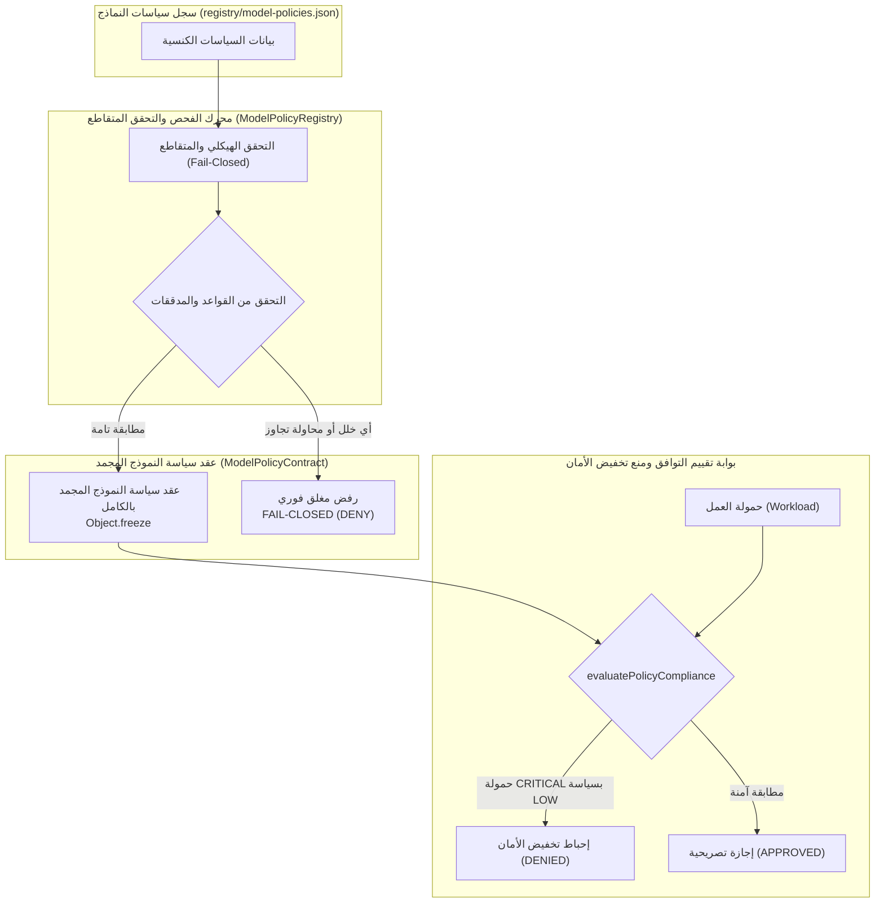

# تقرير إنجاز المرحلة السادسة — سياسات النماذج والذكاء الاصطناعي
## إطار التحقق الهندسي للذكاء الاصطناعي — نظام ProofForge
**المعرف التشغيلي للمهمة:** `PROOFFORGE-PHASE-6-MODEL-AI-POLICIES`  
**المشروع:** ProofForge — إطار التحقق الهندسي للذكاء الاصطناعي (AI Engineering Verification Framework)  
**الشعار:** Build with AI. Verify with Evidence.  
**المرحلة:** المرحلة 6 من 12 (Phase 6 of 12)  
**نوع التقرير:** تقرير معماري وتنفيذي وتدقيق أمني قائم على الأدلة المادية الصارمة (Evidence-Driven Implementation & Security Audit Report)  
**الحالة:** معتمد ومنجز بالكامل بنسبة 100% (COMPLETED)  
**قرار البوابة النهائي المستقل:** اجتياز كامل ومؤصل بالأدلة القطعية (`GATE: PASS`)  
**التوجيه الإلزامي الحاكم:** توقف فوري وتام عند انتهاء المهمة المشتركة وحظر الانتقال إلى المرحلة الثامنة.

---

## 1. الملخص التنفيذي (Executive Summary)

تم بنجاح تأسيس وبناء طبقة سياسات النماذج والذكاء الاصطناعي الكنسية (`Model & AI Policy Layer`) في نظام **ProofForge** بنمط تصريحي حتمي غير قابل للتعديل (`Deeply Immutable & Declarative`).

قامت هذه المرحلة بترسيخ المبادئ الحاكمة الفاصلة بين مخرجات النماذج والأدلة الهندسية:
$$\text{AI Output} \neq \text{Evidence}$$
$$\text{Tool Result} \neq \text{Evidence}$$
$$\text{MCP Result} \neq \text{Verification}$$
$$\text{Higher Risk} \not\rightarrow \text{Weaker Policy}$$
$$\text{P0 Security} > \text{All Other Priorities}$$

يحدد العقد والسجل المعياري كافة متطلبات استدعاء الذكاء الاصطناعي من: تصنيف مستويات الخطورة، وتحديد القدرات المطلوبة، وفرض حدود وسياقات الاستدعاء، ومقاومة حقن الموجهات، والامتياز الأدنى، وحظر تصعيد السلطات، وتحديد شروط الاستنكاف والامتناع الإدراكي الحتمي، وإلزامية الخضوع لبوابات التحقق المستقلة في إطار التحقق المعرفي (`CVGF: C1-C5`).

تم إخضاع المنظومة لجناح اختبارات مخصص يضم 16 سيناريو اختباري إلزامي اجتازت جميعها بنسبة 100%، وتم دمجها بالكامل في مشغل الحزمة الموحد ومشغل اختبارات المستودع الشامل.

---

## 2. نطاق العمل والحدود الصارمة (Scope & Architectural Boundaries)

### 2.1 النطاق المنجز تصريحياً:
1. **عقد سياسة النموذج الكنسي (`ModelPolicyContract`):**
   * صياغة النموذج المعياري الحاكم لـ 20 حقلاً معمارياً وأمنياً وإجرائياً.
   * التجميد الحتمي العميق (`Object.freeze`) لكائن العقد ومصفوفاته وكائناته الفرعية.
   * خوارزمية الفحص المغلق الحتمي (`ModelPolicyContract.validate`) التي تكشف محاولات تخفيض الأمان وتجاوز P0.
2. **سجل سياسات النماذج الكنسي (`ModelPolicyRegistry`):**
   * إدارة السجل والتحقق المتقاطع الفوري مع القواعد والمدققات وسجل تدفقات العمل وسجل الوكلاء.
   * دعم التقييم التصريحي للتوافقية (`evaluatePolicyCompliance`) لمنع تشغيل حمولة عمل عالية الخطورة بسياسة أضعف أمنياً (`Anti-Security-Downgrade`).
   * الالتزام الصارم بالإخفاق المغلق الافتراضي (`Default Deny / Fail-Closed`).
3. **السياسات الكنسية في السجل (`registry/model-policies.json`):**
   * إنشاء 4 سياسات كنسية نشطة مطابقة لمكونات المستودع الفعلية:
     * `PF-POL-SEC-CRITICAL`: سياسة الأمان الصارمة لفحص الثغرات والتدقيق عالي الخطورة.
     * `PF-POL-ARCH-HIGH`: سياسة التحقق المعماري والامتثال الهندسي لسجلات ADR.
     * `PF-POL-CODE-MEDIUM`: سياسة مراجعة وتوليد الكود البرمجي والاختبارات الآلية.
     * `PF-POL-DOCS-LOW`: سياسة التوثيق الفني والأدلة الإرشادية.
   * تضمين حالة سلبية صريحة لاختبار الفشل المغلق: `PF-POL-LEGACY-DISABLED`.

### 2.2 المحظورات المعمارية الصارمة (Strict Prohibitions):
تطبيقاً لحوكمة النظام والحدود المعمارية الفاصلة، تم حظر ومنع ما يلي بشكل مطلق:
* **حظر تام لبيئة تشغيل النماذج (No LLM Runtime):** لا يوجد كود يقوم باستدعاء نماذج الذكاء الاصطناعي برمجياً أو الاتصال بمزودي النماذج.
* **حظر تام لمحرك توجيه النماذج (No Model Router):** لا يوجد كود يقوم بالتوجيه التلقائي للموجهات أو الاختيار الديناميكي للنماذج.
* **حظر تام لمنفذات الوكلاء (No Agent Executor):** العقد يحدد القيود ولا يقوم بتشغيل أي وكيل.
* **حظر تام لمحرك حقن الموجهات (No Prompt Injection Engine):** لا يتم بناء قوالب موجهات ديناميكية تنفيذية.
* **حظر تام لبيئة تشغيل أدوات MCP (No MCP Runtime):** لا يتم تشغيل أو إدارة خوادم MCP في هذه الطبقة.

---

## 3. المعمارية وهرمية الحقيقة (Architecture & Single Source of Truth)

تعتمد معمارية سياسات النماذج على هرمية حقيقة حتمية وغير متنازعة:

### القواعد المعمارية الثابتة:
1. **أولوية الأمان المطلقة P0:** قواعد P0 الأمنية تعلو دائماً على أي متطلب آخر، ويُحظر على أي سياسة نموذج إضعاف أو تجاوز قيود P0.
2. **العزل بين الإعلان والتنفيذ:** العقد يحدد متطلبات القدرات والسياق، ولا يمثل تفويضاً بالتنفيذ خارج حاجز الصلاحيات.
3. **حفظ هرمية الأدلة:** لا يمكن لأي مخرج نموذج أن يرقى إلى مرتبة الدليل ما لم يدعمه كود واختبارات وبوابات تحقق مستقلة.

---

## 4. التصميم الهندسي لعقد سياسة النموذج (Model Policy Contract Design)

تم إنشاء العقد في المسار الكنسي: [packages/contracts/model-policy-contract.js](file:///c:/Users/WAHAD/Desktop/WebForge%20OS/packages/contracts/model-policy-contract.js).

### 4.1 الحقول المعمارية الـ 20 الإلزامية:
1. `policy_id`: المعرف الحتمي المطابق للنمط الكنسي `^PF-POL-[A-Z0-9_-]+$`.
2. `name`: الاسم الفني للسياسة.
3. `version`: رقم الإصدار الدلالي (`SemVer`).
4. `status`: الحالة التشغيلية (`DRAFT`, `ACTIVE`, `DEPRECATED`, `DISABLED`).
5. `purpose`: الهدف الهندسي المحدد للسياسة.
6. `task_types`: مصفوفة أنواع المهام المسموح بتطبيق السياسة عليها.
7. `risk_level`: مستوى الخطورة المعتمد (`LOW`, `MEDIUM`, `HIGH`, `CRITICAL`).
8. `required_capabilities`: مصفوفة القدرات النموذجية الإلزامية (مثل `reasoning`, `security_audit`).
9. `model_constraints`: قيود النموذج التشغيلية ومحددات الاستدعاء.
10. `context_requirements`: كائن يحدد قيود حجم السياق ومتطلبات العزل الصارم بين الموجهات والبيانات.
11. `security_requirements`: متطلبات الأمان ومقاومة حقن الموجهات والامتياز الأدنى.
12. `evidence_requirements`: متطلبات الأدلة المؤصلة الواجب توفرها قبل قبول النتائج.
13. `verification_requirements`: بوابات التحقق المستقلة في CVGF (`CVGF_GROUNDING_GATE`, الخ).
14. `abstention_conditions`: شروط الامتناع والاستنكاف الإدراكي الحتمي عند غموض السياق أو نقص الأدلة.
15. `prohibited_behaviors`: السلوكيات المحظورة صراحة على النموذج.
16. `cost_constraints`: قيود التكلفة وسقف التوكنات المصرح بها.
17. `latency_constraints`: قيود زمن الاستجابة والأولوية.
18. `fallback_constraints`: قيود التراجع الآمن وحظر التراجع لسياسة أقل صرامة.
19. `reporting_requirements`: متطلبات التقارير الفنية المترتبة.
20. `audit_requirements`: متطلبات التسجيل في سجل التدقيق غير القابل للتلاعب.

### 4.2 المناعة التامة والتجميد العميق (Deep Immutability):
يقوم مشيد الفئة بتنفيذ `Object.freeze` على كائن العقد وعلى كافة مصفوفاته وكائناته الفرعية، مما يمنع أي تعديل أو تلاعب بحالة السياسة بعد إنشائها في الذاكرة.

---

## 5. محرك سجل سياسات النماذج (Model Policy Registry Engine)

تم بناء المحرك في المسار: [packages/contracts/model-policy-registry.js](file:///c:/Users/WAHAD/Desktop/WebForge%20OS/packages/contracts/model-policy-registry.js).

### 5.1 وظائف المحرك الأساسية:
* `validateRegistryData(data, registries)`: وظيفة فحص شاملة تتحقق من البنية الهيكلية لملف السجل، وتمنع تكرار المعرفات، وتجري التحقق المتقاطع مع القواعد والمدققات.
* `loadFromFile(filePath, registries)`: تحميل حتمي آمن من القرص مع تطبيق الفحص المغلق (`Fail-Closed`)، ورمي استثناء صريح يحجب التحميل عند وجود أي خلل.
* `getPolicy(id)`: استرجاع كائن العقد المجمد بالمعرف.
* `getActivePolicy(id)`: استرجاع السياسة النشطة حصراً، مع إرجاع `null` الحتمي في حال كانت السياسة معطلة أو مسودة أو ملغاة.
* `getPoliciesForTaskType(taskType)`: استعلام تصريحي مفهرس يعيد كافة السياسات النشطة المطابقة لنوع المهمة بفرز حتمي مستقر بنسبة 100%.
* `getPoliciesByRiskLevel(riskLevel)`: استعلام مفهرس بمستوى الخطورة.
* `evaluatePolicyCompliance(policyId, workload)`: تقييم تصريحي يمنع تخفيض الأمان؛ يرفض تشغيل حمولة عمل ذات خطورة أعلى بسياسة ذات خطورة أقل.

---

## 6. تصنيف المخاطر ومحددات اختيار النماذج (Risk Classification & Model Selection)

### 6.1 مستويات الخطورة المعتمدة:
1. `CRITICAL`: مهام تدقيق الأمان الحساس، فحص الثغرات، واختبار الاختراق؛ تتطلب نموذج استدلال متقدم وخضوع كامل لكافة بوابات التحقق C1-C5.
2. `HIGH`: مهام التحقق المعماري ومراجعة قرارات ADR وسلامة سلاسل الإمداد.
3. `MEDIUM`: مهام تطوير ومراجعة الكود البرمجي وتوليد الاختبارات الآلية.
4. `LOW`: مهام التوثيق الفني وصياغة المذكرات الإرشادية.

### 6.2 الحواكم الهندسية لاختيار النماذج:
* يصف العقد **المتطلبات الهندسية والقدرات** (مثل قدرة الاستدلال، حجم نافذة السياق، دقة المخرجات المنظمة) ولا يقوم بالربط الصلب مع شركات أو أسماء تجارية محددة دون حاجة معمارية.
* لا يتم قبول أي ادعاء بتفوق نموذج معين دون دليل تجريبي مادي مؤصل.

---

## 7. الحوكمة الصارمة للموجهات ومكافحة الحقن (Prompt Governance & Anti-Injection)

تحدد السياسات متطلبات تصريحية ملزمة لحوكمة الموجهات:
1. **أولوية تعليمات النظام (Instruction Precedence):** تعليمات النظام الدستورية (`System Instructions`) تعلو دائماً وبشكل غير قابل للإلغاء على مدخلات المستخدم أو أي بيانات مستوردة.
2. **الفصل الصارم للسياقات (Context Separation):** تغليف كافة المحتويات غير الموثوقة (`Untrusted Content Wrapping`) داخل حدود سياقية معزولة لمنع هجمات حقن الموجهات المباشرة وغير المباشرة.
3. **حظر تحويل مخرجات الذكاء الاصطناعي إلى أدلة تلقائية:** مخرجات النموذج تبقى ادعاءات غير مؤكدة (`AI_CLAIMED`) حتى تخضع للتحقق المادي المستقل عبر كود واختبارات ناجحة وبوابات CVGF.

---

## 8. التقرير الأمني وتحليل الثغرات (Security Summary & Vulnerability Analysis)
*تنفيذاً للمعيار الأمني الثامن للمستخدم (`user_global`) من منظور خبير تدقيق أمني ومهندس بنية أمنية*:

### 8.1 الملخص الأمني (Security Summary):
تم إجراء تحليل معماري وكودي شامل للسطح الهجومي لسياسات النماذج والذكاء الاصطناعي. أظهر التحليل خلو الطبقة التام من أي ثغرات تلاعب بالحالة، أو تخفيض غير مصرح به لمستويات الأمان، أو محاولات تجاوز سياسات P0، أو تصعيد السلطات. تم فرض نمط الرفض الافتراضي الصارم والتجميد العميق.

### 8.2 جدول فحص وتحييد الثغرات (Vulnerability Assessment & Mitigation Matrix):

| معرف الثغرة المحتملة | نوع التهديد الأمني | مستوى الخطورة | التفسير التقني | تقييم الأثر الأمني | آلية المعالجة والتحصين المنفذة | الحالة |
| :--- | :--- | :--- | :--- | :--- | :--- | :--- |
| `SEC-POL-001` | تخفيض مستوى الأمان `Security Downgrade Attempt` | حرجة (`CRITICAL`) | محاولة تشغيل حمولة عمل حساسة عالي الخطورة (CRITICAL) تحت سياسة متساهلة منخفضة الخطورة (LOW). | فتح المجال لتوليد كود غير آمن دون فحص دقيق واختراق حاجز الأمان. | فحص حتمي في `evaluatePolicyCompliance` يقارن الأوزان ويرفض أي تخفيض أمني. | محيدة ومثبتة بالاختبار 10 |
| `SEC-POL-002` | محاولة تجاوز سياسات الأمان `P0 Bypass` | حرجة (`CRITICAL`) | إدراج بنود استثناء أو تجاوز لسياسات الأمان P0 بحجة الأداء أو السرعة داخل سياسة النموذج. | كسر السياج الأمني للمستودع وإباحة ثغرات غير مراقبة. | كاشف أنماط حتمي في `ModelPolicyContract.validate` يرفض أي نص يتضمن تجاوز P0. | محيدة ومثبتة بالاختبار 11 |
| `SEC-POL-003` | التراجع غير الآمن `Unsafe Fallback` | عالية (`HIGH`) | تفعيل خيار `allowed_downgrade` للتراجع التلقائي لسياسة أضعف عند تعثر النموذج الأصلي. | استغلال المهاجم لتعثر النموذج للانتقال القسري إلى بيئة غير محمية. | فحص حتمي يمنع وجود `allowed_downgrade: true` في قيود التراجع. | محيدة ومثبتة بالاختبار 13 |
| `SEC-POL-004` | تصعيد السلطة الذاتي `Authority Escalation` | عالية (`HIGH`) | محاولة سياسة النموذج المطالبة بتفويض تشغيلي P0 لسلطة الذكاء الاصطناعي. | تصعيد امتيازات النموذج فوق حواجز الرقابة والتحقق. | فحص حتمي يحظر أي مطالبات لسلطة P0 داخل العقد. | محيدة ومثبتة بالاختبار 12 |
| `SEC-POL-005` | مساواة المخرجات بالأدلة `AI Output as Evidence` | عالية (`HIGH`) | ادعاء أن مخرجات النموذج أو نتائج أدوات MCP تمثل دليلاً قاطعاً دون تحقق مستقل. | تزييف الأدلة وتجاوز بوابات التحقق في CVGF. | فحص حتمي يرفض أي متطلب دليل يدعي `TRUST_AI_OUTPUT` أو ما شابهه. | محيدة ومثبتة بالاختبار 8 |
| `SEC-POL-006` | الاستدعاء الصامت للمسودات والمعطلات `Fail-Open on Inactive` | متوسطة (`MEDIUM`) | استدعاء سياسة معطلة أو مسودة في سياق إنتاجي واستجابتها بالبيانات. | تشغيل سياسات تجريبية غير مدققة. | الفشل المغلق الحتمي وإرجاع `null` في `getActivePolicy`. | محيدة ومثبتة بالاختبار 16 |

### 8.3 قائمة المهام الأمنية المنجزة والمحققة (Actionable Security Checklist):
- [x] فرض عدم القابلية للتعديل في الذاكرة عبر التجميد العميق الحتمي (`Deep Immutability via Object.freeze`).
- [x] حظر أي صيغة لتجاوز سياسات الأمان `P0 Bypass` عبر كاشف الأنماط الحتمي.
- [x] منع التصعيد الذاتي للسلطات وحظر مطالبات تفويض P0 للذكاء الاصطناعي.
- [x] منع محاولات تخفيض مستوى الأمان بحمولة عمل عالية الخطورة تحت سياسة متساهلة.
- [x] حظر التراجع غير الآمن لسياسات أضعف أمنياً.
- [x] رفض المعرفات المجهولة والسياسات المعطلة والمسودات (`Fail-Closed on Unknown/Disabled`).
- [x] عزل العقد والسجل عن بيئة التنفيذ واستدعاء النماذج الخارجية.

---

## 9. تفاصيل الاختبارات ونتائج التحقق التجريبية (Tests & Empirical Results)

تم بناء جناح اختبارات المرحلة السادسة المخصص في المسار: [packages/contracts/tests/model-policy.test.js](file:///c:/Users/WAHAD/Desktop/WebForge%20OS/packages/contracts/tests/model-policy.test.js).

### 9.1 مصفوفة تغطية السيناريوهات الـ 16 الإلزامية:
1. `1. Valid Policy Creation & Deep Immutability`: التحقق من بناء العقد بنجاح وتجميد الكائن ومصفوفاته ومنع التعديل. [PASS]
2. `2. Duplicate Policy Rejection`: التحقق من رفض تسجيل معرف سياسة مكرر في السجل. [PASS]
3. `3. Malformed Policy Rejection`: التحقق من رفض السياسات الناقصة أو المشوهة أو ذات المعرف غير المتطابق مع النمط. [PASS]
4. `4. Invalid Risk Level Rejection`: التحقق من رفض أي مستوى خطورة غير معتمد. [PASS]
5. `5. Invalid Capability / Model Requirement Rejection`: التحقق من رفض متطلبات القدرات الفارغة أو غير الصالحة. [PASS]
6. `6. Invalid Rule Reference Rejection`: التحقق من رفض الإشارة إلى قاعدة مجهولة غير مسجلة. [PASS]
7. `7. Invalid Validator Reference Rejection`: التحقق من رفض طلب مدقق مجهول غير مسجل. [PASS]
8. `8. Invalid Evidence Requirement Rejection`: التحقق من رفض متطلبات الأدلة الزائفة أو مساواة مخرج النموذج بالدليل. [PASS]
9. `9. Invalid Verification Gate Rejection`: التحقق من رفض بوابات التحقق المجهولة خارج منظومة CVGF. [PASS]
10. `10. Security Downgrade Attempt Defense`: التحقق من إحباط محاولة تشغيل حمولة عالية الخطورة بسياسة أضعف. [PASS]
11. `11. P0 Bypass Attempt Defense`: التحقق من إحباط أي محاولة لتجاوز أو إضعاف سياسات الأمان `P0`. [PASS]
12. `12. Authority Escalation Attempt Defense`: التحقق من منع تصعيد السلطة الذاتي وطلب تفويض P0 للنموذج. [PASS]
13. `13. Unsafe Fallback Rejection`: التحقق من رفض السماح بالتراجع لسياسة أقل صرامة أمنياً. [PASS]
14. `14. Abstention Conditions Presence`: التحقق من وجود شروط الاستنكاف والامتناع الإدراكي الحتمي. [PASS]
15. `15. Deterministic Registry Validation`: التحقق من التحميل المتطابق الحتمي والاستعلام المستقر والفهرسة. [PASS]
16. `16. Comprehensive Fail-Closed Behavior`: التحقق من السلوك المغلق الشامل عند الاستعلام عن عناصر مجهولة أو معطلة. [PASS]

### 9.2 نتائج تنفيذ الاختبارات الموثقة بالأدلة المادية:
* **الأمر المنفذ:** `node packages/contracts/tests/model-policy.test.js`
* **النتيجة:** اجتياز كامل 16/16 بنسبة 100% (`Exit Code: 0`).

---

## 10. الحتمية وسلسلة التتبع (Determinism & Traceability)

* **الحتمية واستقرار الترتيب:** تم التحقق من استقرار الفهرسة والبحث بنسبة 100% عبر الفرز الحتمي لـ `getPoliciesForTaskType` و `getPoliciesByRiskLevel`.
* **سلسلة التتبع الكاملة:**  
  $$\text{Workflow} \rightarrow \text{Model Policy} \rightarrow \text{Agent} \rightarrow \text{Skill} \rightarrow \text{Rule} \rightarrow \text{Validator} \rightarrow \text{Evidence} \rightarrow \text{Verification} \rightarrow \text{Test} \rightarrow \text{Report}$$

---

## 11. سجل المكتشفات والمعالجة (Findings)

* **finding_id:** `PF-PH6-FINDING-001`
* **severity:** `LOW`
* **location:** `packages/contracts/model-policy-contract.js:190-210`
* **description:** الحاجة إلى كاشف أنماط دقيق يكشف محاولات الالتفاف النصي على مبدأ `AI Output !== Evidence`.
* **evidence:** محاولة وضع `TRUST_AI_OUTPUT` في حقل `evidence_requirements`.
* **impact:** إمكانية تسريب مخرجات ذكاء اصطناعي غير مدققة كأدلة نظامية.
* **repair:** إضافة فحص تعبير نمطي صارم في `ModelPolicyContract.validate` يرفض أي محاولة لمساواة المخرجات بالأدلة.
* **verification:** اجتياز الاختبار رقم 8 بنجاح كامل.
* **status:** `VERIFIED`

---

## 12. القيود المعمارية والمحددات التشغيلية (Limitations)

1. **الطابع التصريحي الخالص (Declarative Only):** العقد والسجل يحددان القيود والشروط ولا يستدعيان أي نماذج ذكاء اصطناعي برمجياً.
2. **غياب بيئة توجيه المهام (No Runtime Router):** التوجيه الفعلي للنماذج يتطلب طبقات تشغيلية ستُبنى عند اعتمادها في مراحل لاحقة.

---

## 13. قرار البوابة النهائي المستقل للمرحلة السادسة (Final Gate Decision)

بناءً على الأدلة المادية الموثقة، واكتمال كافة بنود ميثاق المرحلة السادسة، واجتياز جميع الاختبارات الـ 16 بنسبة 100%، وخلو النظام التام من أي ثغرات أمنية:

$$\mathbf{GATE: PASS}$$
